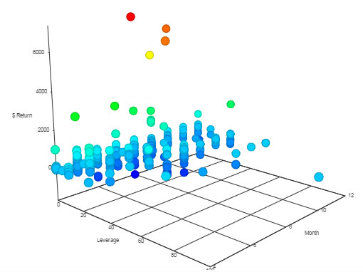

Charts data in 3 dimenions

## Basics

Set up **Data Source** and 3D chart type

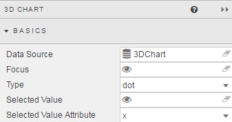

### Data Source

See [Defining a Query](introduction.md#defining-a-query) and [Analytics](introduction.md#analytics) for more on data sourcing.

### Focus

Used for [linking components](introduction.md#linking-components). Requires a [view state parameter](introduction.md#view-state-parameters).

### Type

Sets the type of 3D Chart to Use

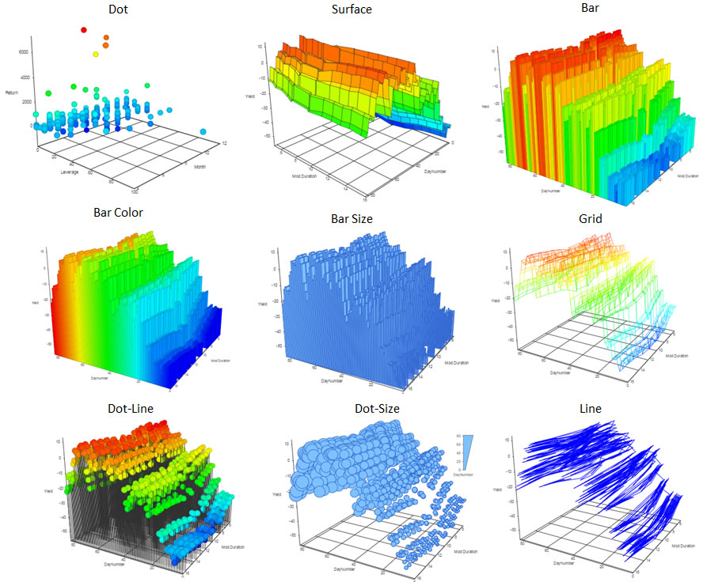

### Selected Value 

Used to map a chart (query) data point to a [view state parameter](introduction.md#view-state-parameters) when a chart bar is clicked by the user. 

[1] Create a [view state parameter](introduction.md#view-state-parameters) and assign to <i>Selected Value</i>
 
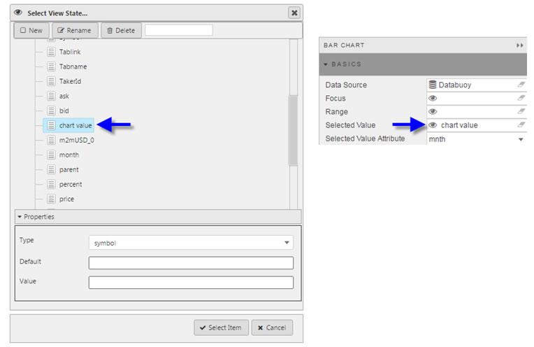

[2] Go to <a href="#selected-value-attribute">Selected Value Attribute</a> to select a query variable to store in the Selected Value View State Parameter.

### Selected Value Attribute

This comes from the Data Source and is the variable paired with the <a href="#selected-value">selected value</a> [view state parameter](introduction.md#view-state-parameters). 

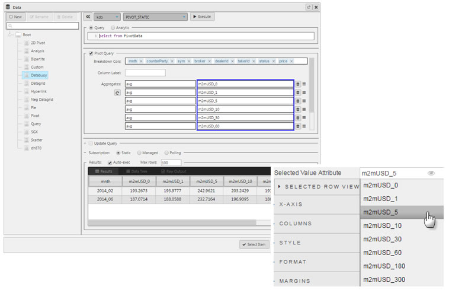

<aside class="warning">When mapping <i>Selected Values</i> to <i>Selected Value Attribute</i>, ensure the <i>Data Type</i> of the View State Parameter matches the <i>Data Type</i> of the <a href="#data-source">Data Source</a>; e.g. integer for numbered data </aside>

## X

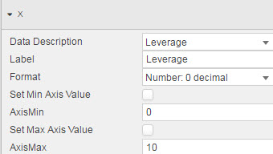

Configure data for X-axis

**Data Description**

Select which <a href="#data-source">data source</a> variable will be used to plot against the X-Axis

**Label** 
 
Select descriptive label for X-Axis

**Format**

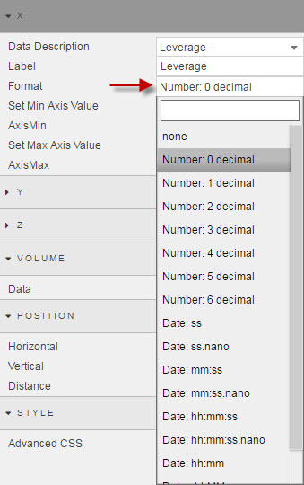

From dropdown menu, select the numeric or date format to use

**Set Min Axis Value**

Check control to use *AxisMin*

**AxisMin**

Sets minimum X-axis value when *Set Min Axis Value* is checked

<aside class="warning">Ensure <b>Set Min Axis Value</b> is enabled for chart to use <b>AxisMin</b></aside>

**Set Max Axis Value**

Check control to use **AxisMax**

**AxisMax**

Sets maximum X-axis value when **Set Max Axis Value** is checked

<aside class="warning">Ensure <b>Set Max Axis Value</b> is enabled for chart to use <b>AxisMax</b></aside>

## Y

Configure data for Y-axis

**Data Description**

Select which <a href="#data-source">data source</a> variable will be used to plot against the Y-Axis

**Label** 
 
Select descriptive label for Y-Axis

**Format**

From dropdown menu, select the numeric or date format to use

**Set Min Axis Value**

Check control to use *AxisMin*

**AxisMin**

Sets minimum X-axis value when *Set Min Axis Value* is checked

<aside class="warning">Ensure <b>Set Min Axis Value</b> is enabled for chart to use <b>AxisMin</b></aside>

**Set Max Axis Value**

Check control to use *AxisMax*

**AxisMax**

Sets maximum X-axis value when *Set Max Axis Value* is checked

<aside class="warning">Ensure <b>Set Max Axis Value</b> is enabled for chart to use <b>AxisMax</b></aside>

## Z

Configure data for Z-axis

**Data Description**

Select which <a href="#data-source">data source</a> variable will be used to plot against the Z-Axis

**Label** 
 
Select descriptive label for Z-Axis

**Format**

From dropdown menu, select the numeric or date format to use

**Set Min Axis Value**

Check control to use *AxisMin*

**AxisMin**

Sets minimum X-axis value when *Set Min Axis Value* is checked

<aside class="warning">Ensure <b>Set Min Axis Value</b> is enabled for chart to use <b>AxisMin</b></aside>

**Set Max Axis Value**

Check control to use *AxisMax*

**AxisMax**

Sets maximum X-axis value when *Set Max Axis Value* is checked

<aside class="warning">Ensure <b>Set Max Axis Value</b> is enabled for chart to use <b>AxisMax</b></aside>

## Volume

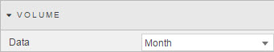

From the <a href="#data-source">data source</a> select the variable to use for plot size.

## Position

Set 3D Position

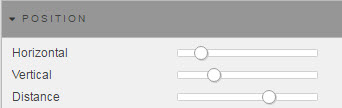

Adjust sliders to orientate the orientation of the 3D Chart

<aside class="warning">Alternatively, go into Preview mode and rotate the 3D Chart. Use the mouse scroll wheel to zoom in and out.</aside>

## Style

### Advanced CSS

Configure chart css

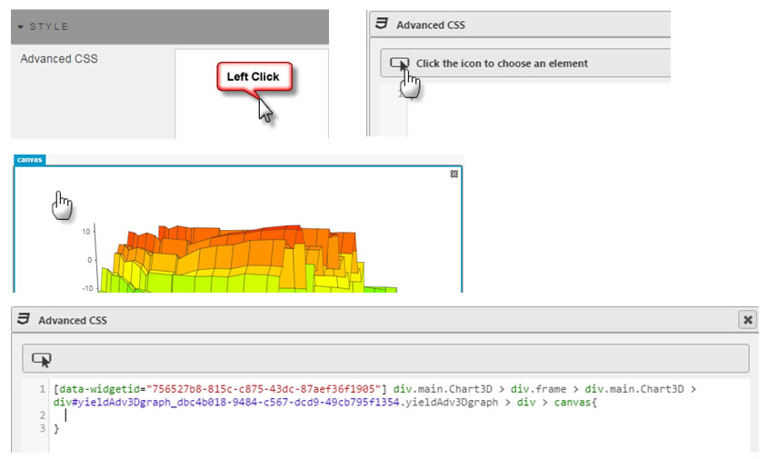

### Custom Tooltip

Set rollover tooltip information

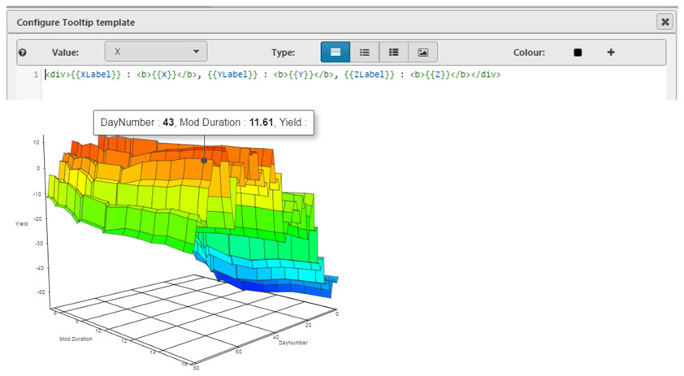

## Format

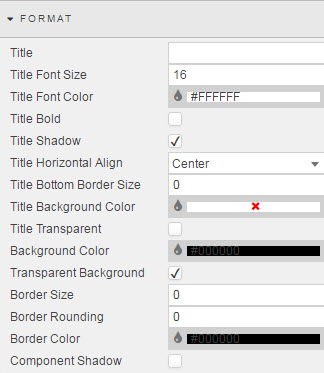

See [Format](introduction.md#format) in Introduction for more.

## Margins

See [Margins](introduction.md#margins) in Introduction for more