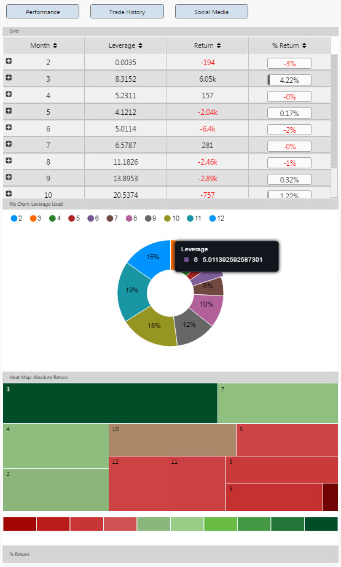
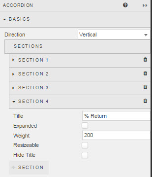
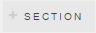
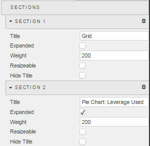
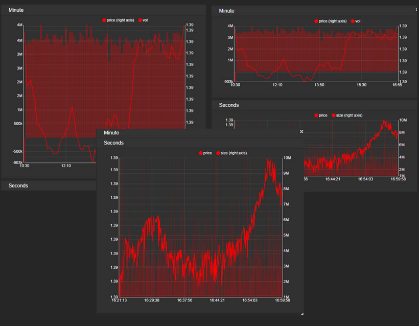
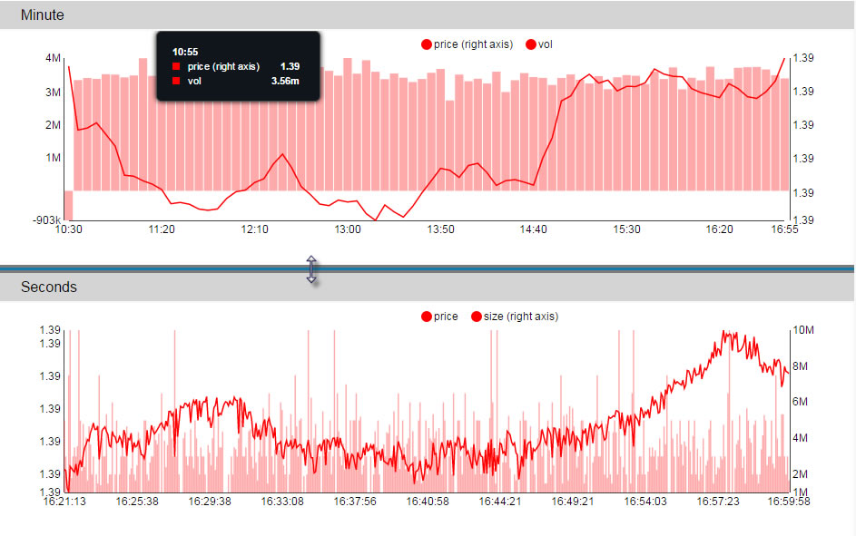
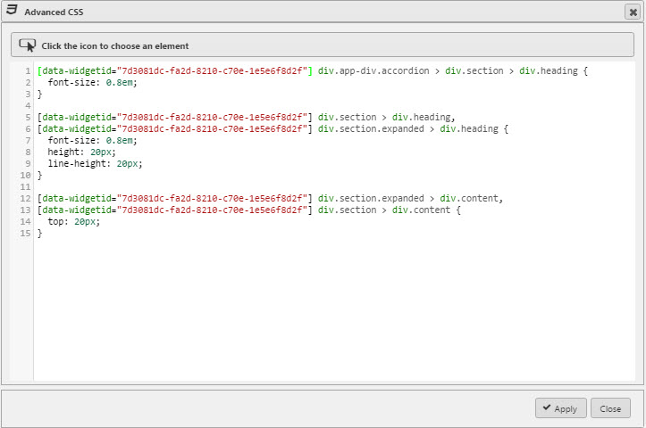
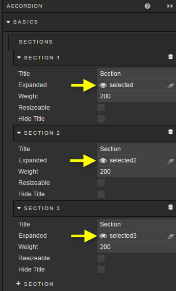
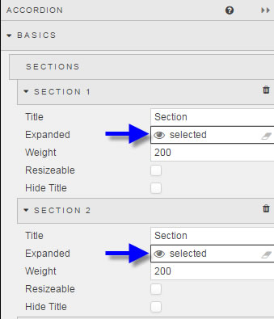

## Basics

Similar to tabs in it supports multiple views in a single component. The accordion component is broken into sections. Each section can hold a single component or [Layout Panel](layout.md). If a [Layout Panel](layout.md) panel is used then multiple components can be displayed inside a single Accordion section.

To create a section, click  

<aside class="admonition caution">Single components added to the accordion component will resize on changes to expanded, full or custom. 
However, if [Layout Panel](layout.md) is used inside an accordion, components added to the Layout panel will not resize for interactions with the accordion unless <i>Fill Height</i> is checked. 
In addition, <i>Advanced Layout</i> should also be checked in the Layout panel when used inside an Accordion Panel.</aside>

Accordion interaction
 

## Sections

Drag-and-drop a component or [Layout Panel](layout.md) into an accordion section

**Title**

Give Accordion section a name

**Expanded**

Check control. When enabled the Accordion will load in its expanded state.

**Weight**

This is a relative sizing measure to determine the viewable area for each section inside the Accordion. 

For example, two sections of <i>Weight</i> '200' will each take up half of the viewable area (200/(200+200)).  A section with <i>Weight</i> of '400' and another of '200' will occupy 66% (400/(400+200)) of the viewable area.

<aside class="admonition caution">If Resizable is enabled, the values of <i>Weight</i>  will change on interaction</aside>

**Resizeable**

If checked, dashboard user will be able to manually adjust section size

**Hide Title**

Removes the "Section" header when checked

## Style

[1] Left-click inside the Advanced CSS.

[2] Click the icon , then click on the Accordion element (a blue highlight will appear around the component)

[3] Add the required CSS

## Margins

See [Margins](introduction.md#margins) in Introduction for more

## Format

See [Format](introduction.md#format) in Introduction for more.

### Linking Two Accordion Behaviours

 

Two or more Accordion components can be linked so an interaction in one will pass to another. 

To do this, assign a [view state parameter](introduction.md#view-state-parameters) to the *Expanded* property. Unlike for linked Tabs, each shared accordion expand/contract behaviour will use the same [view state parameter](introduction.md#view-state-parameters). 
 
More than one section in a single Accordion component can share a behaviour if they use the same [view state parameter](introduction.md#view-state-parameters):

