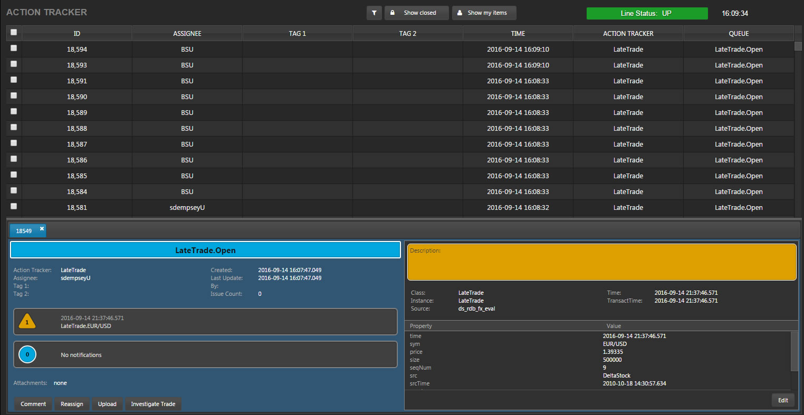
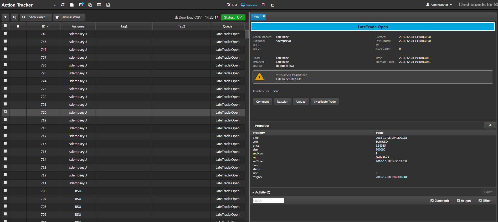
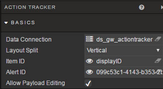
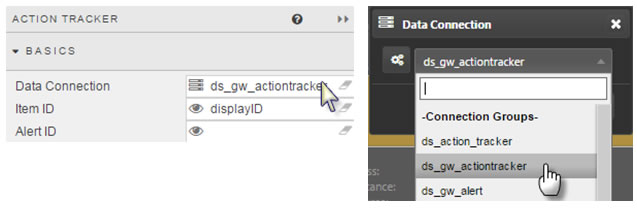
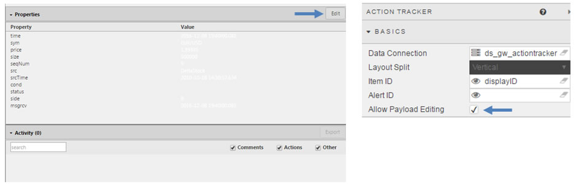
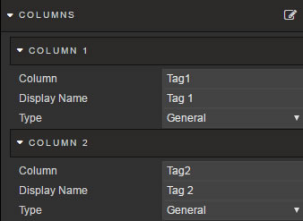
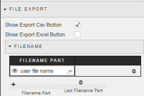
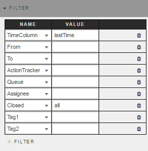
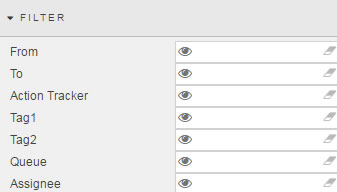
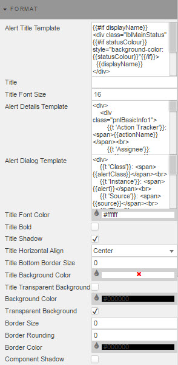

 

  
_Alternative Vertical Layout_

Action Tracker is a self-contained alerting application. Further information on Action Tracker can be found in _Stream for Kx_. <!-- FIXME -->
 

## Basics
 


_Data Connection_
: Select the required connection  


Layout split
: Toggles between vertical and horizontal layouts

_Item ID_
: Create a [View State Parameter](introduction/#view-state-parameters) to use as Item ID
 
_Alert ID_
: Create a [View State Parameter](introduction/#view-state-parameters) to use as Alert ID

_Allow Payload Editing_
: Check to allow users to edit the details of the Alert  



## Columns



_User Defined_
: When checked, the selected column will remain in the Data Grid if the selected column variable is removed from the query. A user-defined query is effectively a ‘lock’ on the column

!!! warning "Watch out"
    If the _User Defined_ column variable is missing in the query, the User Defined column will show as an empty column in the Data Grid

<dt markdown="1">_Data Field Name_</dt>
<dd>
    <p></p>

    <p>When using a wildcard, all dynamic columns derived from a query will use the wildcard column format.  The wildcard can be used in conjunction with text headers; e.g. <code>bid*</code> for both <code>bid</code> and <code>bid_update</code>.</p>
      
    <p>Select the <em>Data Field Name</em> from data columns in the Data Source query.</p>
      
    <p>Additional columns can be added, including wildcard columns. If a wildcard is used, any undefined columns will adopt the properties of the wildcard column; e.g. data alignment, decimal precision etc.</p>

    <p></p>
</dd>

_Display Name_
:   
The name assigned for the column in the Data Grid. This is case sensitive.

<dt markdown="1">_Width (relative)_</dt>
<dd>
    <p></p>
    
    <p>Relative to the width of the Data Grid. The scale is contingent on the values of each column; for example, columns with a relative width of 20, 10, 5, 1 will scale at a column width of 55% (i.e. 20/(20+10+5+1)), 28%, 14% and 3%.</p>
  
    <p>Relative columns will scale according to the browser size.</p>
  
    <p></p>
</dd>

_Minimum Width (pixels)_ 
: Minimum width in pixels for a column. Columns using _Minimum Width (pixels)_ will scale according to browser size. 

_Text Align_
: Alignment of values inside Data Grid.  


_Sortable_
:   
When checked, users clicking on a column header will toggle between ascending and descending sort. 

_Format_
: Select formatting for data type in column. If `DateTime` is selected, then either a _Date Format_ or _Time Format_ must also be selected.  


_Precision_
: The number of decimal places used for numeric data.

_Hide Trailing Zeroes_
: Suppresses the display of trailing zeros  
 


_Currency Symbol_
:   
Adds a currency symbol prefix to column data    
 

<dt markdown="1">_Date Format_</dt>
<dd>
    <p>Combination Date and Time Format. Ensure either a Date or DateTime format is selected.</p>
    <p></p>
    <p></p>
</dd>

Select date format
: 
  
_Time Format_
: Select time format. Ensure Time or DateTime Format is selected.    


<dt markdown="1">_Min Value Color_</dt>
<dd>
    <p></p>
    <p>Selection will place a color border highlight around the lowest value in the column</p>
    <p></p>
    <p>To remove, click again on the color and select <em>No Color</em> from the palette tool.</p>
    <p></p>
</dd>

<dt markdown="1">_Max Value Color_</dt>
<dd>
    <p></p>
    <p>Selection will place a color border highlight around the lowest value in the column</p>
    <p></p>
    <p>To remove, click again on the color and select <em>No Color</em> from the palette tool.</p>
    <p></p>
</dd>

<dt markdown="1">_Range Color_</dt>
<dd>
    <p></p>
    <p>Applies a selected colour gradient across all cells in a column. Assigning a color will automatically apply the Range Color.</p>
    <p></p>
    <p>To remove, click again on the color and select <em>No Color</em> from the palette tool.</p>
    <p></p>
</dd>

<dt markdown="1">_Percentage Color_</dt>
<dd>
    <p></p>
    <p>Adds a mini-bar in Percentage formatted data. The proportion of the bar filled runs from 0 to 100%. To enable set <em>Format</em> to <em>Percentage</em></p>
    <p></p>
    <p>Select a colour to use for the bar.</p>
    <p></p>
    <p>To remove, click again on the color and select <em>No Color</em> from the palette tool.</p>
    <p></p>
</dd>

!!! Tip "View State Parameters as colors"
    Any of _Min Color_, _Max Color_, _Range Color_ and  _Percentage Color_ can be a View State Parameter.

    To assign a View State Parameter, roll over the end of the input bar until  appears, then click to assign. 

_Read Only_
: Checked columns cannot be edited

<dt markdown="1">_Template_</dt>
<dd>
    <p><br/>
    <em>Templating help</em></p>
    <p>Template allows for richer customisation of columns. In this example, information from two columns (<em>URL</em> and <em>Name</em>) is merged together to form an active link:</p>
    <p></p>
    <p></p>
</dd>

_Hidden_
: Hide display of column in Action Tracker grid


## File Export



_Show Export CSV Button_
: Check to enable export of content as CSV

_Show Export Excel Button_
: Check to enable export of content in Excel format

_Filename_
: Add filename details to export of CSV/Excel files


## Filter



Assigns a [View State Parameter](introduction.md#view-state-parameters) to each of the listed filters




## Highlight Rules

Used to apply color updates to notify users of changes in Data Grid values


_Name_
: Name of the rule

_Target_
: Select the Data Grid column to which the rule will apply. It can be any column; it does not have to be the column which is using the operator.

_Condition Source_
: The data series on which the trigger is measured

_Condition Operator_
: Select a rule operation, including greater- and less-than, not-equal-to, exactly-equal-to, and text-contains alerts

_Condition Value_
: The value threshold that will trigger the alert.  Default is _previous value_

_Color_
: The cell text-color change when rule is true

_Backround Color_
: The cell background-color change when rule is true. 

_Border Color_
: The cell border-color change when rule is true

_Icon_
: An icon to appear when rule is true

_Icon Color_
: The color for the icon (if used) when rule is true  


## Format



_Alert Title Template_
: Included CSS for _Alert Title_

_Alert Details Template_
: Included CSS for _Alert Details Panel_

_Alert Dialog Template_
: Included CSS for _Alert Dialog Panel_

<i class="fa fa-hand-o-right"></i> [Component style](style/#component-style) for more on Title and Border configuration.

## Virus scanning

Files uploaded via the File Upload dashboard component or attachments uploaded via the Action Tracker may be screened for viruses.

There are two prerequisites for enabling virus scanning:

1. ClamAV must be installed on the appserver box with up to date definitions.
2. In delta.profile, enable virus scanning as follows:  
`DELTAAPPSERVER_VIRUS_SCAN_ENABLED=true`

The appserver must be restarted in order to pick up any changes to the above environment variable.

To verify whether virus scanning has been enabled, check the running tomcat process 
```bash
using ps -ef | grep tomcat
```
and look for 
```bash
-DdeltaAppServerVirusScanEnabled=true
```
or
```bash
-DdeltaAppServerVirusScanEnabled=false
```
With virus scanning enabled, uploaded files will automatically be scanned and, if they fail the virus check, the upload is aborted and an error will be reported on the dashboard.
