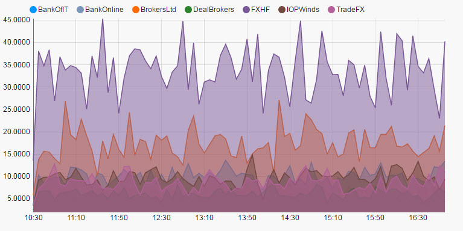
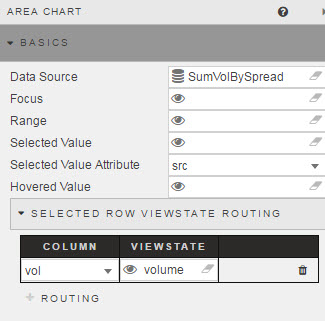
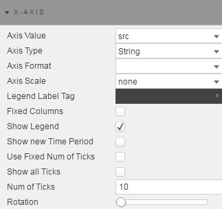
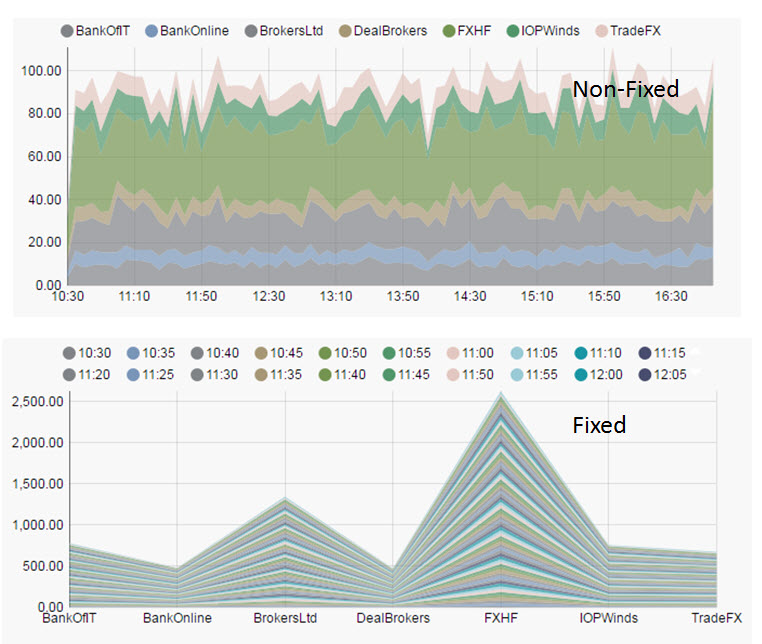
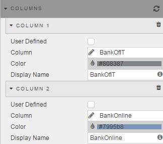
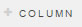
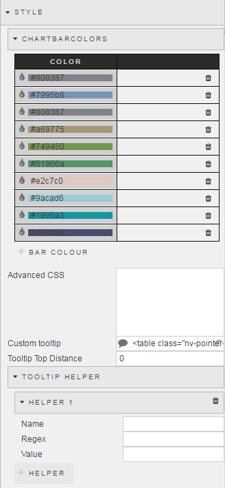
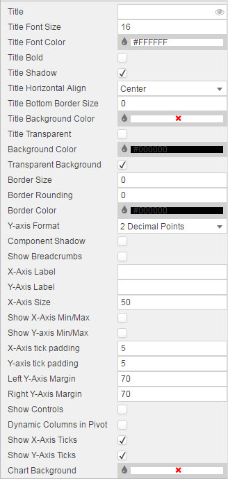

### Basics



### Data Source

See [Defining a Query](introduction.md#defining-a-query) and [Analytics](introduction.md#analytics) for more on data sourcing.

### Focus 

Used for [linking components](introduction.md#linking-components). Requires a [view state parameter](introduction.md#view-state-parameters).

### Range

Similar to **Focus**, instead the assigned [view state parameter](introduction.md#view-state-parameters) is used to link a [range slider](rangeslider.md) to the chart.

### Selected Value 

Used to map a chart (query) data point to a [view state parameter](introduction.md#view-state-parameters) when a chart bar is clicked by the user. 

[1] Create a [view state parameter](introduction.md#view-state-parameters) and assign to <i>Selected Value</i>
 


[2] Go to <a href="#selected-value-attribute">Selected Value Attribute</a> to select a query variable to store in the Selected Value View State Parameter.

### Selected Value Attribute

This comes from the Data Source and is the variable paired with the <a href="#selected-value">selected value</a> [view state parameter](introduction.md#view-state-parameters). 


<aside class="admonition caution">When mapping <i>Selected Values</i> to <i>Selected Value Attribute</i>, ensure the <i>Data Type</i> of the View State Parameter matches the <i>Data Type</i> of the <a href="#data-source">Data Source</a>; e.g. integer for numbered data </aside>

### Selected Row ViewState Routing

The aforementioned <a href="#selected-value">Selected Value</a> and <a href="#selected-value-attribute">Selected Value Attribute</a> handles a single data map. <a href="#selected-row-viewstate-routing">Selected Row Viewstate Routing</a> supports multiple mappings between <a href="#selected-value">Selected Values</a> and <a href="#selected-value-attribute">Selected Value Attributes</a>.


To add a row, click 

### Hovered Value

Assign a [view state parameter](introduction.md#view-state-parameters). Stores the value of the X-Axis (usually date or time).
 
## X Axis



**Axis Value**

Sets which query column variable will be used as the x-axis chart label


**Axis Type**

Sets the data type for the label used for **X-Axis Value**


<aside class="admonition caution">If x-axis labels are looking incorrect, try selecting a different <b>Axis Type</b></aside>

**Axis Format**

Where **Axis Type** is Date, **Axis Format** will show a list of display options


<aside class="admonition caution">Axis Format requires <b>Axis Type</b> of type <i>Date</i></aside>

**Legend Label Tag**

Coming soon

**Fixed Columns**

Check to toggle chart between standard chart scale and fixed (transposed) chart view.



**Show Legend**

Toggles display of chart legend


**Show new Time Period**

Ensures the latest data point of a time sequence is displayed

**Use Fixed Num of Ticks**

Toggles control to use **Num of Ticks**

**Show All Ticks**

Displays every charted data point in the x-axis

**Num of Ticks**

The number of ticks to display in the x-axis if **Use Fixed Num of Ticks** is checked

**Axis Rotation**

Rotate x-axis label


### Columns



To add a column, select 

**User Defined**
  
A 'read only' lock of the column.

<aside class="admonition caution">Helps if working with multiple copies of a chart and are changing <a href="#data-sources">Data Sources</a>.  Locking the column will preserve formatting even if the listed <i>Column</i> source isn't referenced in a changed <a href="#data-sources">data source</a>.</aside>

**Column**

The charted value from the **Data Source** 

**Color**

Select from color palette or use Hex color reference

<aside class="admonition caution">If charting Pivot/OLAP data, charting colors will be selected from <a href="#style">Style</a> menu.</aside>

**Display Name**

The charted variable name to display in the Y-axis

## Zoom/Pan 


**Pan On**

Check control to switch Zoom and Pan functionality on


**Type**

Select between drag-to-select <i>Zoom</i>, or <i>Pan</i> control

**Zoom Select Color, Opacity and Border**

Selects the background color, background color opacity and the border for the selected area. 

**Min and Max Zoom**


Set [view state parameter](introduction.md#view-state-parameters) for to store the range value for <b>Min and Max Zoom</b>

**Mouse Pan**

Check to select mouse pan control; best used on real-time time series data 

**Mouse Pan Interval and Type**

Set time pan control for chart; chart will move in timed sections.


## Style

Configure Pivot line colors, CSS and Custom Toolbar



### ChartBarColors

Sets bars color and order for Pivot/OLAP chart. 

Colors can be set using Hex reference or by clicking on the color bar and selecting from the pop-up palette. 

### Advanced CSS

Left click inside the Advanced CSS editor. Click the selector icon, then left-click inside the chart component to bring up the relevant CSS code. Add changes to your css as required. 


### Custom Tooltip

Step 1: Create View States for items in tooltip


Step 2: Add a html tag for View States (using handlebars)


Step 3: Chartview


Tooltips can use View State Parameters which have been mapped to Data Source variables


In the Configure Tooltip template, add html tags for the View State Parameters to display (using handlebars) 

If viewstate parameter = *param1*

Add a table cell with *param1* viewstate to tooltip with the tag:  <td>{{obj.param1}}</td>


Tool tip will appear as: 


**Tooltip Top distance**

Sets distance from mouse in pixels at which tooltip appears

### Tooltip Helper

Tooltip Helper


Apply Tooltip Helper Variable to Tooltip reference


Tooltips use <a href="http://handlebarsjs.com/">Handlebars.js</a> so variables can be added dynamically to tooltip.

For example:
 
```
{{fx}} : {{volume}}
```

could appear as
EUR/USD: 250000

To format "250000" so it will appear as "$250,000" use Tooltip Helper

**Name**

Give the function a name.  This name will be used inside the tooltip.

For example:


```
{{fx}} : {{fd volume}}
```

**Regex**

The regular expression used to find the required pattern

In this example:

```
(\d{3})(?=\d)
```

**Value**

The value to replace the text with. In this case, comma-delimited currency values: 

```
$1,
```

## Format



See [Format](introduction.md#format) in Introduction for more on shared formatting options. Additional formatting specific to horizontal bar charts is detailed below

**Y-Axis Format**

Configures the number of decimal places used in a numeric X-Axis.


**Is Grouped**

When checked, data will be independently charted across the y-axis. If unchecked, y-axis categories will be stacked


**Show Controls**

When checked, Users will have the ability to toggle between Grouped and Stacked Chart views with a menu option in the top-left of the chart


<aside class="admonition caution">
In addition to user-controlled group and stack controls are individual toggles for charted data points. Click inside the chart legend icon to switch selected data chart view on or off.
</aside>


**Stacked as %**

Stacked as Percentage Checked On
 


Stacked as a Percentage Checked off


<aside class="admonition caution">When viewing a Stacked Chart; i.e. when <a href="#is-grouped">Is Grouped</a> is unchecked or a User uses the charting controls to select Stacked view, the stacked chart view will change.</aside>

**Show Stacked Labels**

When checked, displays stacked values in chart as configured in <a href="#data-source">Data Source</a>. If <a href="#stacked-as-%">Stacked as %</a> is checked, then values displayed will be percentile values. 


**Y-axis Force Min**

The default chart best-fits data to the axis to maximise visual differnces. It sets the lowest value in your data to the baseline. 


Checking *Y-axis Force Min* will set the Y-axis to use the value entered <a href="#y-axis-min">Y-Axis Min</a>.

**Y-axis Force Max**

As with <a href="#y-axis-force-min">Y-axis Force Min</a> will set y-axis maximum to use <a href="y-axis-max">Y-Axis Max</a> value. 

<aside class="admonition caution">Using <i>Y-axis Force Max</i> may crop chart if y-axis values exceed <i>Y-Axis max</i></aside>

**Y-axis Min**

The defined value will be used if <a href="#y-axis-force-min">Y-axis Force Min</a> is checked.

**Y-axis Max**

The defined value will be used if <a href="#y-axis-force-max">Y-Axis Force Max</a> is checked.

<aside class="admonition caution">Use Y-axis Max to standardize the appearance of neighboring chart components where relative comparisons are important</aside>

**Y-Axis Ticks (best fit)**

Chart will best fit number of displayed y-axis ticks to value set


**X/Y Axis Labels**
  
Adds text labels for x- and y-axis


**X-Axis Size**

Sets the distance between the X-axis and the border of the component. 


Distance between x-axis and line chart

**Show X-axis Min/Max**

Display in the x-axis the min/max values.


**Show Y-axis Min/Max**
 
Display in the y-axis the min/max values.


<aside class="admonition caution">If Y-axis min/max values are used, these will be displayed</aside>

**X/Y Axis Tick Padding**


Defines spacing between x- and y-axis labels to chart x- and y-axis.


**Left/Right Y-Axis Margin**

Distance between Y-Axis and chart component edge

**Y-axis min/max range scale**

Defines the range between min and max values of y-axis


<aside class="admonition caution">If defined range is greater than data range a negative y-axis will be applied</aside>

**Dynamic Columns in Pivot**

Marks if dynamic colums are used for a [pivot query](introduction.md#pivot-query)

**Show X- Y-Axis Ticks**

Toggles the display of chart tick labels

**Auto-New Column**

When a query adds a new column of data, the chart will update to add the new column of data. 

**Chart Background**

Change background color of chart

## Margins

See [Margins](introduction.md#margins) in Introduction for more
