## Basics

Defines Data Source, component linking, and [view state parameters](introduction#view-state-parameters) populated when a chart bar is clicked

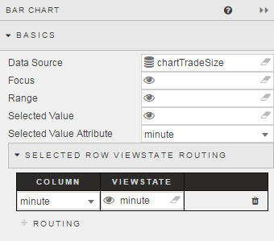

### Data Source

See [Defining a Query](introduction#defining-a-query) and [Analytics](introduction#analytics) for more on data sourcing.

### Focus

Used for [linking components](introduction#linking-components). Requires a [view state parameter](introduction#view-state-parameters).

### Range

Used for linking to a [range slider](rangeslider). Requires a [view state parameter](introduction#view-state-parameters).

### Selected Value 

This is a [view state parameter](introduction#view-state-parameters). It's used to store the clicked-on chart data point to a view state parameter.  

[1] Create a [view state parameter](introduction#view-state-parameters) and assign to _Selected Value_
 


[2] Go to <a href="#selected-value-attribute">Selected Value Attribute</a> to select a query variable to store in the Selected Value View State Parameter.

### Selected Value Attribute

This comes from the Data Source and is the variable paired with the <a href="#selected-value">selected value</a> [view state parameter](introduction#view-state-parameters).  When the user clicks on the chart, the associated query variable will be mapped to the <a href="#selected-value">Selected Value</a> view state.  


!!! Warning "Data Type Match"
    When mapping _Selected Values_ to _Selected Value Attribute_, ensure the _Data Type_ of the View State Parameter matches the _Data Type_ of the <a href="#data-source">Data Source</a>; e.g. integer for numbered data.

### Selected Row ViewState Routing

The aforementioned <a href="#selected-value">Selected Value</a> and <a href="#selected-value-attribute">Selected Value Attribute</a> handles a single data map. <a href="#selected-row-viewstate-routing">Selected Row Viewstate Routing</a> supports multiple mappings between <a href="#selected-value">Selected Values</a> and <a href="#selected-value-attribute">Selected Value Attributes</a>.

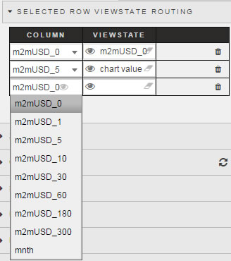

To add a row, click 

## X Axis

Define appearance of the chart X-axis.

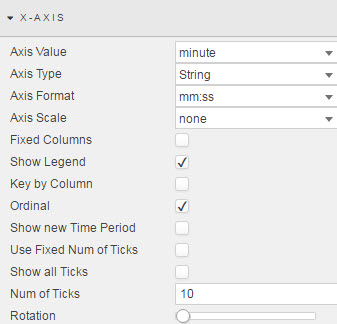

**Axis Value**

Sets which query column variable will be used as the x-axis chart label

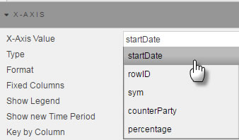

**Axis Type**

Sets the data type for the label used for X-Axis Value

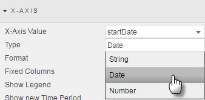

!!! Tip 
    If x-axis labels look incorrect, try selecting a different <a href="#type">Type</a>

**Axis Format**

Used for when <a href="#axis-type">X-Axis Type</a> is of type _Date_.

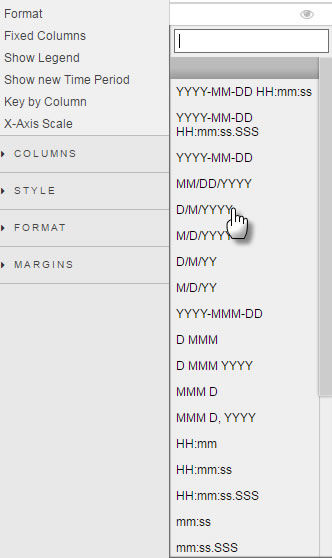

**Axis Scale**

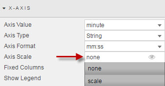

Select no scaling, or use numberic/time scaling depending on selected axis type. 

**Fixed Columns**

Check to toggle chart between standard chart scale and fixed (transposed) chart view.  

**Show legend**

Toggles display of chart legend

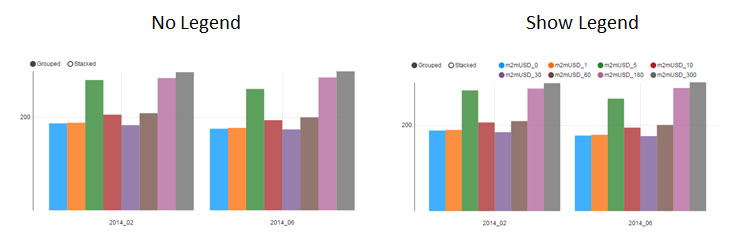

**Key by Column**

Simliar visual to <a href="#fixed-columns">fixed columns</a> except uses x-axis labels for legend labels. 

**Ordinal**

When checked, x-axis will scale by time or numeric sequence

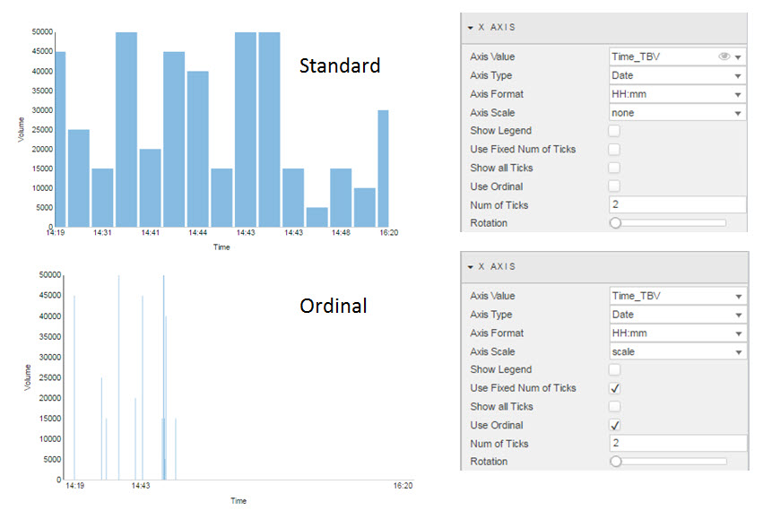

!!! Tip
    Best used when <a href="#axis-scale">Axis Scale</a> is set to _scale_.

**Show new Time Period**

Ensures the latest data point of a time sequence is displayed

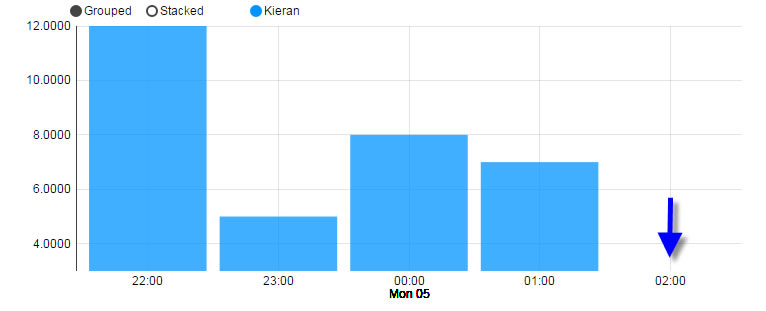

**Use Fixed Num of Ticks**

Toggles control to use _Num of Ticks_

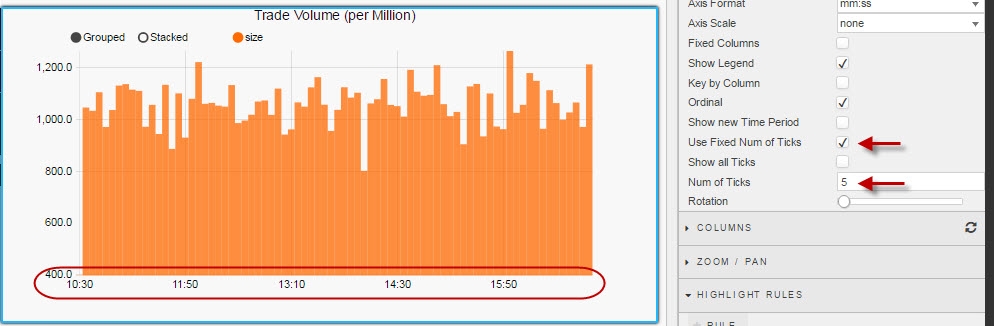

**Show All Ticks**

Displays every charted data point in the x-axis

**Num of Ticks**

The number of ticks to display in the x-axis.

!!! Check 
    Requires a check for <a href="#use-fixed-num-of-ticks">Use fixed num of ticks</a> to enable.

**Axis Rotation**

Rotate x-axis label

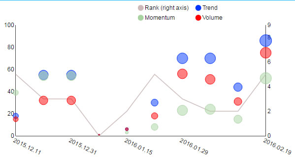

## Columns

Define which data columns from the <a href="#data-source">data source</a> to plot 

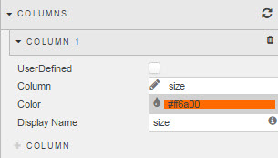 

To refresh the chart to its default (prior saved) state, click the refresh button

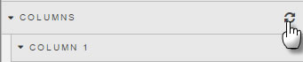

To add a column, click 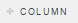

**User Defined**

This is equivalent of a 'read-only' lock and protects against overwrite.

### Column

To select a data column, click inside the Column input box. This will display a list of available data to choose.
 
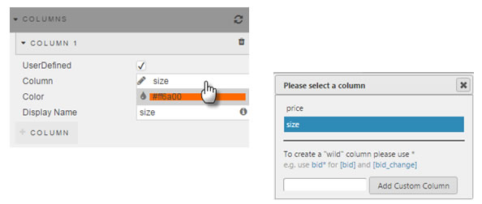

**Wildcard query**

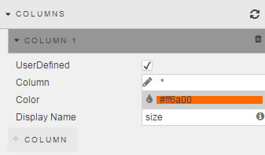

Use the wildcard to group select data. The wildcard can also be used to select partial data sets.

For example, wildcard selection charted the three available data series:

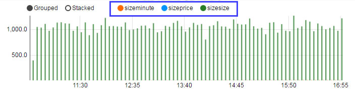

If wildcard is select for column name, all matching columns for the wildcard (e.g: size* matches to _sizeminute_, _sizeprice_, _sizesize_) will share formatting (e.g. color, highlight rules etc.). 

**Color**

Select from color palette or use Hex color reference

!!! Note "Pivot Data Charts"
    If charting Pivot/OLAP data, charting colors will be selected from <a href="#style">Style</a> menu.

**Display Name**

Defines the name used in the chart legend

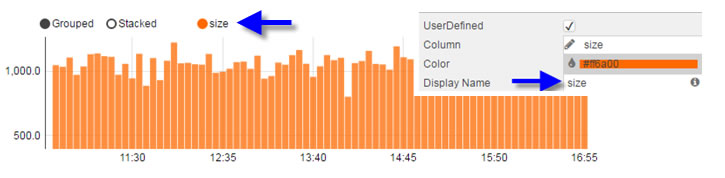

!!! Tip "Wildcard in Display Name"
    If wildcard is used for <a href="#column">Column</a> name, dashboards will instead use the Display Name from the database.

## Zoom/Pan 

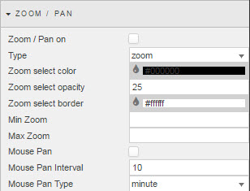

**Pan On**

Check control to switch Zoom and Pan functionality on

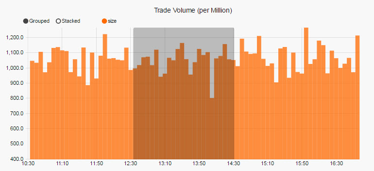

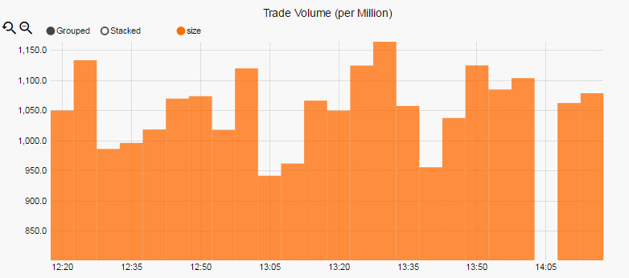

**Type**

Select between drag-to-select _Zoom_, or _Pan_ control

**Zoom Select Color, Opacity and Border**

Selects the background color, background color opacity and the border for the selected area. 

**Min and Max Zoom**

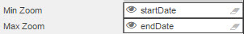

Set [view state parameter](introduction#view-state-parameters) for to store the range value for _Min and Max Zoom_

**Mouse Pan**

Check to select mouse pan control; best used on real-time time series data 

**Mouse Pan Interval and Type**

Set time pan control for chart; chart will move in timed sections.

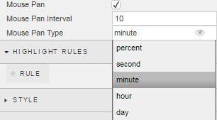

## Highlight Rules

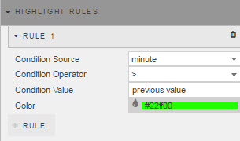

Used to color code bar charts. Best used with real-time streaming or polling data. 

Click on 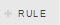 to include additional highlight rules.

**Condition Source**

The dependent variable from the <a href="#data-soruce">data source</a> defining the trigger.

**Condition Operator**

Dropdown menu of rule operations, including greater and less than, not equal to, exactly equal to, and text contains alerts

**Condition Value**

What value threshold will trigger the alert. Typically, this is "previous value" but can be numeric or text (depending on the source data)

**Color**

What color the bar will be when the highlight rule is true. 

## Style

OLAP Bar Color

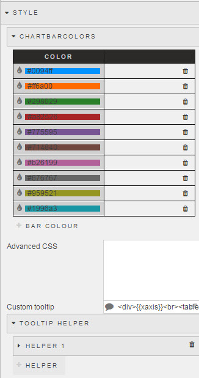

### ChartBarColors

Sets bars color and order for Pivot/OLAP chart. 

Colors can be set using Hex reference or by clicking on the color bar and selecting from the pop-up palette. 

### Advanced CSS

Left click inside the Advanced CSS editor. Click the selector icon, then left-click inside the chart component to bring up the relevant CSS code. Add changes to your css as required. 


### Custom Tooltip

Step 1: Create View States for items in tooltip

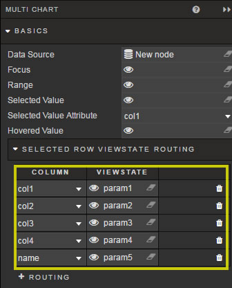

Step 2: Add a html tag for View States (using handlebars)

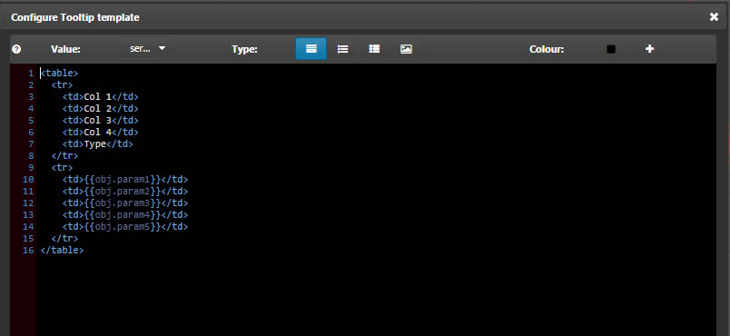

Step 3: Chartview

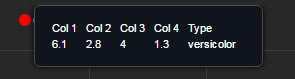

Tooltips can use View State Parameters which have been mapped to Data Source variables

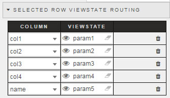

In the Configure Tooltip template, add html tags for the View State Parameters to display (using handlebars) 

If viewstate parameter = `param1`

Add a table cell with `param1` viewstate to tooltip with the tag:  `<td>{{obj.param1}}</td>`

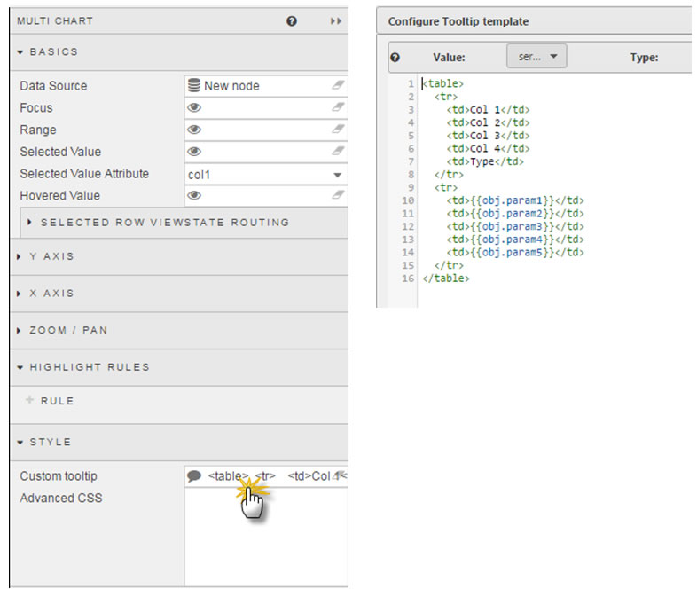

Tool tip will appear as: 

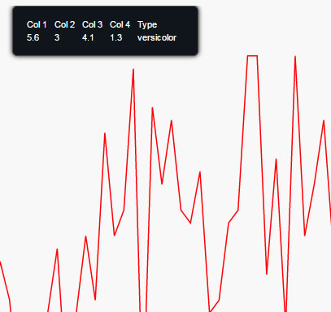

**Tooltip Top distance**

Sets distance from mouse in pixels at which tooltip appears

### Tooltip Helper

Tooltip Helper

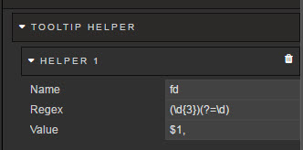

Apply Tooltip Helper Variable to Tooltip reference

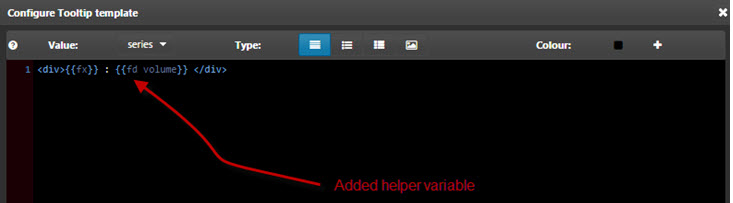

Tooltips use <a href="http://handlebarsjs.com/">Handlebars.js</a> so variables can be added dynamically to tooltip.

For example:
 
```
{{fx}} : {{volume}}
```

could appear as
EUR/USD: 250000

To format "250000" so it will appear as "$250,000" use Tooltip Helper

**Name**

Give the function a name.  This name will be used inside the tooltip.

For example:

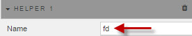

```
{{fx}} : {{fd volume}}
```

**Regex**

The regular expression used to find the required pattern

In this example:

```
(\d{3})(?=\d)
```

**Value**

The value to replace the text with. In this case, comma-delimited currency values: 

```
$1,
```

## Format

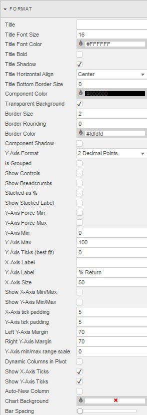

See [Format](introduction#format) in Introduction for more on shared formatting options. Additional formatting specific to bar charts is detailed below

**Y-Axis Format**

Configures the number of decimal places used in a numeric X-Axis.


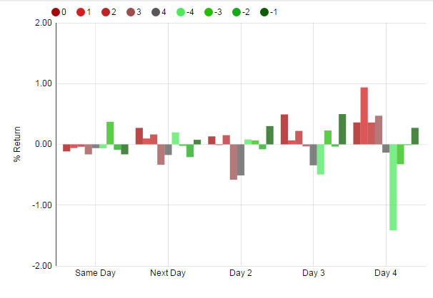

**Is Grouped**

When checked, data will be independently charted across the y-axis. If unchecked, y-axis categories will be stacked

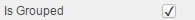

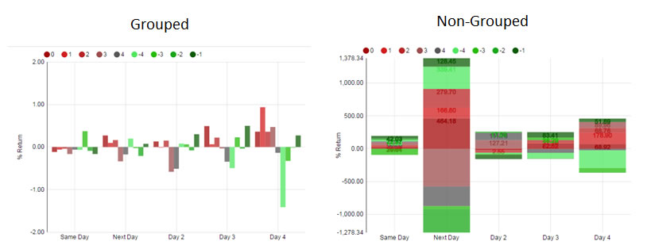

**Show Controls**

When checked, Users will have the ability to toggle between Grouped and Stacked Chart views with a menu option in the top-left of the chart

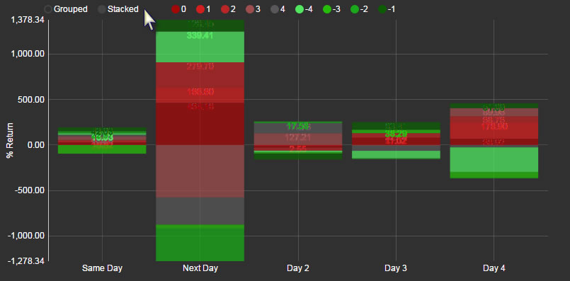

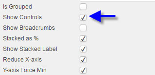

!!! Tip
    In addition to user-controlled group and stack controls, are individual toggles for charted data points. Click inside the chart legend icon to switch selected data chart view on or off.
    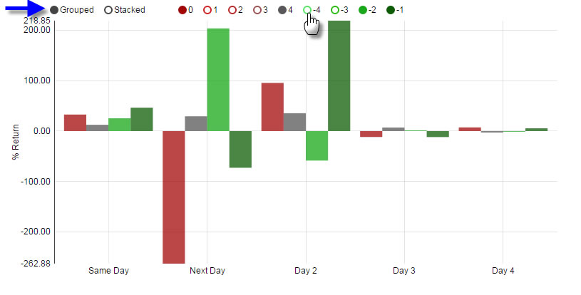

**Stacked as %**

Stacked as Percentage Checked On
 
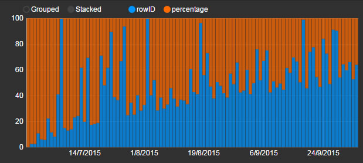

Stacked as a Percentage Checked off

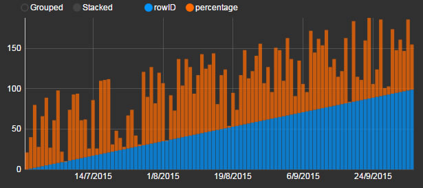

**Show Stacked Labels**

When checked, displays stacked values in chart as configured in <a href="#data-source">Data Source</a>. If <a href="#stacked-as-%">Stacked as a %</a> is checked, values displayed will be percentile values. 

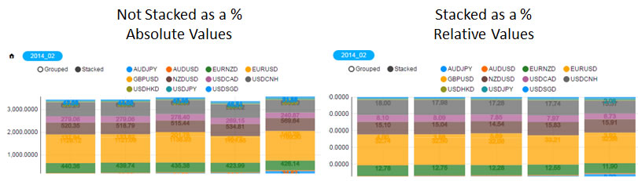

**Y-axis Force Min**

The default chart best-fits data to the axis to maximise visual differnces. It sets the lowest value in your data to the baseline. 

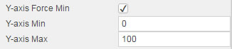

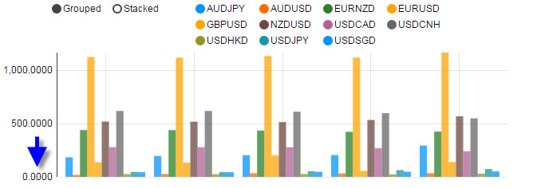

Checking _Y-axis Force Min_ will set the Y-axis to use the value entered <a href="#y-axis-min">Y-Axis Min</a>.

**Y-axis Force Max**

As with <a href="#y-axis-force-min">Y-axis Force Min</a> will set y-axis maximum to use <a href="y-axis-max">Y-Axis Max</a> value. 

!!! Warning "_Max_ set to less than highest value in Y-axis"
    Using _Y-axis Force Max_ may crop chart if y-axis values exceed _Y-Axis max_

**Y-axis Min**

The defined value will be used if <a href="#y-axis-force-min">Y-axis Force Min</a> is checked.

**Y-axis Max**

The defined value will be used if <a href="#y-axis-force-max">Y-Axis Force Max</a> is checked.

!!! Tip
    Use Y-axis Max to standardize the appearance of neighboring chart components where relative comparisons are important.

**Y-Axis Ticks (best fit)**

Chart will best fit number of displayed y-axis ticks to value set

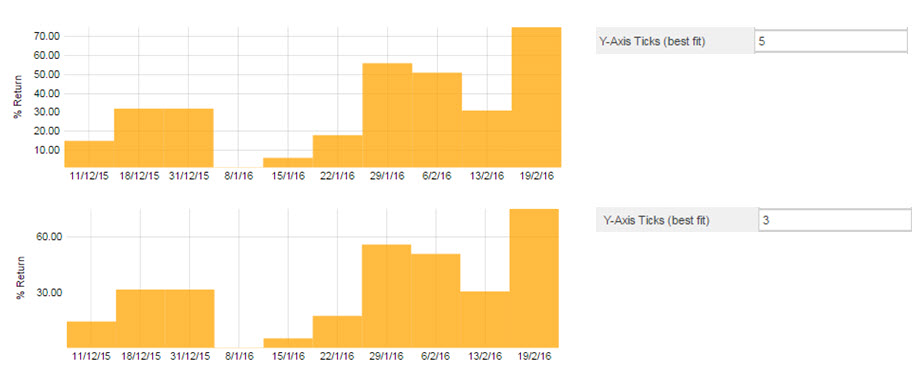

**X/Y Axis Labels**
  
Adds text labels for x- and y-axis

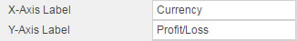


**X-Axis Size**

Sets the distance between the X-axis and the border of the component. 


Distance between x-axis and line chart

**Show X-axis Min/Max**

Display in the x-axis the min/max values.


**Show Y-axis Min/Max**
 
Display in the y-axis the min/max values.


!!! Note "Use of Min/Max"
    Charts will best fit the y-axis, setting the minimum value to the lowest value in the charted y-range. To force zero the Y-axis, use _Y axis Min_

**X/Y Axis Tick Padding**


Defines spacing between x- and y-axis labels to chart x- and y-axis.


**Left/Right Y-Axis Margin**

Distance between Y-Axis and chart component edge

**Y-axis min/max range scale**

Defines the range between min and max values of y-axis


!!! Warning "Out of Range Values"
    If defined range is greater than data range a negative y-axis will be applied

**Dynamic Columns in Pivot**

Marks if dynamic colums are used for a [pivot query](introduction#pivot-query)

**Show X- Y-Axis Ticks**

Toggles the display of chart tick labels

**Auto-New Column**

When a query adds a new column of data, the chart will update to add the new column of data. 

**Chart Background**

Change background color of chart

**Bar Spacing**

Low Bar Spacing


High Bar Spacing


Use the slider control to change the spacing between bars in the Bar Chart.

## Margins

See [Margins](introduction#margins) in Introduction for more