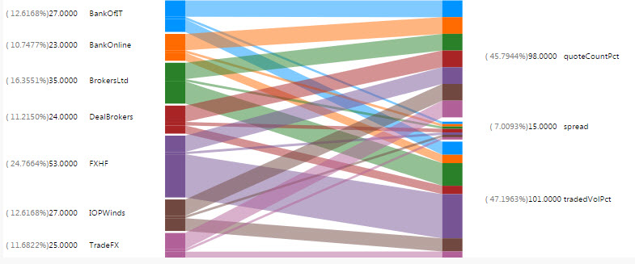

A unique two-way interactive chart featuring two independent data sets and associated relationships. Compatible with Pivot/OLAP data.

### Basics
 
Bipartite Menu

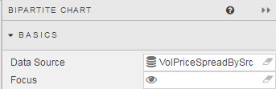

Define **Data Source** and component linkages

### Data Source

See [Defining a Query](introduction#defining-a-query) and [Analytics](introduction#analytics) for more on data sourcing.

### Focus

Used for [linking components](introduction#linking-components). Requires a [view state parameter](introduction#view-state-parameters).

### Right Hand Compare variables

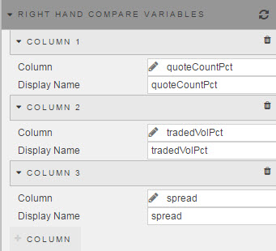

Defines dependent variables for Right-Hand Data Set. Add data columns with 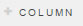

**Column**

Select <a href="#data-source">Data Source</a> variable to include in the right-hand data set

**Display Name**

Display Name for aforementioned _data source_ variable

### Left Hand Compare Group

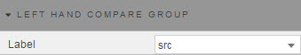
 
Select from <a href="#data-source">Data Source</a> the independent variable to categorize Right Hand data source dependent variables.

## Style

### ChartBarColors

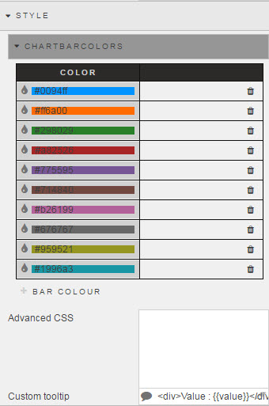

To add a color, click 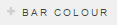

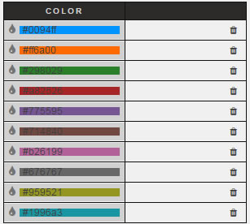

### Advanced CSS

Select to add CSS elements to Bipartite Chart

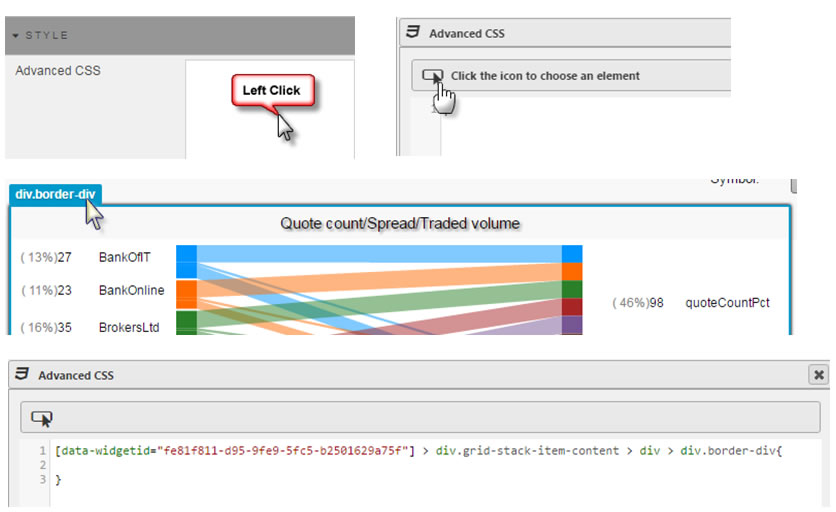

## Format

Bipartite Format

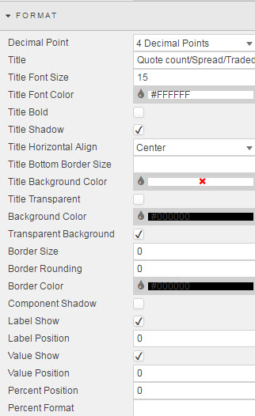

See [Format](introduction.md#format) in Introduction for more on shared formatting options. Additional formatting specific to horizontal bar charts is detailed below

**Component Shadow**

Sets shadow on component

**Label Show**

Check control for left- and right-hand variable labels

**Label Position**

Defines width of gap between numeric and variable text labels

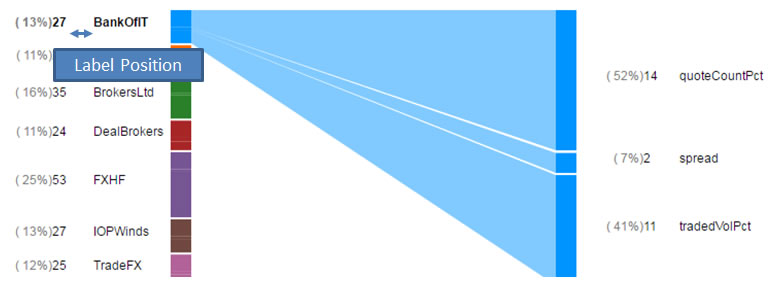

**Value Show**

Check control to display value next to bipartite relative section size

**Value Position**

Defines width of gap between percentage and value 

 

**Percent Position**

Defines width of gap between component edge and percentage value

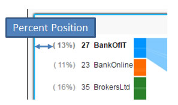
 
**Percent Format**

*Not in Use*

## Margins

See [Margins](introduction#margins) in Introduction for more