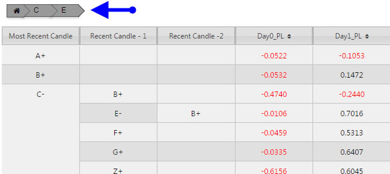
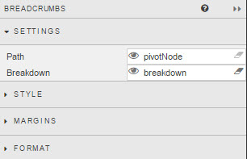
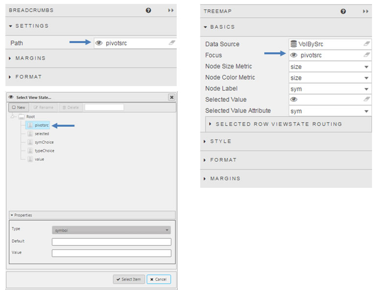

Responsible for controlling Pivot/OLAP navigation

## Settings

_Path_

: Sets the [View State Parameter](introduction#view-state-parameters) shared with the _Focus_ property of components supporting Pivot/OLAP interactions; e.g. charts and [Pivot Grid](pivotgrid).

: 

_Breakdown_

: Assign a [view state parameter](introduction#view-state-parameters) which is shared with the *Breakdown* property of the Pivot/OLAP query; e.g. Charts and [Pivot Grid](pivotgrid).

: 

: 

## Style

1. Left click inside Advanced CSS button

    

2. Select the Breadcrumbs component by first clicking on the  icon in the pop-up dialog and then clicking on the [Playback](playback) component. 

3. Add the required CSS content

<i class="fa fa-hand-o-right"></i> [Styling dashboards](style)
