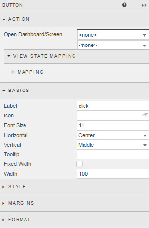
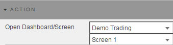
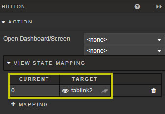
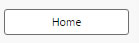
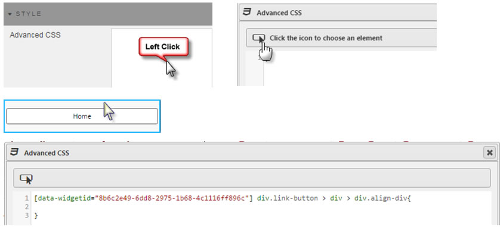

Adds individual button controls for jumps to dashboards and dashboard screens.

## Action

Defines the Dashboard and Dashboard Screen to open on button click.

### View State Mapping

Mapping a value to a View State Parameter (within a dashboard)

 
View State Mapping allows values of View State Parameters from the source dashboard to be transferred to View State Parameters in the destination Dashboard.

!!! Tip
    When mapping View State Parameters across dashboards, it will be necessary to create the Target _View State Parameter_ in the destination dashboard first. Viewstate Mapping can only map to existing View State Parameters; Dashboards will not create them.
 
To add a new Mapping element, click 

## Basics

**Label**

Name to appear on the Button

**Font Size**

Size of font to use the button.

**Horizontal**

Sets alignment (left, center or right) of button inside the boundaries _Button_ component

**Vertical**

Sets alignment (top, middle, bottom) of button inside the boundaries _Button_ component

**Tooltip**

Descriptive tooltip to appear on button rollover

**Fixed Width**

Check box to define width of input box.  If unchecked, button will fill width of _Button_ component box.

**Width**

When _Fixed Width_ is checked, width will define the button size in pixels. 

## Style

Use Advanced CSS to set styles
 

## Margins

See [Margins](introduction#margins) in Introduction for more

## Format

See [Format](introduction#format) in Introduction for more.

