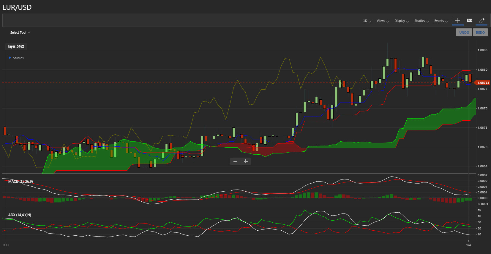
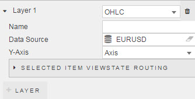
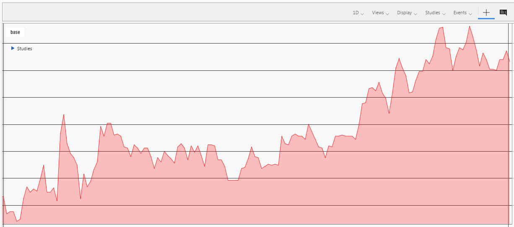
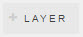
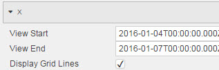
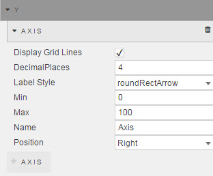
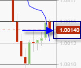
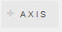
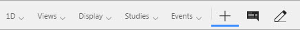
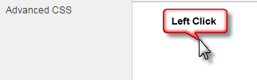

## Layers

Sets <a href="#data-source">Data Source</a> and data type to plot on the chart. More than one data source can be used.

**Layer 1**

Dropdown select of price type. Selecting will update the inputs supported

Type | Description
--- | ---
OHLC | Open, High, Low and Close Candlestick
Line | Single price (open, high, low, close)
Bar | Single price (open, high, low, close)
Mountain | Single price (open, high, low, close), but space between price line and x-axis is filled inputs

_OHLC_

**Name**

Define name of price layer

**Data Source**

See [Defining a Query](introduction#defining-a-query) and [Analytics](introduction#analytics) for more on data sourcing.

**Color**

Set color of chart line

_Line_, _Bar_, _Mountain_

**Name**

Define name of price layer

**Data Source**

See [Defining a Query](introduction#defining-a-query) and [Analytics](introduction#analytics) for more on data sourcing.

**X-Axis Data**

Set data series from <a href="#data-source">Data Source</a> to use as x-Axis.

**Y-Axis Data**

Set data series from <a href="#data-source">Data Source</a> to use as y-Axis data

**Y-Axis**

Define Y-Axis. Can be a [view state parameter](introduction#view-state-parameters)

**Color**

Set color of chart line

**Opacity**

Set opacity (transparency) of price line

### Selected Item Viewstate Routing

Maps Data Columns to [view state parameter](introduction#view-state-parameters)

To add a row, click 

Add an additional layer (<a href="#data-source">Data Source</a>) by clicking 

## Axes

Set price axis

### X

**View Start**

Set start DateTime for the chart. This can be configured to a [view state parameter](introduction#view-state-parameters) and set to a [Range Slider](rangeslider)

**View End**

Set end DateTime for the chart. This can be configured to a [view state parameter](introduction#view-state-parameters) and set to a [Range Slider](rangeslider)

**Display Grid Lines**

Check control to display x-axis gridlines

### Y

**Display Grid Lines**

Check control to display y-axis gridlines

**Display Places**

Set decimal place to display

**Label Style**

Select from Dropdown

Label | Description
--- | ---
roundRectArrow | round rectangle with arrow point
semiRoundRect | round rectangle to the right
roundRect | round rectangle left and right
tickedRect | square rectangle
rect | square rectangle
noop | no label highlight

**Min**

Minimum value for axis

**Max**

Maximum value for axis

**Name**

Name of price axis

**Position**

Set left or right axis.

Add an additional axis by clicking 

## Options

**Display Menu**

Toggles display of user menu

**Layout**

Configure which menu items to keep

: {"interval":"day","periodicity":1,"timeUnit":null,"candleWidth":6.727642276422764,"volumeUnderlay":false,"adj":true,"crosshair":true,"chartType":"candle","extended":false,"marketSessions":{},"aggregationType":null,"chartScale":"linear","panels":{"chart":{"percent":0.512,"display":"layer_10915","chartName":"chart","top":0},"On Bal Vol":{"percent":0.128,"display":"On Bal Vol","chartName":"chart","top":430.08},"Boll %b (20,2,ma)":{"percent":0.15999999999999998,"display":"Boll %b (20,2,ma)","chartName":"chart","top":537.6},"Awesome":{"percent":0.2,"display":"Awesome","chartName":"chart","top":672}},"pandf":{},"symbols":[{"symbol":"layer_10915","symbolObject":{"source":"EURUSD","symbol":"layer_10915","type":"OHLC","xAxisData":"","yAxisData":""},"periodicity":1,"interval":"day","timeUnit":null},{"symbol":"layer_4616","symbolObject":{"source":"OHLC","symbol":"layer_4616","type":"Line","xAxisData":"Date","yAxisData":"Close"},"periodicity":1,"interval":"day","timeUnit":null,"parameters":{"display":"","shareYAxis":true,"symbolObject":{"source":"OHLC","symbol":"layer_4616","type":"Line","xAxisData":"Date","yAxisData":"Close"},"chartName":"chart","chartType":"line","panel":"chart"}},{"symbol":"layer_4950","symbolObject":{"source":"OHLC","symbol":"layer_4950","type":"Line","xAxisData":"Date","yAxisData":"Date"},"periodicity":1,"interval":"day","timeUnit":null,"parameters":{"display":"","shareYAxis":true,"symbolObject":{"source":"OHLC","symbol":"layer_4950","type":"Line","xAxisData":"Date","yAxisData":"Date"},"chartName":"chart","chartType":"line","panel":"chart"}}],"span":null,"studies":{"Bollinger Bands (20,2,ma,y)":{"type":"Bollinger Bands","inputs":{"Field":"field","Period":20,"Standard Deviations":2,"Moving Average Type":"ma","Channel Fill":true,"id":"Bollinger Bands (20,2,ma,y)","display":"Bollinger Bands (20,2,ma,y)"},"outputs":{"Bollinger Bands Top":"#0073ba","Bollinger Bands Median":"auto","Bollinger Bands Bottom":"#0073ba"},"panel":"chart","parameters":{"chartName":"chart","editMode":true}},"ma (50,ma,0,n)":{"type":"ma","inputs":{"Period":50,"Field":"field","Type":"ma","Offset":0,"Underlay":false,"id":"ma (50,ma,0,n)","display":"ma (50,ma,0,n)"},"outputs":{"MA":"#66308f"},"panel":"chart","parameters":{"chartName":"chart","editMode":true}},"ma (200,ma,0,n)":{"type":"ma","inputs":{"Period":"200","Field":"field","Type":"ma","Offset":0,"Underlay":false,"id":"ma (200,ma,0,n)","display":"ma (200,ma,0,n)"},"outputs":{"MA":"#a187bd"},"panel":"chart","parameters":{"chartName":"chart","editMode":true}},"On Bal Vol":{"type":"On Bal Vol","inputs":{"id":"On Bal Vol","display":"On Bal Vol"},"outputs":{"Result":"auto"},"panel":"On Bal Vol","parameters":{"chartName":"chart","editMode":true}},"ma (20,Result On Bal Vol,ma,0,n)":{"type":"ma","inputs":{"Period":"20","Field":"Result On Bal Vol","Type":"ma","Offset":0,"Underlay":false,"id":"ma (20,Result On Bal Vol,ma,0,n)","display":"ma (20,Result On Bal Vol,ma,0,n)"},"outputs":{"MA":"#FF0000"},"panel":"On Bal Vol","parameters":{"chartName":"chart","editMode":true}},"Boll %b (20,2,ma)":{"type":"Boll %b","inputs":{"Field":"field","Period":20,"Standard Deviations":2,"Moving Average Type":"ma","id":"Boll %b (20,2,ma)","display":"Boll %b (20,2,ma)"},"outputs":{"%b":"auto"},"panel":"Boll %b (20,2,ma)","parameters":{"studyOverZonesEnabled":true,"studyOverBoughtValue":100,"studyOverBoughtColor":"#ea1d2c","studyOverSoldValue":0,"studyOverSoldColor":"#8ec648","chartName":"chart","editMode":true}},"Awesome":{"type":"Awesome","inputs":{"id":"Awesome","display":"Awesome"},"outputs":{"Increasing Bar":"#8ec648","Decreasing Bar":"#ea1d2c"},"panel":"Awesome","parameters":{"chartName":"chart","editMode":true}}}}

## Style

[1] Left click inside Advanced CSS button

[2] Select the chartIQ component by first clicking on the  icon in the pop-up dialog and then clicking on the chartIQ component. 

[3] Add the required CSS content

## Format

See [Format](introduction#format) in Introduction for more.

## Margins

See [Margins](introduction#margins) in Introduction for more
