The Configuration Manager supports user-configurable parameter settings; e.g. for alerts.

The Manager features a navigation panel on the left with details of the selected Parameter listed in the Data Grid to the right.

Double-click a cell to change the value of the parameter

_Export CSV_
: Exports contents of the Data Grid as a CSV

_Import CSV_
: Imports CSV content to the selected Parameter

_Add Row_ 
: Add an additional row for content to the selected Parameter

_Move up_ 
: Move the selected row up one step

_Move down_ 
: Move the selected row down one step

_Duplicate_ 
: Duplicate selected row in the Parameter grid

_Delete_ 
: Delete selected row in the Parameter grid

_Revert_ 
: Undo last Parameter change

_Save_ 
: Save changes made to the Parameters

_Switch View_ 
: Transposes the table view columns-to-rows; rows-to-columns

!!! Tip "Save!"
    When adding a description to your Parameter remember to save the description before switching to another view to ensure updates are not lost.

## Parameter Groups

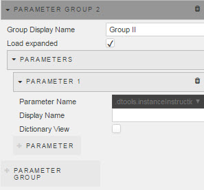

_Group DIsplay Name_
: Add a Parameter Group and name it

_Load expanded_ 
: Check if the Alert Group is to auto-display associated Parameters on load.

    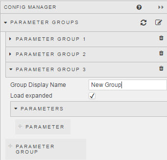

### Parameter

Select a parameter to configure:

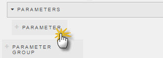

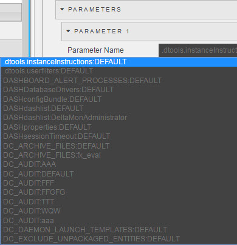

_Display Name_
: Name to be displayed in the Navigation Panel

_Dictionary View_
: Check to view the Parameter as a dictionary. 

    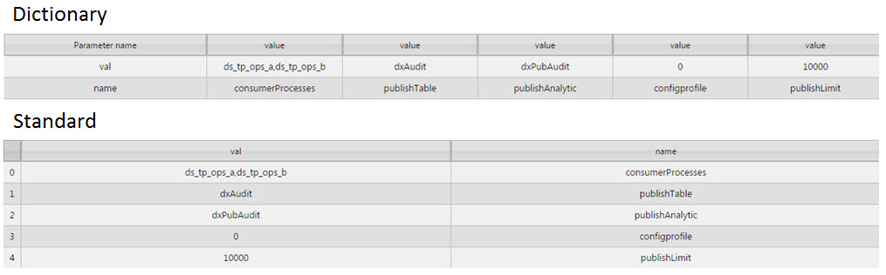

## View

The View menu customizes the appearance of the Configuration Manager

### Tabbed View

: 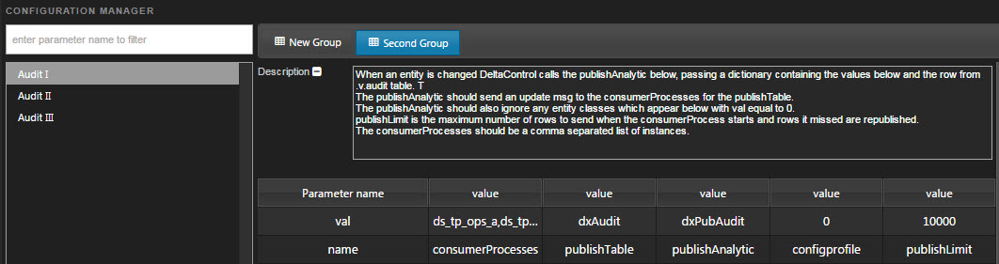  
_A tabbed view_

: Depending on the _Tab Source_ selected, orders either the Parameter Groups or nested Parameters into tabs, listing the nested Parameters or Parameter Groups in the left-hand navigation panel.

_Show Description by Default_
: Toggles the display of the description for the Parameter

## Grid Options

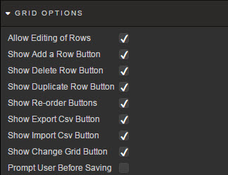

A list of check boxes to set which controls are available to the user

Option | Effect
------ | ------
_Allow Editing of Rows_ | User click-and-edit of a row
_Show Add a Row Button_ | 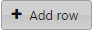
_Show Delete Row Button_ | 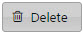
_Show Duplicate Row Button_ | 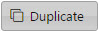
_Show Re-order Buttons_ | 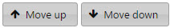
_Show Export CSV Button_ | 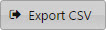
_Show Import CSV Button_ | 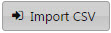
_Show Change Grid Button_ | 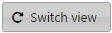

## Style

1. Left click inside Advanced CSS button

    

2. Select the Config Manager component by first clicking on the  icon in the pop-up dialog and then clicking on the Config Manager component. 

3. Add the required CSS content

<i class="fa fa-hand-o-right"></i> [Style](style)

