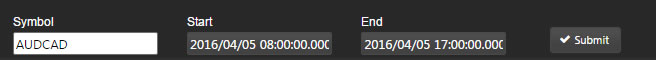

The Data Form component quickly converts [view state parameter](introduction#view-state-parameters) inputs from a _Data Source_ query into user configurable inputs for the dashboard. All that is required for the Data Form component is the <a href="#data-source">Data Source</a>

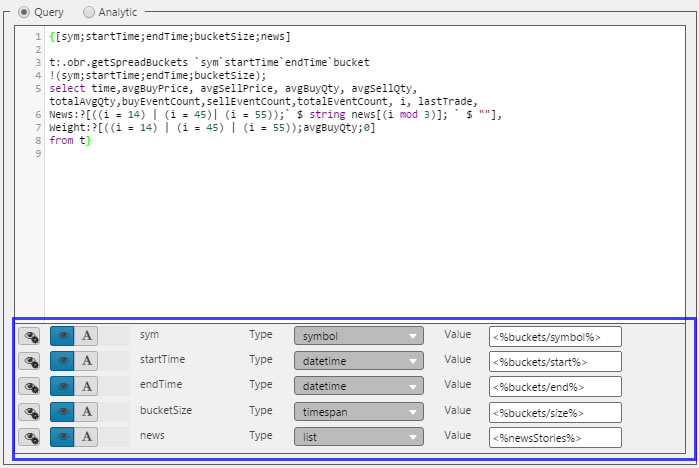

## Basics

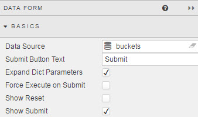

Configuration options

### Data Source

See [Defining a Query](introduction#defining-a-query) and [Analytics](introduction#analytics) for more on data sourcing.

**Expanded Dict Parameters**

When checked, a <a href="#data-source">Data Source</a> using dictionary type [view state parameter(s)](introduction#view-state-parameters), will expand out the dictionary inputs.

**Show Reset**

Includes a reset to return [view state parameter](introduction#view-state-parameters) to default values.

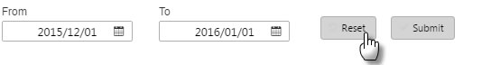

**Show Submit**

Includes a submit button which allows a range of [view state parameter](introduction#view-state-parameters) to be updated before applying the values to the connected <a href="#data-source">Data Source</a>.

!!! Note "No Submit button?"
    If there no _Show Submit_ button, each change of a [view state parameter](introduction#view-state-parameters) will be applied to the connected _Data Source_. Use a Submit button if multiple inputs are required/preferred before sourcing from the database.

### View State Parameters

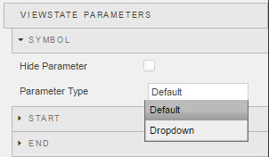

**Hide Parameter**

Hide the input. Prevent user updates of variable

**Parameter Type**

Select if the input for the <a href="#data-source">Data Source</a>[view state parameter](introduction#view-state-parameters) is a user input box or a dropdown.

### Set View State on Submit

The Data form pulls [view state parameter](introduction#view-state-parameters) inputs from the _Data Source_ [view state parameter](introduction#view-state-parameters). Setting a _View State on Submit_ allows for non-Data Source view state parameters to be set when the Submit button is submit.

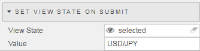

!!! Tip
    This view state control is best used for boolean switches; e.g. expanding an Accordion section containing a result output from a Data Form submit. 

## Style

**Advanced CSS**

Configure customisation options for **Data Form** component

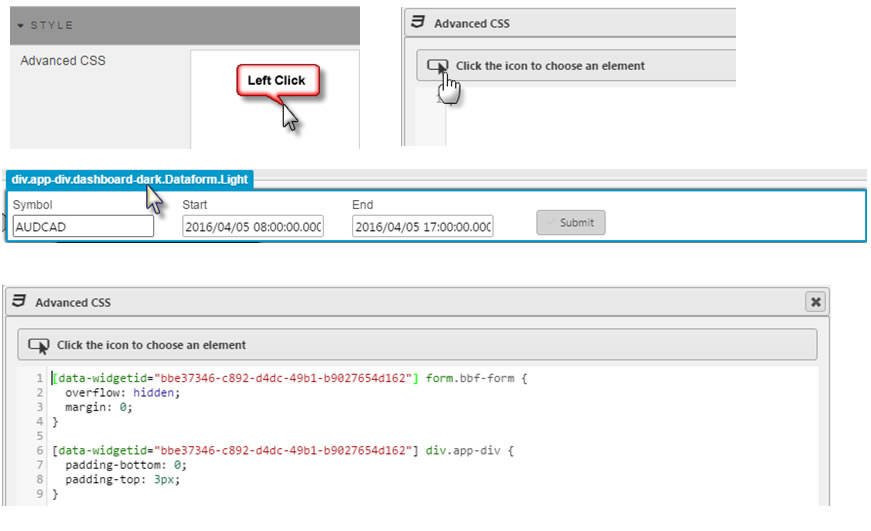

**Display**

Dropdown choice of options 

Selection | Configuration
--- | ---
Default | 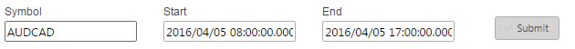
Inline-Block | 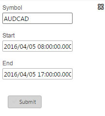
Inline | 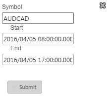
Flex | 
Table | 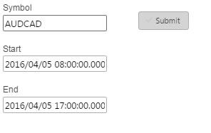

**Minimum Width**

Slider sets the width of the _Data Form_ input box. 
 
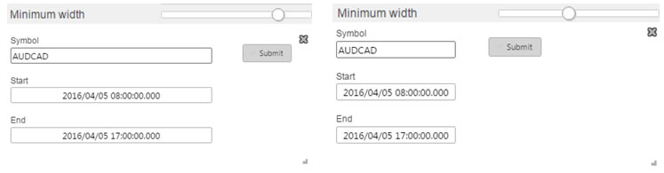

## Format

See [Format](introduction#format) in Introduction for more.

## Margins

See [Margins](introduction#margins) in Introduction for more