## _Basics_

The key element is the <a href="#data-source">Data Source</a>, where the query or analytic is defined. 

Also includes setting switches for search, filtering, editing cells, insert and delete rows, sorting, grouping and custom column display.

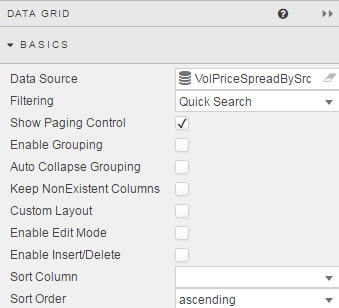

### _Data Source_

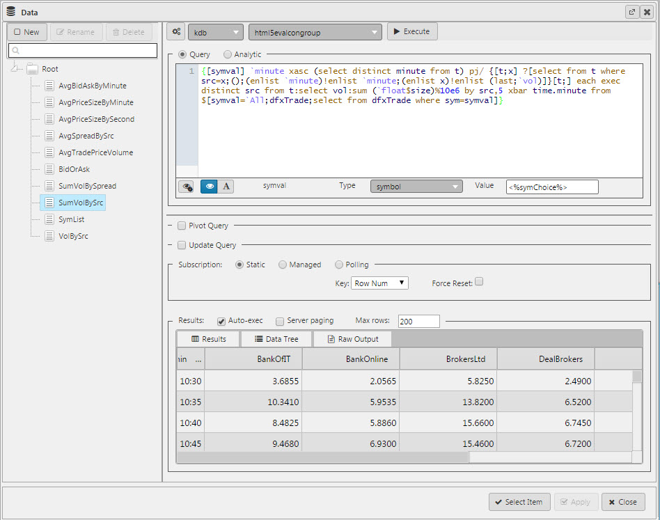

Defines the source data to display in the Data Grid. See [Defining a Query](introduction#defining-a-query) and [Analytics](introduction#analytics) for more on data sourcing.

### _Filtering_

Three types of filtering are available:

_Quick Search_
: 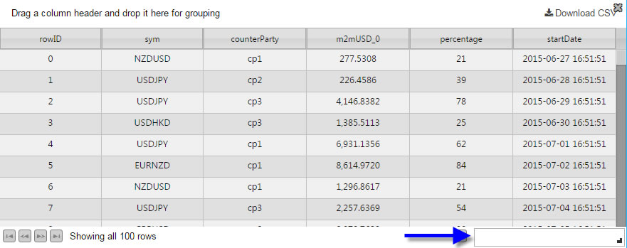

_Column Filters_
: 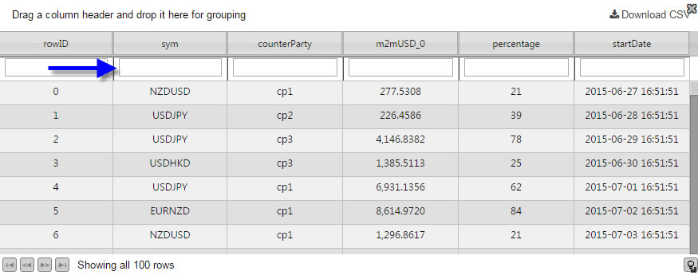

_Disabled_ 
: No filters

### _Show Paging Control_

Toggle display of pagination controls. Used for large data sets.

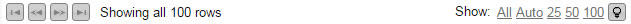

### _Enable Grouping_

Users can group data together. Subtotals can be applied with [_Summary Row For Groupings_](datagrid#summary-row-for-groupings)

### _Auto Collapse Grouping_

When the Dashboard is loaded, data grid groupings will be in collapsed form. Grid groupings are configured in [_Grouping Columns_](datagrid#grouping-columns)

### _Keep NonExistent Columns_

Use of non-existent columns is employed when working with a large number of queries. If a <a href="#data-source">Data Source</a> is changed, the prior column configurations from the original <a href="#data-source">_Data Source_</a> will be kept if this control is checked. 

Dynamic queries which have don’t have fixed column definitions can check the _Keep NonExistent Columns_ to retain configuration options; e.g. column formatting. In this scenario, the `*` would be used in the _Data Field Name_      

### _Custom Layout_

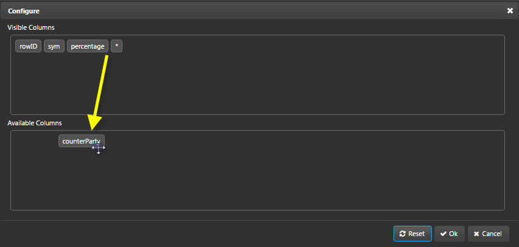  
_Configuration menu_

!!! warning "All columns are available to users"
    The user configuration will pick up all available columns from the <a href="#data-source">Data Source</a> query. Don't enable User Configuration if there are columns to remain hidden from users. 

When checked, a Configuration menu will appear in the Data Grid. 

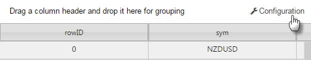

Users can change the display of columns in the Data Grid
  
'Hidden' columns will in the "Available Columns" list. This may not be desirable if a hidden column is used to store a calculation or is used for a highlight rule opertor not for display to the User. For these Data Grids it may be necessary to disable Custom Layout.

!!! Note
    User configuration will be saved on exiting the dashboard and will be available on next login.

### _Enable Edit Mode_

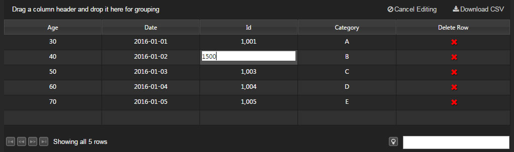

Used in conjunction with [Update Query](introduction/#update-query).

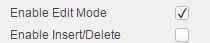 

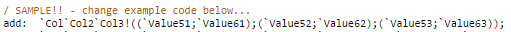 

When in the Dashboard Builder’s Preview or Quickview mode, click _Edit_ to enable the functionality; _Submit Changes_ when done or _Cancel_ to reject. 

### _Enable Insert/Delete_

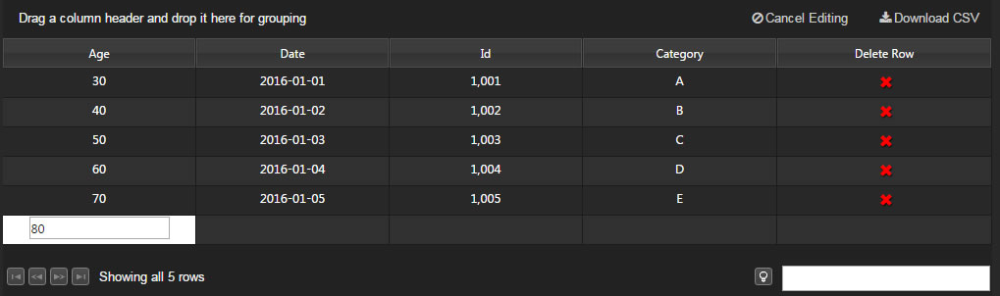

Used in conjunction with [Update Query](introduction/#update-query).

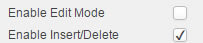

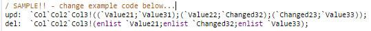 

When in the Dashboard Builder’s Preview or Quickview mode, click _Edit_ to enable the functionality; _Submit Changes_ when done or _Cancel_ to reject. 

## Columns

Defines how data is formatted in each column. 

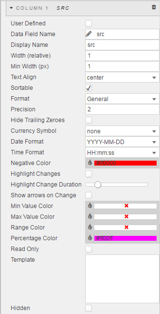
  
In addition to individual column configurations, global settings can be defined from _Column Edit_.
  
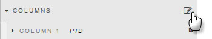
  
Select columns on the left using Ctrl-click on columns.

Next select properties on the right to be applied across selected columns.
  
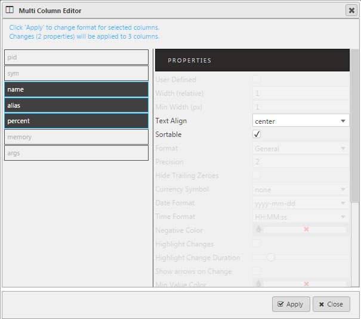
  
Columns can be removed from a Data Grid by clicking the trashcan icon
  
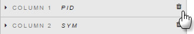

### _User Defined_

When checked, the selected column will remain in the Data Grid if the selected column variable is removed from the query. A User Defined query is effectively a 'lock' on the column

!!! Warning "_User Defined_ checked for missing _Data Source_ variable"
    The _User Defined_ column will show as an empty column in the Data Grid if the _User Defined_ column variable is missing in the query.

### _Data Field Name_

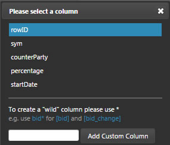

Dynamic columns derived from a query should use a wildcard in the _Data Field_ to share configurations.  The wildcard can be used in conjunction with text headers; e.g. `bid*` will pick up `bid` and `bid_update`.

The _Data Field Name_ is selecting from data columns in the <a href="#data-source">Data Source</a>. 

If a wildcard is used, any undefined columns will adopt the column specifications of the wildcard column; e.g. data alignment, decimal precision etc.

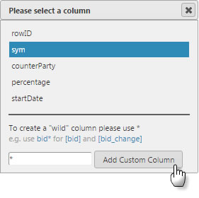

### _Display Name_

The name assigned for the column in the Data Grid. This is case-sensitive.

### _Width (relative)_

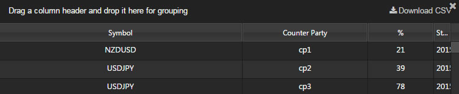

Width relative to the Data Grid. The scale is contigent on the values of each column.

!!! note "Example"
    Columns with a relative width of 20, 10, 5, 1 will scale at a column width of 55% (i.e. 20/(20+10+5+1)), 28%, 14% and 3%.  

Relative columns will scale according to the browser size.

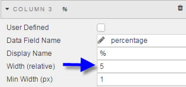

### _Min Width (px)_

This is the pixel minimum width for a column. Columns will never be smaller than the minimum width, but can be wider. 

Columns using _Minimum Width_ will scale according to browser size

### _Text Align_

Alignment of values inside Data Grid. 

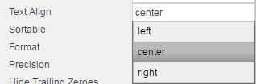

### _Sortable_

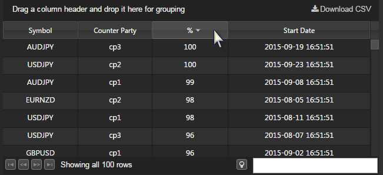

When checked, users clicking on column header will toggle between ascending and descending sort. 

### _Format_

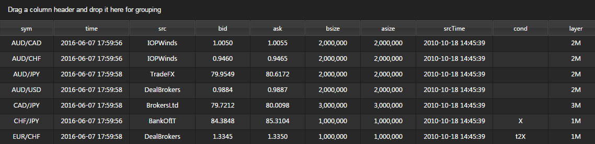  
_Sample formats_
      
Select formatting for data type in column
  
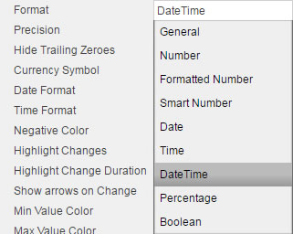

### _Precision_

Where numeric data is used, _Precision_ sets the number of decimal places used.

### _Hide Trailing Zeroes_

Removes the display of zeroes from end digits after the decimal point.

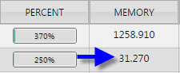

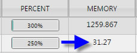

### _Currency Symbol_

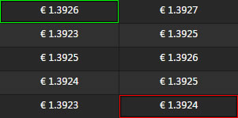
     
Adds a currency symbol prefix to column data
  
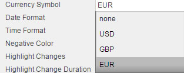

### _Date Format_

Select a Time or DateTime format
  
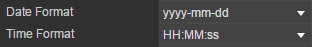
  
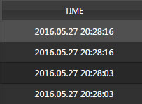
  
Select date format

  

### _Time Format_

Select a Time or DateTime format

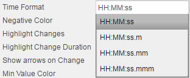

### _Min Value Color_

  
Selection will place a color border highlight around lowest value in column
  
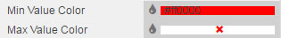

To remove, again click on the color and select _No Color_ from the palette tool.

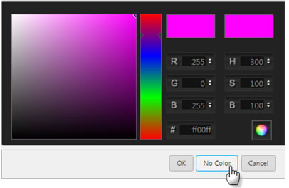

### _Max Value Color_

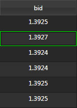
  
Selection will place a color border highlight around highest value in column
  
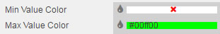

Click the color bar again and then click _No Color_ to remove the Max color setting 

### _Range Color_

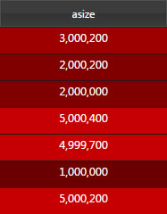
  
Applies a selected colour gradient across all cells in a column. Assigning a color will automatically apply the Range Color. 
  
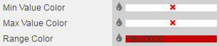

Click the color bar and then _No Color_ to remove the Range color from column data

### _Percentage Color_

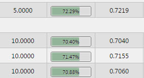

Adds a mini-bar in Percentage-formatted data. The proportion of the bar filled runs from 0 to 100%

To enable set _Format_ to `Percentage` 

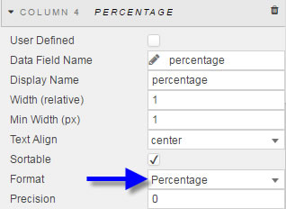

Select a color to use for the bar 

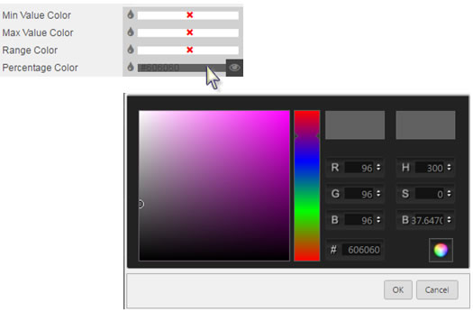

!!! tip "Colors can be View State Parameters"
        _Min Value Color_, _Max Value Color_, _Range Color_, and _Percentage Color_ can be View State Parameters. To assign a View State Parameter, roll over end of input bar until  appears, click to assign. Set the view state to use a Hex color reference.

### _Read Only_

Columns which are checked _Read Only_ cannot be edited

### _Template_

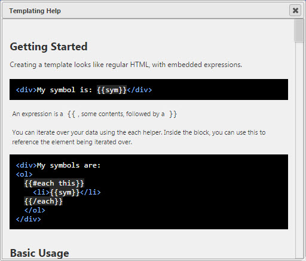 

Template allows for richer customisation of columns. In this example, information from two columns (`URL` and `Name`) is merged together to form an active link:

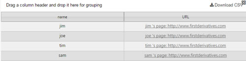

## _Selection & Routing_

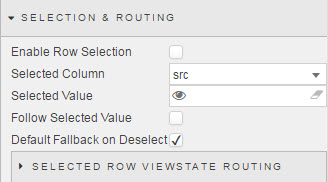

When enabled, a user selecting a data grid row will have data grid variables assigned to [View State Parameters](introduction#view-state-parameters). In the example below, `rowID` from a Data Grid is mapped to a `rowid` View State Parameter. 

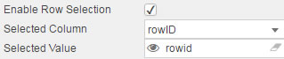

To start, _Enable Row Selection_ must be checked.

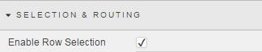

If just a single value is to be stored, the _Selected Column_ and _Selected Value_ can be used. If more than one value is to be stored, then <a href="#selected-row-viewstate-routing">Selected Row Viewstate Routing</a> must be used. 

1. Select the column of the data you wish to store

    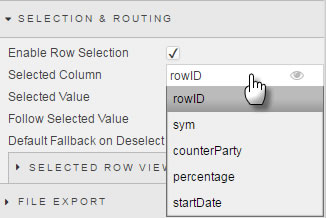

2. Assign a View State Parameter which will receive and store the selected cell value

    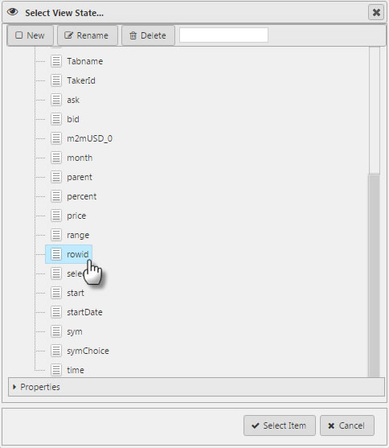

!!! Tip "Need more than one data map?"
    If more than one value from a grid is to be stored, use _Selected Row Viewstate Routing_.

### _Selected Row Viewstate Routing_

Where _Selected Column_ and _Selected Value_ store just a single value, _Selected Row Viewstate Routing_ can store multiple values

Click 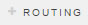 to set storage for additional values

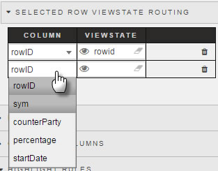

Add a row for each Data Grid variable to store to a View State Parameter. 

_Follow Selected Value_

: When checked, row selection highlight will retain view on screen during scroll event. 

_Default Fallback on Deselect_

: When checked, default viewstate parameter values will be used (if set) in the absence of a row select.

## _File Export_

Data from a data grid can be exported to a spreadsheet using the CSV downloader

The filename can be specified, or linked to a View State Parameter which can then be defined by the user

## _Grouping Columns_

On loading, Data Grids can be configured into groups. Subtotals can be added with <a href="#summary-row-for-groupings">Summary Row For Groupings</a>

Click on  to add a Grouping

Each additional Grouping level will create subgroups derived from the previous grouping; i.e. the top Grouping is processed before subsequent groups are created. Groupings can be re-organised using a left-click-and-drag. 
 

Dashboard Users can also create groupings on the fly with a left-click-and-drag of a column header into the space directly above the column headers: 

## _Highlight Rules_

Used to apply color updates to notify users of changes in Data Grid values

_Name_

: The name of the rule

_Target_

: From the dropdown menu, select the target Data Grid column on which the rule will act 

    The _Target_ column can be any column in the Data Grid.  It does not have to be the data grid column using the operator.

_Condition Source_

: The data series on which the trigger is measured

_Condition Operator_

: Dropdown menu of rule operations, including greater and less than, not equal to, exactly equal to, and text contains alerts

    Trigger | Explanation
    --- | ---
    search | find Condition Value match; assign [view state parameter](introduction#view-state-parameters) and pair with [Text Input](textinput). 
    contains | find all instances with the Condition Value
    starts with | find all instancs starting with the Condition Value
    ends with | find all instance ending with the Condition Value
    == | exact match, e.g. client name
    < | less than Condition Value
    > | greater than Condition Value
    <= | less than or equal to Condition Value
    >= | greater than or equal to Condition Value
    != | excludes Condition Value
    Fill Left-to-Right | fills cell with color from left-to-right
    Fill Right-to-Left | fills cell with color from right-to-left

_Condition Value_

: What value threshold will trigger the alert.  Default is _previous value_

_Color_

: The text color change when rule is true

_Backround Color_

: Background cell color change when rule is true. 

_Border Color_

: Cell border color change when rule is true

_Icon_

: Select an icon to appear when rule is true

_Icon Color_

: Select the color for the icon (if used) when rule is true

    

## Style

<i class="fa fa-hand-o-right"></i> [Style](style)

_Row Height_

: 

    Defines the height of the Data Grid table rows

_Even Row Background_ & _Odd Row Background_

: Defines the colour of the even and odd data grid rows. Colors can be selected from the color palette, a View State Parameter (of a hex color reference) or a direct hex color reference. 

_Selected Row Background_

: If <a href="#selected-row-viewstate-routing">Selected View State Routing</a> is enabled, then this color will define the background for the selection row. 

_Header Text Transformation_

: Sets the text type for Data Grid column header names

_Header Font Weight_

: Sets the font type for Data Grid column header names

_Font Family_

: Sets the font family for Data Grid column header names

_Font size_

: Sets the font size for Data Grid column header names

_Advanced CSS_

: Used to apply CSS to Data Grid.

    1. Click inside the _Advanced CSS_ editor  
        

    2. Click on the  in the pop-up dialog  
        

    3. Click on a Data Grid element to view the CSS reference  
        

    4. Add the required CSS  
        

    5. Click _Apply_  
        

## _Summary Row for Groupings_

_Grouping Columns_ will reorganise the Data Grid layout. _Summary Row for Groupings_ will add simple mathematical calculations to these groups.

Click on  to add a new summary row. 

_Column_

: This is the data grid column on which the calculations will be made

_Aggregate Function_

: The mathematical funtion to apply: `average`, `sum`, `min` or `max`

_Label_

: The text label to use for the calculation

_Color_

: The font color for the grouping. Default color is none, so unless a color is selected the grouping calculation will appear 'invisible'

    

