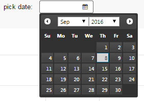
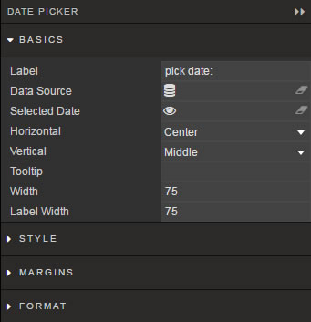
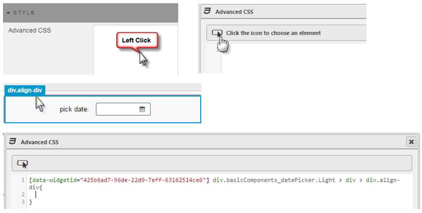

Used for assigning date inputs to [view state parameter](introduction.md#view-state-parameters).

The Date Picker will show highlighted dates for days with data

<aside class="admonition tip">For time data of type Datetime, use the [Data Form](dataform.md) component for User inputs</aside>

## Basics

Configures Date Input Box

**Label**

Descriptive Label for Date Picker Input

### Data Source

See [Defining a Query](introduction.md#defining-a-query) and [Analytics](introduction.md#analytics) for more on data sourcing.

**Selected Date**

Assign [view state parameter](introduction.md#view-state-parameters) of type Date

**Horizontal**

Sets alignment (left, center or right) of date selector inside the boundaries *Date Picker* component

**Vertical**

Sets alignment (top, middle, bottom) of date selector inside the boundaries *Date Picker* component

**Tooltip**

Text description which appears when User mouses over the *Date Picker*

**Width**

Defines pixel width of dropdown

**Label Width**

Defines pixel width of dropdown *Label*

<aside class="admonition tip">If assigned <i>Label Width</i> is narrower than can fit the <i>Label</i> description, text in the <i>Label</i> will wrap</aside>

### Style

Use Advanced CSS to set styles
 

## Margins

See [Margins](introduction.md#margins) in Introduction for more

## Format

See [Format](introduction.md#format) in Introduction for more.

