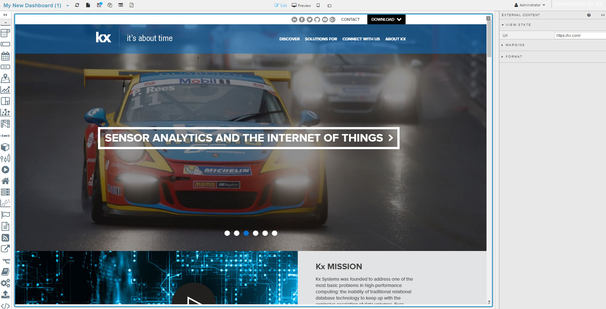
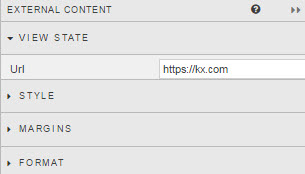

## External Content

### View State

Embed external web page content into a Dashboard

## Style

[1] Left click inside Advanced CSS button

[2] Select the External Content component by first clicking on the  icon in the pop-up dialog and then clicking on the External Content component. 

[3] Add the required CSS content

## Format

See [Format](introduction#format) in Introduction for more.

## Margins

See [Margins](introduction#margins) in Introduction for more

