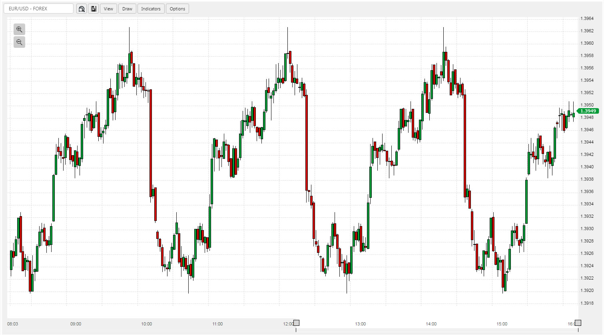

Financial Charts is a self-contained component for displaying asset prices (forex, equities and bonds) when connected to a price feed. 

## _Basics_

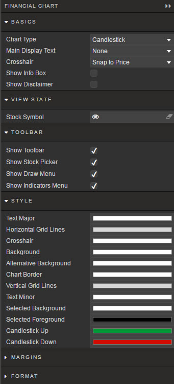

Configures type of chart

_Chart Type_

: 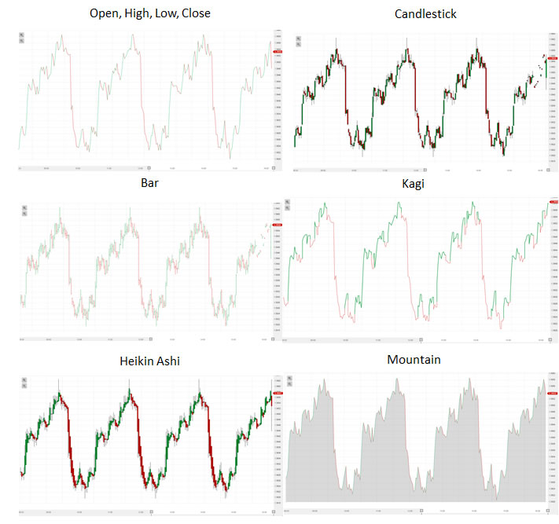

_Main Display Text_

: Watermark label for center of chart

_Crosshair_

: Crosshair action

    _Snap to Price_ 
    : Crosshair centers on closing price of selected time period

    _Free Flow_ 
    : Crosshair position at mouse point

    _None_ 
    : No crosshair

_Show Info Box_

: Check box to display Open, High, Low and Closing Price of selected time period

    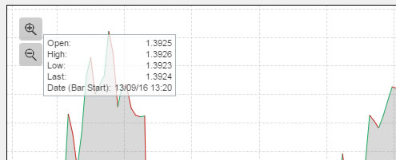

_Show Disclaimer_

: In small font, at the bottom right of the chart, a disclaimer is displayed

    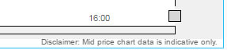

## View State

Configure viewed financial asset

_Stock Symbol_

: Best configured using a [View State Parameter](introduction.md#view-state-parameters).  Set default asset to use on chart load. 

## Toolbar

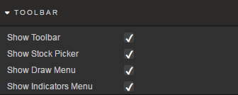

Checkboxes control whether the Toolbar appears and what appears on it

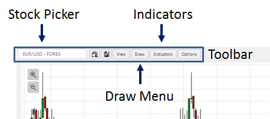

## Style

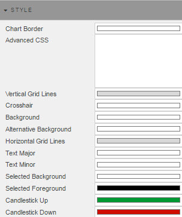

Adds styling elements, setting colors for different parts of the chart.

_Chart Border_

: Color of chart border

_Advanced CSS_

: Advanced styling rules

    1. Click inside _Advanced CSS_  
        

    2. Click on 

    3. Select chart component  
        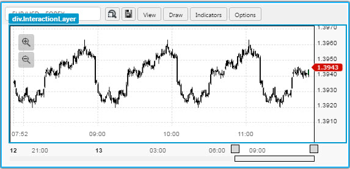

    4. Edit and apply CSS

_Vertical Grid Lines_

: Color of grid lines

_Crosshair_

: Color of overlay crosshair

_Background_

: Background color of chart

_Alternative Background_

: 

    Alternative (second) background color of chart

_Horizontal Grid Lines_

: Color of horizontal grid lines

_Text Major_

: 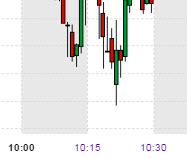

    Color of main text on chart (e.g. primary x-axis labels)

_Text Minor_

: Color of text label on chart (e.g. minor x-axis labels)

_Selected Background_

: 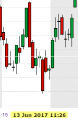

    Color of highlight text in X axis

_Selected Foreground_

: Color of text of X-axis highlight

_Candlestick Up_

: Color of candlestick price bars where open &gt; prior close

_Candlestick Down_

: Color of candlestick price bars where open &lt; prior close

## _Margins_ and _Format_

<i class="fa fa-hand-o-right"></i> [Styling dashboards](style)

## Chart Controls

Controls available to the user. 

### Asset Search

Search for asset from connected price feed

### Region Zoom

Click the region-zoom icon  to activate.  Click on the chart and drag left or right the area of price action to focus on.  Release the click to zoom. 

### Save Chart

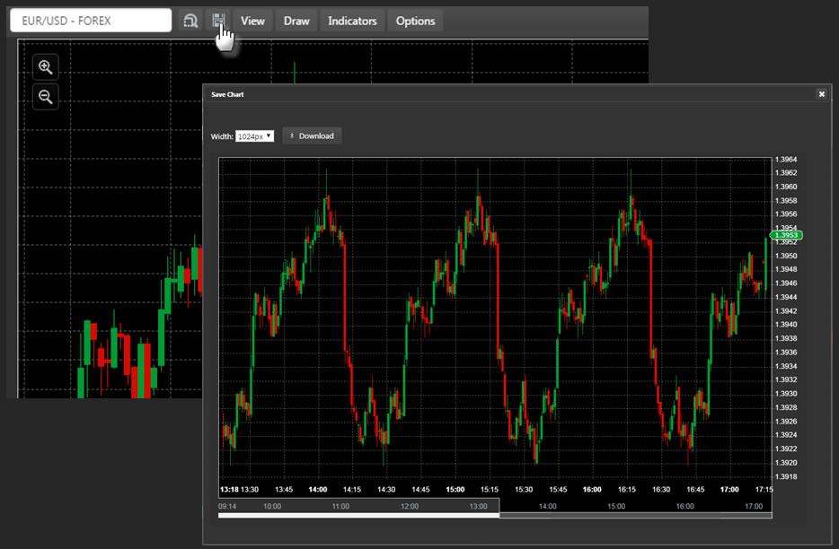

On chart save, a pop-up window offers a dropdown choice of image size (360, 460, 520, 620, 780, 900, 1024, 1280, and 1,600px) and a . Chart will be saved to Download directory on PC. 
 

### View

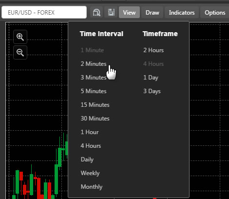

Support for tick to monthly data. First select *Time Interval*, this will show available *Timeframes*. Select *Timeframe* to load chart.

### Draw

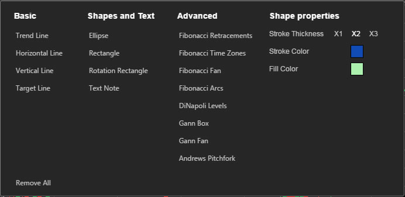

Draw items are classified into three categories: _Basic_, _Shapes and Text_, and _Advanced_.  Prior to adding a draw item, the _Shape Properties_ can be set.  These properties can also be changed after a shape is added. 
 
_Trend Line_

: This line is anchored by two points on a chart.  To create a price channel, select-and-right-click the line on the chart and do a line copy.  Then, select an area of the chart, right-click-and-select paste. A parallel line will be positioned next to the original.  This line can then be moved by left-click-and-drag of the line to the desired area of the chart.

    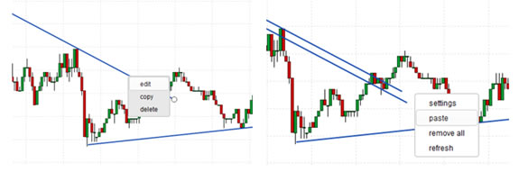

_Horizontal Line_

: This is a price-line marker, best used to denote custom support and resistance.  When a Horizontal Line is applied it automatically extends to the price axis and displays the price.
 
    To configure the line, right-click edit.  A line can be edited for different thickness or colour, opacity, type and if the line should extend beyond the anchors to the future (default) or past. 

    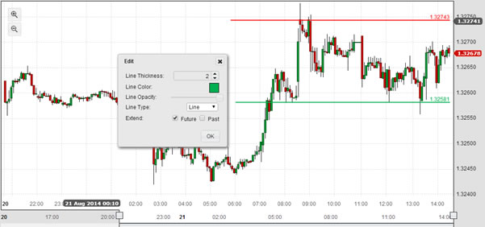

_Vertical Line_
 
: Similar to a horizontal line, except it marks a point in time.  A left click on the line will display the move icon, then drag to reposition the line

_Target Line_

: Sets line at selected target price. Includes entry and stop levels

    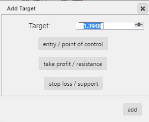

_Ellipse_

: Adds a circle on the chart, perhaps to highlight peaks and troughs in price action.  The opacity tool within the Edit menu can be set so as not to obscure the underlying price action

    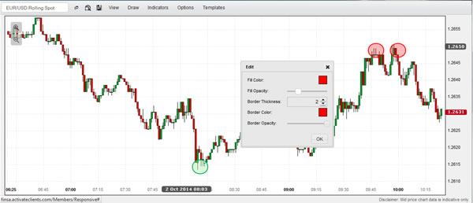

_Rectangle_ and _Rotation Rectangle_

: The Rectangle tool can be used to mark consolidation regions or thicker bands of support and resistance

    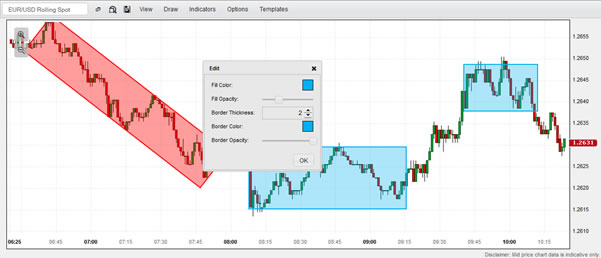

_Text Note_

: Comments can be added directly to the chart.  Each note has four pointer anchors; one on each side.  These can be dragged into position. 
 
    Font size, margin padding and border thickness can be adjusted.  Text colour and border colours and opacity can be changed too.
 
    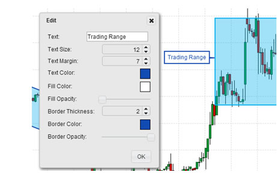

_Fibonacci Retracements_, _Time Zones_, _Fan_ and _Arcs_

: Set Fibonacci anchors to peaks and troughs.  Right-click-edit to change colours, opacity and line thickness

    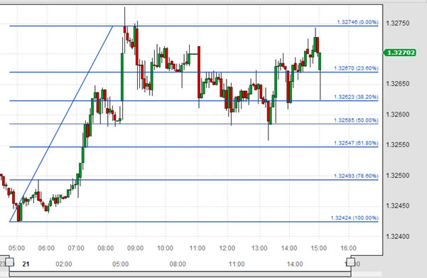

_DiNapoli Levels_

: Set the three anchors so the mid-point is highest (for projecting price targets in a bullish trend) or lowest (for projecting price targets in a bearish trend).

    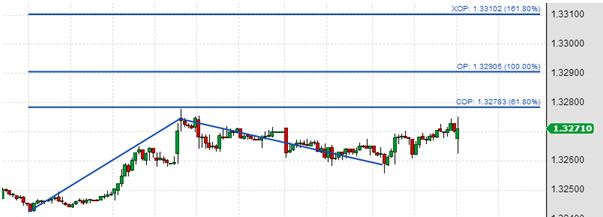

_Gann Box_ and _Gann Fan_

: Can help define upcoming support/resistance and inflection points.  Use the opacity tool to blend the Gann box into the price chart. 

    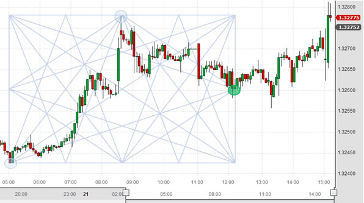

_Andrews’ Pitchforks_

: Andrews’ pitchforks are configured so that the mid-line of a Pitchfork is anchored at the base of the trend, with the two outer forks aligning along the projected channel. 

    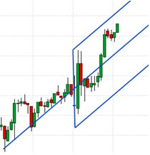

Draw Item | Description
--- | ---
DiNapoli Levels | DiNapoli Levels are part of the Fibonacci group of price analytics. Where Fibonacci levels typically look at retracements, DiNapoli Levels look at expansions, and are used to determine price projections. The COP is the Contracted Objective Point is 0.618 (61.8%) of the length of wave A measured from the end of corrective wave B.  The OP or Objective Point, is the 1.000 (100%) the length of wave A measured from the end of wave B.  The XOP or eXpanded Objective Point is 1.618 (168%) the length of wave A measured from wave B. Followers of Elliot Wave Theory can use this projections as guidelines for upcoming pivot points.
Fibonacci Retracements | Fibonacci Retracements are ratios used to identify potential reversal levels.  The ratios are derived from the Fibonacci sequence. The most popular Fibonacci Retracements are 61.8% (often round to 62%) and 38.2% (often rounded to 38%). Fibonacci retracements are used to define retracement levels to help forecast the extension of a correction or pullback. Fibonacci retracements can also be used to forecast the extent of a bounce in a decline. Price moves which retrace more than 72% often go to retrace the entire (100%) move
Andrews’ Pitchfork | Andrews’ Pitchfork is a trend channel tool consisting of three lines. The median line has two parallel equidistant trend lines. The anchor line for the trend lines is typically the reaction high and low going from left to right on the chart.  The equidistant lines mark support and resistance. In cases where price breaks the channel line, the Andrews’ Pitchfork can be redrawn so the Median line represents the broken channel line. The outer equidistant trend line then becomes the price target for the channel break
Fibonacci Fans | Fibonacci Fan lines are trend lines based on Fibonacci retracement points. These fan lines can be used to estimate potential support or resistance levels. After a move, the Fibonacci Fan lines can be drawn to identify potential support or reversal levels. Once a pullback starts, the fan lines provide key level to watch as prices correct.
Fibonacci Time Zones | Fibonacci Time Zones are vertical lines based on the Fibonacci Sequence. The lines run along the time axis and are used to determine price reversals based on time. A major high or low is typically used as the start point. Fibonacci Time Zones can be extended into the future to warn of potential times for reversal. Clustering of Fibonacci Time Zones at the start can be ignored, but as the sequence expands out the potential relevance of the time reversal increases
Fibonacci Arcs | Fibonacci Arcs are half circles which run along a trend line. The different points along the arc mark potential support or reversal levels as determined by Fibonacci levels factoring for both price and time. The arc is defined by connecting a high/low (or low/high). Each arc line going forward marks a reversal - factoring time and price - for the reaction to the prior trend.  For example, for an arc set after and advance (low to high), the arc lines mark potential support levels for a bounce on the resulting correction
Gann Box | Gann Lines are not the same as trendlines, but are diagonal lines which move at a uniform rate of speed. Gann Lines help determine where price might be in the future and can be used to define support and resistance. The primary Gann angles are 1x2, 1x1 and 2x1, where 1x2 means the angle is moving one unit of price for every two units of time. Other angles are also drawn at 1x8, 1x4, 4x1 and 8x1.  The 1x1 angle if often referred to as the 45-degree angle. To effectively use the Gann Box, the Box should hold its square form when fitting to a chart.  Timing of reversals occur when Gann lines reach the borders of the square. The Gann Box works best on weekly or monthly charts, shorter time frame charts tend to have too much 'noise'. 
Gann Fan | Gann Lines are not the same as trendlines, but are diagonal lines which move at a uniform rate of speed. Gann Lines help determine where price might be in the future and can be used to define support and resistance. The primary Gann angles are 1x2, 1x1 and 2x1, where 1x2 means the angle is moving one unit of price for every two units of time. Other angles are also drawn at 1x8, 1x4, 4x1 and 8x1.  A balanced trend will follow the 1x1 angle, a strong trade will run at or above 2x1, a weak trend will move at or below the 1x2 trend

### _Indicators_

The _Indicators_ menu provides a list of available price overlays and lower panel technical indicators.

Individual indicator settings can be edited by clicking on the relevant indicator in the Indicator bar

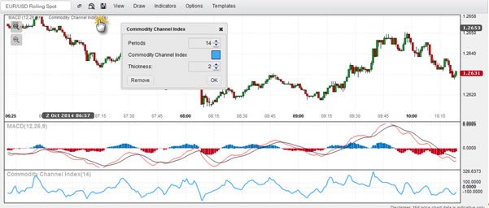

Indicator | Description
--- | ---
Accelerator Indicator | The Accelerator Indicator measures price driving force, and is used as an early warning signal of change.  The zero line is the point at which driving force is in balance.  If acceleration is above zero, it's easier for acceleration to continue upward (price movement) and vice versa.  However, a cross of the zero line is not a signal. Three green columns below the zero line is a long signal, three red columns above the zero line is a short signal
Aroon | Aroon determines if an asset is trending or not, and the strength of that trend - it measures the number of periods since price recorded an x-bar high or low. Aroon is unique because it focuses on time relative to price. An Aroon period of 14, measures the number of days since a 14-day high (Aroon Up) or 14-day low (Aroon Down), expressed as a percentage.  Aroon declines as the elapsed time between a new high or low increases. A new trend occurs when the Aroon lines cross each other, and cross above 50.  A consolidation is signalled when both lines are below 50. In the latter case, a signal occurs when one of the Aroon's crosses 50 and hits 100
Aroon Oscillator | The Aroon Oscillator is the difference between Aroon-Up and Aroon-Down.  The indicator moves between -100 and +100. A bullish trend bias is present when the oscillator is positive, and a bearish trend bias when the oscillator is negative. The Aroon Oscillator is often plotted alongside the Aroon
Awesome Oscillator | A momentum indicator which compares momentum over the last 5 bars with that of the previous 34 (using default settings). The indicator calculates the difference of the respective period simple moving averages of the bar's midpoints between high and low. There are a number of ways to generate trade signals.  A buy signal occurs on a shift in the peak of the histogram from rising to falling ('sell') or falling to rising ('buy'). An additional signal is generated on a cross of the zero line (above the line for a 'buy', below for a 'sell).  More complex signals are generated on histogram divergences, and on double peaks / troughs.  The latter signal is typically a trade in the direction of the prevailing trend and not the usual momentum oversold 'buy' or overbought 'sell'.
Bollinger Bands | Bollinger Bands are volatility bands placed above and below a moving average. Volatility is based on standard deviation around an simple moving average (default value is 2 standard deviations, and a 20-period simple moving average), which changes as volatility increases and decreases. Bollinger Bands automatically widen when volatility increases, and narrow when volatility decreases.  Bollinger bands can help identifying M-Tops and W-Bottoms.  For example, in W-Bottoms, the low price of the second swing low is lower than the price from the first swing low, but whereas the first swing low often breaks the lower Bollinger band, the second swing low often does not. Between each swing low is a rally back to the Bollinger mid-line; i.e. the moving average.  Once prices move higher from the second swing low, and break above the price set from the middle "W", then a new long signal is generated.  At the time of the long signal, prices have risen to the upper bollinger band. 
Commodity Channel Index | The Commodity Channel Index is used to identify a new trend or warn of extreme conditions. It's calculated using the Typical Price (typical price is average high + low + close). The Commodity Channel Index measures the current price relative to the average price. The indicator is high when prices are far above their average, and relatively low when prices are far below their average.  A bullish signal occurs on a cross above +100. A bearish signal occurs on a cross below -100. The Commodity Channel Index can also identify divergences:  A (bearish) divergence occurs when a price makes a new high, but the Commodity Channel Index posts a lower high. A (bullish) divergence occurs when a price makes a new low, but the Commodity Channel Index posts a higher high
Directional Movement System | The Directional Movement System (or Average Directional Index) is a trading system for commodities, but can be applied to other assets. The Directional Movement System measures trend strength without consideration of trend direction. While the Plus Directional Indicator (+DI) and Minus Directional Indicator (-DI) define trend direction.  Together, strength and trend direction can be determined. Directional Movement tracks the relationships between highs and lows, with the Plus Directional Indicator measuring bullish direction and the Minus Directional Indicator tracking bearish direction, while the Average Directional Index uses smoothing factors applied to an Average True Range to determine trend strength.  Trend strength determines if a security is trending or not: a strong trend exists when the ADX is above 25, and no trend is present when below 20, although lag can be an issue. Trade signals occur on crossovers of the +DI and -DI. A bull signal on a cross of +DI above -DI with an initial stop on low of signal day. A bear signal on a cross of -DI above +DI with a stop on the high of the signal day.  The stop is trailed once trend strength increases, with the Average Directional Index above 20. Whipsaw signals are possible, so other technical indicators can be used to help with confirmation.
Ichimoku Clouds | Offers predefined Trend, Support and Resistance levels, which can be used to generate buy and sell signals. The indicator works best on weekly or daily charts. At default settings, Tenkan-sen is mid point of (9-period high + 9-period low)/2. Kijun-Sen is mid point of (26-period high + 26-period low)/2. Senkou Span A is (Tenkan-sen + Kijun-sen)/2, plotted forward 26 periods, and is one 'cloud' boundary. Senkou Span B is (52-period high + 52-period)/2, plotted forward 26 periods, forming the opposite 'cloud' boundary. Chihou Span is close plotted 26 periods in the past. When prices are above the 'cloud', the trend is up (and vice versa), but the trend is flat when prices are in the 'cloud'.  The uptrend is strengthened when 'cloud' is green (and vice versa).  The 'cloud' in the future highlights areas for support (green) or resistance (red). Signals are generated when Tenkan-sen line crosses the Kijun-Sen line.  Stronger long signals occur when the  Tenkan-sen line crosses above the Kijun-Sen line, and the cross occurs above a green cloud. Stronger short signals occur when the Tenkan-sen line crosses below the Kijun-Sen line and the cross occurs below a red cloud. Signals can also occur when price crosses the cloud, when cloud changes colour, or if price crosses the Kijun-sen line
Keltner Channels | Keltner Channels are a trend following indicator used to identify the underlying trend. Keltner Channels are volatility-based envelopes set above and below an exponential moving average.  Unlike Bollinger Bands, which uses standard deviation to define the envelopes, Keltner Channels uses Average True Range (doubled), set above and below a 20-period exponential moving average. Signals are generated on breaks of the envelope, but Keltner Channels are best used in conjunction with a momentum indicator, like RSI. In the latter case, the momentum indicator is used to generate signals on pullbacks, but only when price remains inside the Keltner Channel
MACD | Moving Average Convergence-Divergence (MACD) indicator is a momentum indicator, built from two trend-following moving averages.  As a result the MACD is both a trend following and momentum indicator.  Signals work on signal line crossovers, crossovers of the midline, and divergences.  The MACD line is the 12-day exponential moving average, less the 26-day exponential moving average. A 9-day exponential moving average of the MACD line acts as a signal line.  The MACD histogram is the difference between the MACD line and its 9-day exponential moving average.  A bullish crossover occurs when the MACD line turns up and crosses above the signal line. A bearish crossover occurs when the MACD turns down and crosses below the signal line.  Crossovers at extremes (from the midline) are more prone to failure.
Momentum |  Momentum is simply the difference in the closing price of the current bar with one from n bars ago. The default value for n is 10. Trade signals are generated on a cross of the zero mid-line: a 'buy' for a cross above, a 'sell' for a cross below  
Moving Average (Exponential) | Moving Average smooths price data to form a trend following indicator. The moving average defines the current direction with a lag. An exponential moving average applies more weight to recent prices.  The weighting factor is determined by the period setting.   The longer the period, the greater the lag.  Signals can be generated on price crossing a moving average, one moving average crossing another, or price returning to a moving average in the direction of the trend
Moving Average (Simple) | Moving Average smooths price data to form a trend following indicator. The moving average defines the current direction with a lag.  The Simple Moving Average is a sum of periods, divided by the period. The longer the period, the greater the lag.  Signals can be generated on price crossing a moving average, one moving average crossing another, or price returning to a moving average in the direction of the trend.
Moving Average (Weighted) | Moving Average smooths price data to form a trend following indicator. The moving average defines the current direction with a lag. A linear weighting is applied - with the most recent prices carrying the higher weighting, and the oldest the least. The total is divided by the sum of the weightings to give the weighted moving average value.  Signals can be generated on price crossing a moving average, one moving average crossing another, or price returning to a moving average in the direction of the trend. Parabolic SAR | Parabolic Indicator is a trading strategy based on a trailing stop and reverse method called the "SAR", or Stop-And-Reversal. The SAR trails price as the trend extends over time. The SAR is below prices when prices are rising, and above prices when prices are falling. When price crosses above or below the SAR, a signal is triggered and the trade is switched.  The Parabolic SAR requires a strong trending market to be successful, and is best used in conjunction with an indicator like the Directional Movement System which measures trend strength. 
Pivot Points | Pivot points determine support and resistance.  Pivot points use the prior period's high, low and close to formulate future support and resistance. Pivot Points for 1, 5 and 15 minute chart use prior day's high, low and close. Pivot Points for 30 and 60 minutes use prior week's high, low and close. Daily Pivot Point's use prior month's data. Pivot Points for weekly and monthly use prior year's data. Pivot Points, once set, don't change.  The initial pivot point is the sum of high, low and close, divided by 3
Price ROC | Rate of Change measures the percent change in price from one period to the next.  In effect, the current price is compared to the price from x bars ago, where x is the Periods parameter.  Price Rate of Change is best used to determine whether an asset is oversold or overbought. Centerline crossovers can be used to determine trend direction. 
Price Oscillator | The Price Oscillator is similar to the MACD in its uses two different moving averages.  Where it differs is the Oscillator plots the difference between two simple moving averages.  The Price Oscillator is used to mark when an asset is oversold or overbought. Crosses of the zero define changes in trend direction
Relative Strength Index | Relative Strength Index is a momentum oscillator which measures the speed, and change of price movements. The RSI oscillates between zero and 100. The RSI is overbought when above 70, and oversold when below 30. Divergences can also be tracked with the indicator. A bullish divergence occurs when the Relative Strength Index makes a higher high as price makes a lower low. A bearish divergence occurs when the Relative Strength index makes a higher high, but price makes a lower low
Standard Deviation | Standard Deviation is a volatility metric. It measures the amount of variability around an average: the larger the variability, the more volatile the underlying asset.  It can be used to determine low risk opportunities as volatility declines. 
Stochastic Oscillator | Stochastic Oscillator is a momentum indicator. It measures the location of the close relative to the high-low range over a number of periods.  Divergences between Stochastic Oscillator and price action can warn of trend change.  There are three kinds of stochastics: Full, Fast, Slow.  %K Periods is the raw differential between close and high-low range, %K Slowing is a simple moving average of %K Periods, and %D Periods is a simple moving average of %K Slowing.   When selecting a Fast Stochastic, the %K Slowing period setting should be changed to 1 (i.e a 1-day simple moving average)
Swing Index | The Swing Index compares the relationships between current open, high, low and close prices to a previous period's open, high, low and close prices.  It can be used to determine overbought and oversold conditions by the relative positions of peaks and troughs in the index
Support / Resistance | Support/Resistance identifies potential areas of demand and supply around reversal points as determined by open or closing price (high/low is ignored). A sensitivity setting adjusts the levels of support/demand found; a higher sensitivity setting will identify more short term support/resistance levels.  Areas where support or resistance levels congest are likely of greater significance than isolated support/resistance levels.  Congested support and resistance zones typically define trading ranges.  Support or Resistance levels  are negated when there is a close through the price point
TRIX | TRIX is a momentum oscillator which displays percent rate of change of a triple exponential smoothed moving average.  Crossovers of the mid-line determine momentum, with reversals marked by divergence between TRIX high/lows and price high/lows.  A rising TRIX represents bullish momentum (rising prices), a falling TRIX represents bearish momentum (falling prices). 
True Range | True Range is a volatility indicator. The True Range is the greatest of either: current high less current low, current high less previous close, or current low less previous close. In each case,  the absolute value is determined.  High True Range values represent increased interest in the movement of a given asset (up or down). 
Typical Price | The Typical price is the arithmetic average of High, Low and Close. 
Ultimate Oscillator | The Ultimate Oscillator is designed to capture momentum across three different time frames.  The principle of this is to avoid the pitfalls of single time frame oscillators which can show weakness just as a trend is building strength. Divergences in the Ultimate Oscillator are used as trade signals. For example, a 'buy' trigger forms if the Ultimate Oscillator makes a higher low as price makes a lower low (the reverse is true for a 'sell'), plus the first low for the Ultimate Oscillator occurs below 30 (or high above 70 for a 'sell'), and the peak (or trough) between the two lows (highs) in the Ultimate Oscillator is broken to the upside (downside) as the rally (decline) develops. 
Welles Wilder Smoothing | Welles Wilder Smoothing is used to identify price trends.  To do this, Welles Wilder adds a smoothing factor to a simple moving average.  The output is similar to an exponential moving average set at double the Welles Wilder Smoothing period setting; for example a 7-period Welles Wilder Smoothing has a similar line as a 14-period exponential moving average. 
Williams %R | Williams %R is a momentum indicator, which measures the close relative to the higher high for the look back period.  An asset is overbought when the indicator is above -20, or oversold when the indicator drops below -80. However, assets spending long periods overbought or oversold better reflect heavy buying or selling respectively , and further gains or losses are likely before a reversal can occur. As with stochastics, Williams %R is best used in conjunction with other indicators as a confirmation of bullish or bearish momentum. Divergences between Williams %R behaviour and price action (e.g. new high/low in Williams %R not confirmed by new high/low in price) can signal weakening momentum.
ZigZag | ZigZag is a means to filter out smaller price movements. For example, a ZigZag set at '5' ignores all price swing less than 5%. Only price movements greater than 5% will show.  It has no predictive quality, but can be used alongside Fibonacci retracements or Elliot Wave Projections

## Options

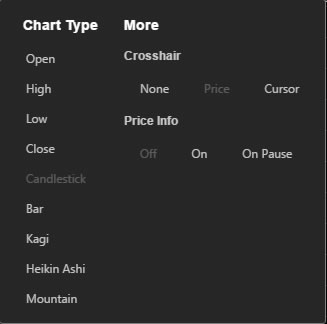

The _Options_ dialog allows the user to configure the Chart Type, including Line (O, H, L, C), Candlestick, Bar, Kagi, Heikin Ashi and Mountain Charts.

The Crosshair can be toggled from off, to the position of the cursor or to align with the closing price. 

Likewise the _Price Info_ can be toggled on or off, or alternative on pause, which appears after the cursor stops moving, and hides when it moves.

## User chart settings

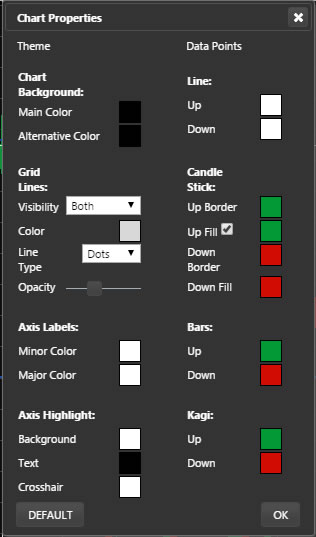

Available from the chart window’s context menu,  allows the user to customize the look of the chart, setting background and axis colours, gridlines, and the colour of the price bars

_Default_ resets to the selected Light or Dark theme.

Also available in the context menu is _Refresh_, reloads the data into the chart using the default settings. 
