# Dashboards for Kx

<iframe src="https://player.vimeo.com/video/135580263" width="100%" height="450" frameborder="0" webkitallowfullscreen mozallowfullscreen allowfullscreen></iframe>

_Dashboards for Kx_ offers an easy-to-use, yet powerful drag-and-drop interface to allow Creators to build dashboards without the need for programming experience. 

_Dashboards for Kx_ provides rich visualisation of real-time streaming data with support for highly optimized polled queries. Built in HTML using JavaScript libraries, _Dashboards for Kx_ can be used in all modern browsers and can be used on mobile and desktop environments.

Kx supports real-time analysis of billions of records and fact access to terabytes of historical data, offering seamless scalability. 

## My first dashboard

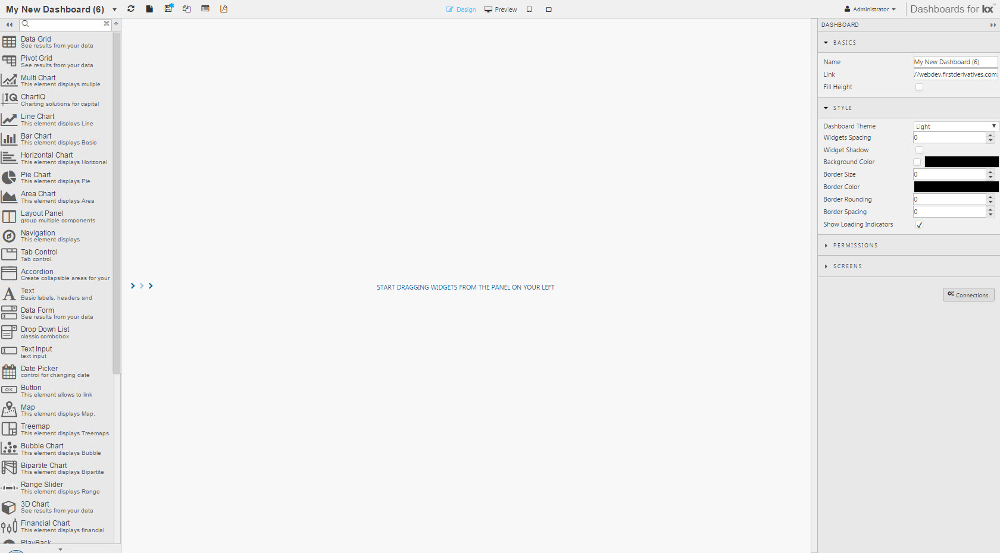

The Dashboard Builder has a central workspace; to the left is a list of components, and to the right are the properties associated with the dashboard or selected component.

The _Administrator_ dropdown menu in the top right offers a Light or (default) Dark theme builder view, and the ability to set the base language for the dashboard. 

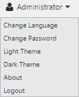

Builder theme is different to Dashboard theme. Define dashboard theme from the Style menu of Dashboards. 

Language support is offered for English, German and Japanese.


### Dashboard basics

In Dashboard properties, give the dashboard a name. The _Link_ is the public link used to share the dashboard with colleagues.

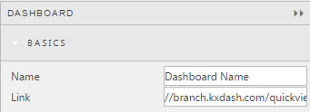

The link is non-editable. Clicking on it will open the dashboard in a new browser tab.


**Fill height**

Check _Fill Height_ so dashboards autofit to the height of the browser depending on user screen resolution. 

Dashboards will automatically autofit for browser width.


### Save dashboards


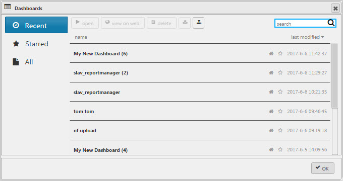  
_Dashboard Manager_

It is good practice to save dashboard work regularly. This can be done from the header menu.

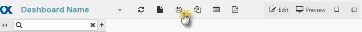

Dashboards can be copied with 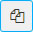. Good for dashboards sharing data formats, sourced from different databases.


### Create a new dashboard

New dashboards can be created clicking the file  icon


### Dashboard Manager

Dashboards are managed, opened and viewed from the _Manage_ menu 

Inside Dashboard Manager, select a dashboard from the list, before clicking 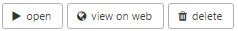 

_View on Web_ shows an end-user view of your dashboard.


### Importing and exporting dashboards

Dashboards can be exported as XML and imported via the Dashboard Manager menu. 


**Import**

1. Open a directory containing your saved XML dashboards
1. Select one or more dashboards to import
1. Open the Dashboard Manager and select _Import_ 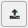
1. Close Dashboard Manager and check Dashboard List Dropdown to find your imported dashboard

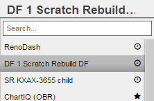


**Export**

1. In the Dashboard Manager, select a dashboard  
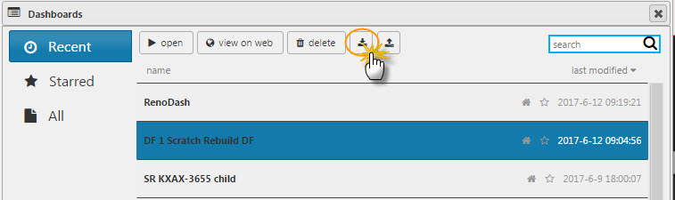

2. Selecting a dashboard highlights the Export icon; click it: 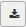

3. Select a location in your file system to save the exported XML.


## Dashboard permissions

Dashboard users can either be read-only, or have assigned write-access permissions – enabling editing of dashboards.  The user group is listed in ==Control for Kx==. <!-- WTF? -->

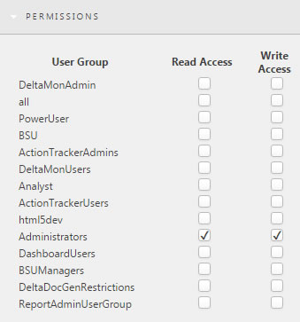


## Screens

All dashboards have a main screen; other screens can be added and linked using the [Navigation](navigation) or [Button](button) components.

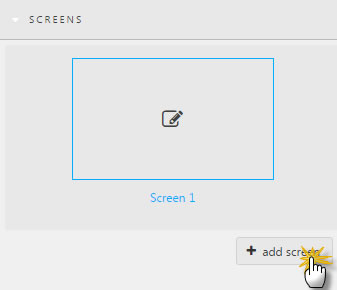


## Creating a connection

Connections can be created from the Dashboard console or Query Editor.

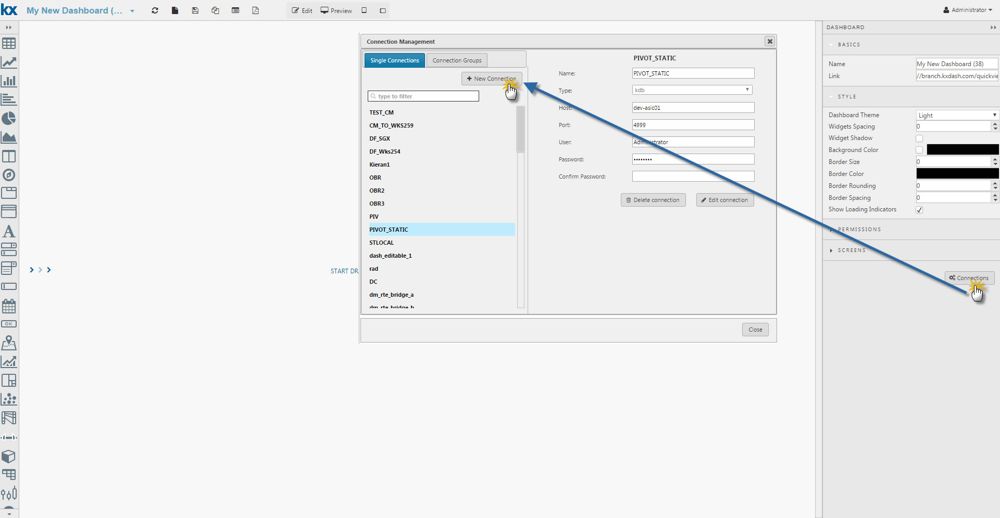

1. Open the Connections menu and create _New Connection_.
2. Give your connection a name.
3. Define _Type_: the default is _kdb_.
4. Define _Host_.
5. Set _Connection Port_.
6. Include any user and password information. Confirm the password. 
7. Save when complete.


### Connection groups

Individual connections can be grouped together: 

1. Give the connection group a name
2. Use Ctrl + select connections in the right-hand-box list.
3. Save the group.

All connections (single and group) will appear in a drop down list in the Data Source Editor.  See [Defining a query][#defining-a-query]

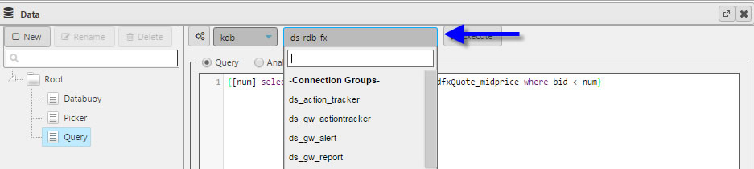

Single connection:

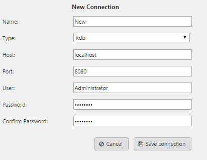

Group connection: 

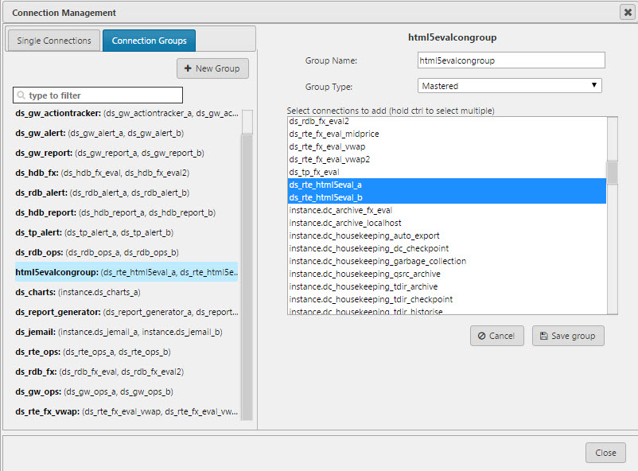


## Adding your first component

Drag and drop components into the workspace:

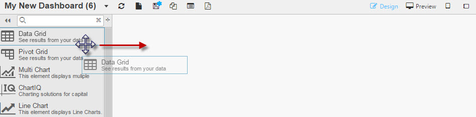

Configure component from the property panel on the right

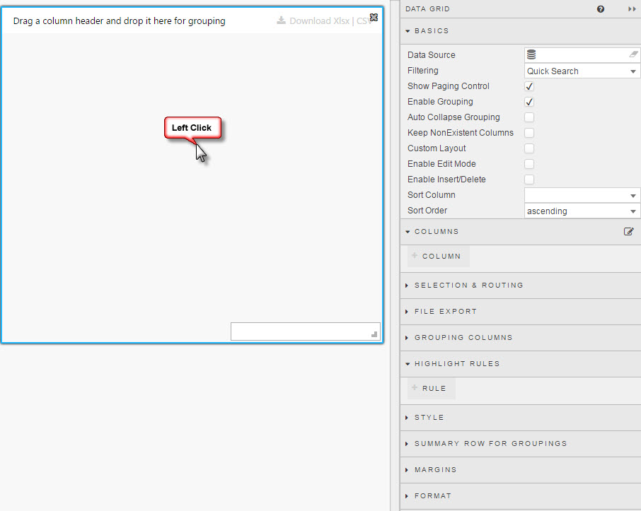

Dashboards are created by bringing available components from the list on the left into the workspace.  Each component has a set of properties, configured using the menu to the right.


### Basic customisation

1. Define Data Source by [assigning a query or analytic](#defining-a-query)
2. Set the Data View – how the display will be displayed in the dashboard <!-- WTF? **See relevant Data & Pivot Grid or Charting Component** -->
3. Set style and formatting, including any title headers. <!-- WTF? See <a href="#dashboard-components">**Dashboard Components**</a> -->

Some components use unique data sources, e.g. [Report Manager](reportmanager) or [Action Tracker](actiontracker). See the component details for more information. 

!!! tip "Linking components"
    Components sharing data sources can be linked, and queries using input variables can have values passed to them using [Dataform](dataform) or [Drop Down List](dropdownlist) components. 
    
    <i class="fa fa-hand-o-right"></i> [Linking components](#linking-components)

The first component for many dashboards will be either a [Data Grid](datagrid), [Pivot Grid](pivotgrid) or [Bar Chart](barchart).

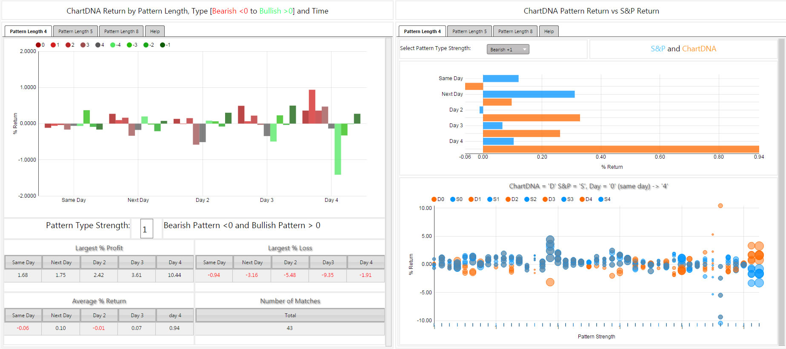

## Defining a query

Queries are defined from _Data Source_ in the _Basics_ property panel. Left-click to open the Query Editor:  
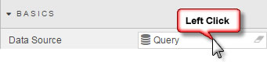

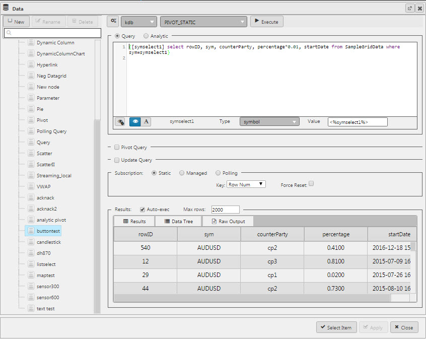  
_Query Editor_

Create a _New_ data source:

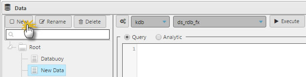

Select the data connection from the dropdown menu. ([Create a connection](#creating-a-connection) if this hasn’t been done yet. Connections can also be created by clicking 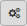.) 

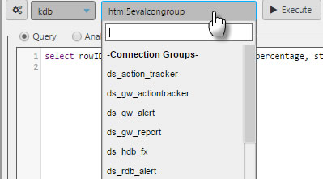

In the Query Editor, add the query for your data:

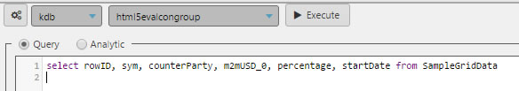

Ensure 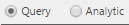 is selected.

!!! tip
    The primary _Query_, _Pivot Query_ and _Update Query_ section of the Query Editor have drag bars (highlighted blue on rollover) to increase or decrease the viewable area of each. 

The default number of display rows is 100, but up to 1 million rows of data can be displayed.  
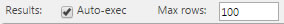


### Sample query

Data Connection
: `html5evalcongroup`

Query
: `select rowID, sym, counterParty, m2mUSD_0, percentage, startDate from SampleGridData` 

Subscription
: 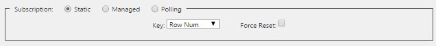

    Static
    : The default setting is static. If data is sourced from a running feed then _Interval_ (in seconds) and _Key_ must be defined. 

    Managed
    : Managed data is a server-side poll of the database, which is then pushed to the client. Managed queries are used for repeat poll requests, to limit hits to the source database. 

    Polling
    : Polling queries are client-based requests to the database. 

Analytics also support Streaming data from a real-time feed.

_Force reset_, if checked, clears stored values on (re)loading the dashboard.


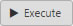 the query to populate data to a [Data Grid](datagrid) or chart.

A successfully-executed query will populate the _Results_ table.

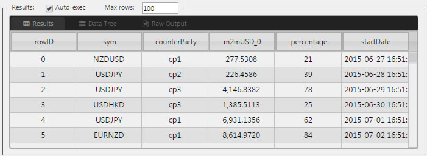

## Pivot query

Pivot queries are used by the [Pivot Grid](pivotgrid) component.


Pivot data is split between independent variables, _Breakdown Cols_ and dependent variables, _Aggregates_. 

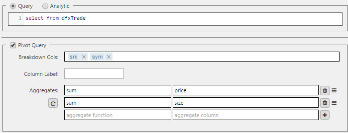

To add a new row to _Aggregates_ click 

!!! warning "Case-sensitive names"
    Names for _Breakdown Cols_ and _Aggregates_ are case-sensitive. If an error occurs, check that column-header names in source database match those used in dashboards. 

The order of the _Breakdown Cols_ can be changed using drag and drop, and can also be changed by the user in the dashboard.  
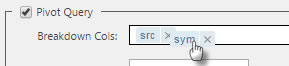  
<i class="fa fa-hand-o-right"></i> [Pivot Grid](pivotgrid)


### Pivot breakdown via breadcrumbs

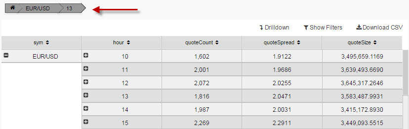

The order of the pivot breakdown can be controlled from the [Breadcrumbs](breadcrumbs) component.

1. Create a _View State_ parameter and associate with the _Breakdown_ property in _Settings_.  
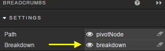
2. In the linked pivot query, assign the _Breakdown_ property to the _Breakdown Cols_ in the pivot query.  
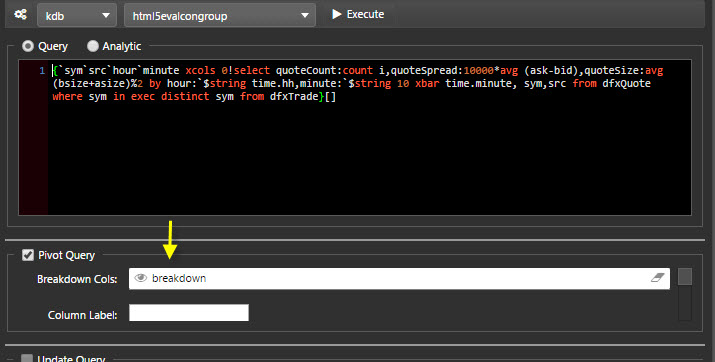

The resulting output shows the breakdown elements laid out in the Breadcrumb component.  These can be dragged and repositioned to change the pivot order.

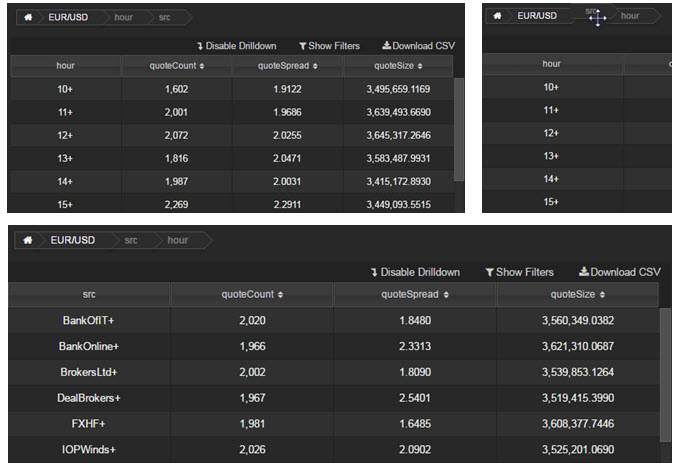


### Column label

A two-dimensional pivot query:

```
{[n]
([hub:n?`CHIA`XASX;country:n?`UK`USA`CANADA`FRANCE;account:n?`4;displayQueue:n?`NEW`ASSIGNED`CLOSED]ncount:n?100)}
```

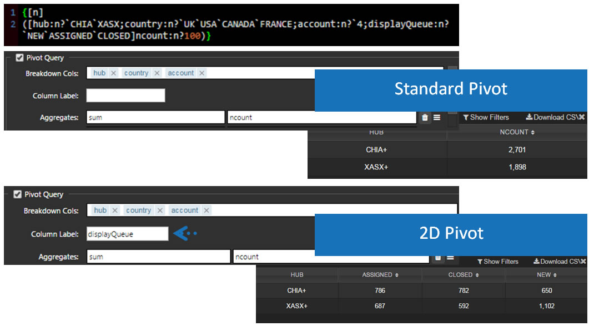

_Column Label_ is used to support 2-dimensional pivots.  An example query:

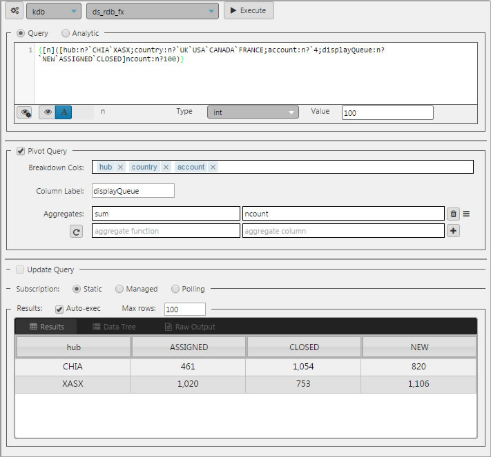

Navigation of a OLAP / Pivot control requires enabling Breadcrumbs in a component, or linking with a [Breadcrumbs](breadcrumbs) component.


### Aggregate functions: unary and binary

Binary Analytic

In the query editor, `select from` the database source

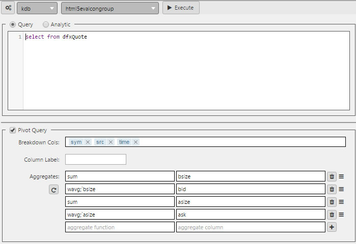

Breakdown Cols
: The drill-down buckets, i.e. the independent variables

Aggregates
: Functions of the dependent variables. Unary functions are `sum`, `avg`, `count`, `min`, `max`. <!-- Binary example as illustrated in the VWAP example (*function:`parameter*). WTF?--> 


### Custom binary analytics

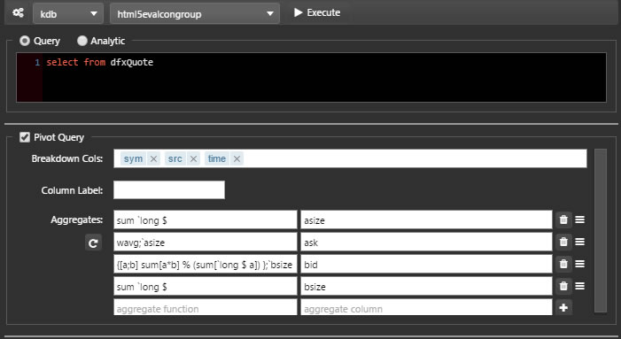
 
A standard built-in binary function is available as part of the VWAP Analytic (_subVWAP_) found in _Demo Trading_ dashboard in the Dashboard evaluation pack. `bsize` is bid size

```q
Example: {[a;b] sum[a*b] % (sum[`long $ a])};`bsize
```

## Update query

In addition to using Update Query code, [Data Grid](datagrid) requires _Enable Edit Mode_ and/or _Enable Insert/Delete_ to be selected.

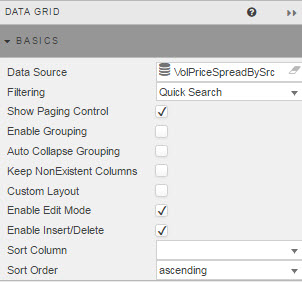

Sample format for an Update Query

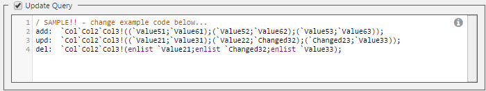

The User can *Edit* in their dashboard

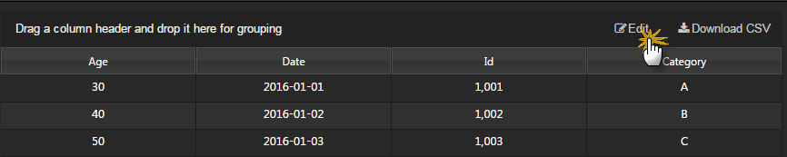

Click inside cell to edit to change or add a row, then *Submit* or *Cancel* changes. 

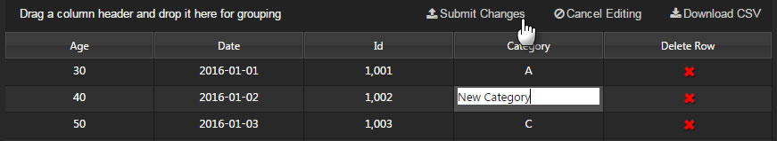

An Update Query allows dashboard users, both read-only and write permissioned, to make changes to the source database inside a [Data Grid](datagrid); for example, when adding a new client to a database. The Update Query requires both a query, and a settings check in Data Grid properties.

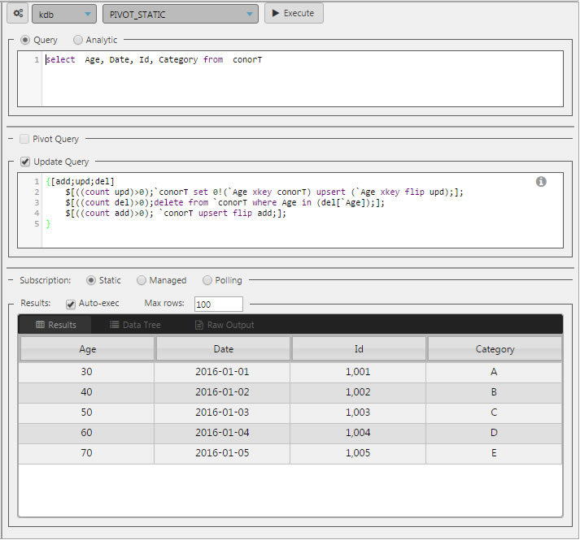

!!! tip "Permission to edit"
    If _Update Query_ is enabled, all users permissioned for that dashboard will be able to make changes. If you want only some read-only permissioned users to have edit permissions:

    * Duplicate the dashboard
    * Uncheck _Enable Edit Mode_ and _Enable Insert/Delete_ from the Data Grid properties 
    * Permission users who shouldn’t have edit control to this duplicate dashboard.  

Remember to link to the [Breadcrumbs](breadcrumbs) component for navigation control of the pivot.


## Analytics

SubVWAP Analytic


Analytics are predefined queries, built in ==Control for Kx==<!-- WTF? -->, which can be configured and executed as data sources.

The _subVWAP_ analytic is an example of an analytic using streaming data.

As with q queries, analytics must include a selected database from the dropdown menu


## View State Parameters

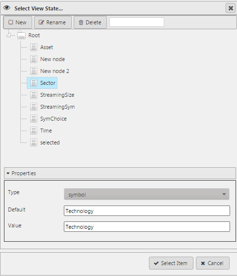  
_View State selector_

View State Parameters are used to store values and states. They can be used to pass values between components and put values into queries. 

The View State selector can be accessed by clicking inside any input box showing the . 

Alternatively, certain inputs also support View State usage, but the icon is hidden; for certain components it’s to the left of the Clear button . If View State Parameters are supported, a rollover of the input box will display the eye icon.

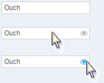 

With the use of View State Parameters, any selection element from the dashboard editor can be made available to the dashboard user. By pairing a View State Parameter variable to a [Text Input](textinput) or [Drop Down List](dropdownlist) component, a user can pass a value, customize a chart color, or use more advanced filtering options. To prevent errors in the formatting of the input, it may be necessary to include a text prompt to help the user pass a variable in the correct format. 


<!-- ### View State Parameter Menu -->
### Creating a View State Parameter

<!-- Select View State Parameter to enable *Rename* and *Delete* parameter WTF? -->

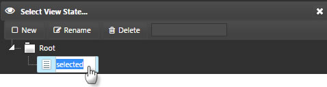 

1. Create a new View State and name it.  
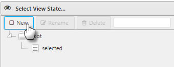
2. Set the _Type_:  
Supported: boolean byte char date datetime dict double float guid int list long minute month second short string symbol time timespan timestamp
3. Set a _Default_ value if required. This will automatically map to _Value_.  When a dashboard is loaded it will automatically run queries using the View State Parameter. 
4. _Select_ to create.  


### View State Parameters in the Query Editor

View State Parameters can also be mapped from the Query Editor. When a user variable is added to a query, the Query Editor will automatically identify such variables. Query variables can be mapped to View State Parameters, and used with components like [Data Form](dataform), [Drop Down List](dropdownlist), or [Date Picker](datepicker).

Inside the Query Editor, map the variable to a View State Parameter. This is an automatic process on click. 


This will update *Value* to reflect the mapped View State Parameter. <!-- In the above example, <%Query/value%> WTF? -->


If a manual change to a View State Parameter is required – for example, to define a Default Value or change the Type, click the highlighted eye icon:


!!! warning
    When defining a parameter type, do so from the View State Parameters dialog, not from the Query Editor.  Changing variable type inside the Query Editor will change it for that query only.  Also, the type defined in Query Editor will be overwritten by the type from the View State Parameter dialog.

    However, when testing a query execution, it can be helpful to assign a value to a query parameter before mapping a View State. This can be done through the Query Editor.


## Linking components

 

Components which share a data source can interact so that updates in one component are reflected in another.

Linking components is done by creating a View State Parameter and assigning it to the _Focus_ variable of a component’s _Basic_ properties. This allows an interaction between linked components; e.g. [Pivot Grid](pivotgrid), [Breadcrumbs](breadcrumbs), and [Bar Chart](barchart), can update on a single click. For example:


on click, becomes


## Snapshot PDF view

A screenshot of a dashboard can be taken using the PDF button: 


## Publish a dashboard

Once a dashboard is complete, it can be published for release. Before publishing, a dashboard can be previewed: . This removes the Editor frame and shows the end-user view with full interactivity.

Preview also offers iPhone and iPad views:


To create a public link, go to the Dashboards Manager: 


Select the Dashboard to publish, and click 


The public link is available in Dashboard Basics properties.


## Publish data from a Non-Delta process

Example of published data from Non-Delta Process


1. Start a q session on the host and port configured in the connection that was set up in Delta Control: 
```
q -p 10101
```
2. Define a table:
```
q)dfxQuoteTest:([]sym:`$();ask:"F"$();bid:"F"$())
```
3. Load the standard pub/sub code in to the q process.  This can be done by loading the u.q file from the Kx website:
```
q)\l u.q
```
4. Initialise and define function names that are called by the Query Manager:
```
q).u.init[]
q).d.unsub:.u.del
```
5. Publish updates to the table, this could be done as follows (as an example):
```
q)pubQuoteTest:{newdata:([]sym:10?(`$"EUR/USD";`$"GBP/USD";`$"USD/JPY");ask:10?1.5f;bid:10?1.35f);`dfxQuoteTest upsert newdata;.u.pub[`dfxQuoteTest;newdata]}
q).z.ts:{pubQuoteTest[]}
q)\t 10000
```


### Setting up an HTML5 dashboard to get updates from the non-Delta process

1. Create a new data grid, uncheck _Show Paging Control_ and _Enable Grouping_  and set filtering to _disabled_ .  

2. Click on the data source and define a new data node. Select the connection you defined from the drop down, select the _tickSubscription_ analytic and set the query to _Streaming_.  

3. In the _Parameters_ box click on _Existing Viewstate Path_ and create three new viewstates:  
a. `table` (type: symbol) and set to `dfxQuoteTest`  
b. `symbols` (type: list) and set to `ccypairs` to subscribe too <!-- WTF? -->  
c. `columns` (type: list) defines display columns  
  
  

4. In the _Parameters_ box, click the _Text_ button to define three arguments: `table`, `symbols` and `columns`. Populate each with the corresponding View State as selected from the dropdown.  

5. Apply and execute  

6.Select, then save the dashboard.  The app will update from the non-Delta process. 

