# Dashboards for Kx

<iframe src="https://player.vimeo.com/video/135580263" width="100%" height="450" frameborder="0" webkitallowfullscreen mozallowfullscreen allowfullscreen></iframe>

Dashboards for Kx offers an easy-to-use, yet powerful drag-and-drop interface to allow Creators build dashboards without the need for programming experience. 

Dashboards for Kx provides rich visualisation of real-time streaming data with support for highly optimized polled queries. Built in HTML using JavaScript libraries, Dashboards for Kx can be used in all modern browsers and can be used on mobile and desktop environments.

Kx supports real-time analysis of billions of records and fact access to terabytes of historical data, offering seamless scalability. 

## First Dashboard


*Above New Dashboard View

The Dashboard builder is comprised of a central workspace; to the left is a list of components, and to the right are the properties associated with the dashboard or selected component.

The Administrator dropdown menu in the top right offers a Light or (default) Dark theme builder view, and the ability to set the base language for the dashboard. 


<aside class="warning">
Builder theme is different to Dashboard theme. Define dashboard theme from the Style menu of Dashboards. 
</aside>

<aside class="warning">
Language support is offered for English, German and Japanese.
</aside>

### Dashboard Basics

In Dashboard properties, give the dashboard a Name. The Link is the public link used to share the dashboard with colleagues.


<aside class="warning">
The Link is non-editable. Clicking on the link will open the dashboard in a new browser tab
</aside>

**Fill Height**

Check Fill Height so dashboards autofit to the height of the browser depending on user screen resolution. 

<aside class="warning">Dashboards will automatically autofit for browser width</aside>

### Save Dashboards

Dashboard Manager


It's good basic practice to regularly save dashboard work. This can be done from the header menu.


<aside class="warning">
Dashboards can be copied with . Good for dashboards sharing data formats, sourced from different databases.
</aside>

### Create a New Dashboard

New dashboards can be created clicking the file  icon

### Dashboard Manager: Open, View & Delete Dashboards

Dashboards are managed, opened and viewed from the Manage menu 

Inside Dashboard Manager, select a dashboard from the list, before clicking  

"View on Web" shows an end-user view of your Dashboard.

### Import / Export Dashboard

Dashboards can be exported (as XML) and imported via the Dashboard Manager Menu. 


**Import**

[1] Open a directory containing your saved XML dashboards

[2] Select one or more dashboards to import

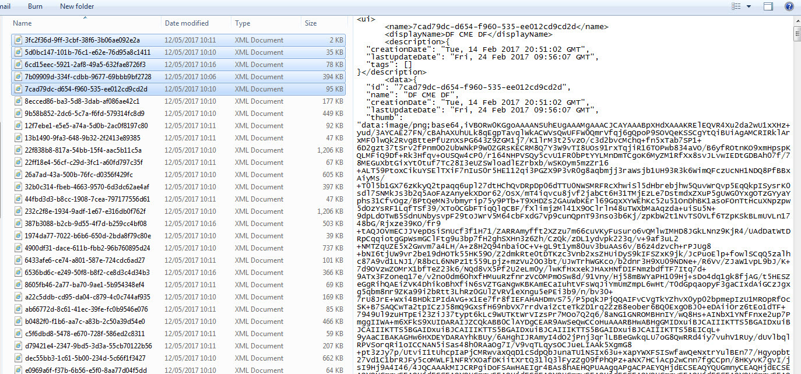

[3] Open the Dashboard Manager and select Import (img/importicon.jpg)

[4] Close Dashboard Manager and check Dashboard List Dropdown for imported dashboards


**Export**

[1] In the Dashboard Manager, select a dashboard


[2] Selecting a dashboard should highlight the Export icon; click the Export icon


[3] Select a location on your PC to export the Dashboard xml file too. 

## Customizing the Dashboard

Setting the global style for your dashboard.

Dashboard Settings: 

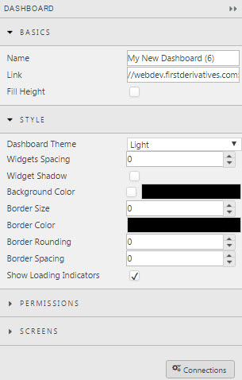

Dashboard Style Example: 

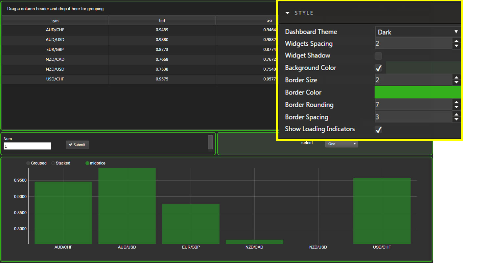

### Dashboard Style

If the dashboard is to have a light or dark theme it can be defined from Style property.  The Style menu is also where spacing between the components and the background color of the component is defined. 

<aside class="warning">
If your dashboard uses streaming, managed or polling data, uncheck 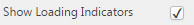
</aside>

### Dashboard Permissions

Dashboard Users can either be Read Only Users, or have assigned Write Access permissions - enabling editing of dashboards.  The User Group list is defined in Control for Kx. 


### Screens

All dashboards have a main screen, but multiple screens can be added and linked using the Navigation or Button component.


## Creating a Connection

Connections can be created from the Dashboard console or Query Editor.


1. Open the Connections menu and create New Connection

2. Give your Connection a Name

3. Define Type

<aside class="warning">
Default Type: kdb
</aside>

4. Define Host

5. Set Connection Port

6. Include any User and Password information. Confirm the Password

7. Save when complete

### Connection Groups

Individual connections can be grouped together 

1. Give Connection Group a Name

2. Use CTRL + select connections in the right-hand-box list.

3. Save Group

All connections (single & group) will appear in a drop down list in the Data Source Editor.  See <a href="#defining-a-query">**Defining a Query**</a>


Single Connection:


Group Connection: 


## Adding Your First Component

Drag-and-drop components into workspace


Configure component from the Property panel on the right


Dashboards are created by bringing components from the list available on the left into the workspace.  Each component has a set of properties, configured using the menu to the right.

### Basic customisation

1. Define Data Source by assigning a query or analytic: see <a href="#defining-a-query">**Defining a Query**</a>

2. Set Data View.  This is how the display will be displayed in the dashboard **See relevant Data & Pivot Grid or Charting Component**

3. Set Style and Formatting, including any Title headers. See <a href="#dashboard-components">**Dashboard Components**</a>

<aside class="warning">
Some Components use unique Data Sources, e.g. Report Manager or Action Tracker. See relevant component for more information. 
</aside>

Components sharing data sources can be linked, and queries using input variables can have values passed to them using Data Form or Drop Down component. see <a href="#linking-components">**Linking Components**</a>

The first component for many dashboards will be either a [Data Grid](datagrid.md), [Pivot Grid](pivotgrid.md) or [Bar Chart](barchart.md).


## Defining a Query

Query Editor


Queries are defined from the Basic Property panel, "Data Source". Left click inside the "Data Source" input box to open the Query Editor


From the Query Editor, create a 'New' Data Source


Select the Data Connection from the dropdown menu. See <a href="#creating-a-connection">**creating a connection**</a> if this hasn't be done yet. 

<aside class="warning">
Connections can also be created by clicking 
</aside>


In the Query editor, add the query for your data


<aside class="warning">
Ensure  is selected
</aside>

<aside class="warning">
The primary Query, Pivot Query and Update Query section of the Query Editor have drag bars (blue highlight on rollover) to increase or decrease the viewable area of each. 
</aside>


<aside class="warning">
The default number of display rows is 100, but up to 1 million rows of data can be displayed. 
</aside>

### Sample Query

**Data Connection:** `html5evalcongroup`

**Query:** `select rowID, sym, counterParty, m2mUSD_0, percentage, startDate from SampleGridData` 


  
<aside class="warning">
The default data setting is static, if data is sourced from a running feed then Interval (in seconds) and Key has to be defined. 

Queried data can be Managed or Polling. 

Managed data is a server-side poll of the database, which is then pushed to the Client. 
Managed queries are used for repeat poll requests to limit hits to the source database. 
Polling queries are client-based requests to the database. 
Analytics also support Streaming data from a real-time feed

Force reset, if checked, clears stored values on Dashboard (re)load. 
</aside>

 the query to populate data to a Data Grid or Chart.

A successfully executed query will populate the Results Table.


## Pivot Query

Pivot Queries are used by the <a href="#pivot-grid">**Pivot Grid**</a> component.


Pivot data is split between independent variables, 'Breadown Cols' and dependent variables, 'Aggregates'. 


To add a new row of 'Aggregates' click 

<aside class="warning">
Names for 'Breakdown Cols' and 'Aggregates' are case sensitive. If an error, check column header names in source database match those used in Dashboards. 
</aside>

The order of the 'Breakdown Cols' can be changed using drag-and-drop, and can also be changed by the User in the dashboard. See <a href="#pivot-grid">**Pivot Grid**</a>


### Pivot Breakdown via Breadcrumbs

Breadcrumb Breakdown


The order of the pivot breakdown can be controlled from the  <a href="#breadcrumbs">Breadcrumbs</a> component.

[1] Create a View State Parameter and associate with the <em>Breakdown</em> property in <strong>Settings</strong>


[2] In the linked Pivot Query, assign the <em>Breakdown</em> property to the <em>Breakdown Cols</em> in the Pivot Query


The resulting output shows the breakdown elements laid out in the breadcrumb component.  These can be dragged-and-repositioned to reorder the pivot order.


### Column Label

Two-dimensional Pivot Query:

```
{[n]
([hub:n?`CHIA`XASX;country:n?`UK`USA`CANADA`FRANCE;account:n?`4;dispalyQueue:n?`NEW`ASSIGNED`CLOSED]ncount:n?100)}
```


*Column Label* is used to support 2-dimenional pivots.  An example query is given below:


<aside class="warning">
Navigation of a OLAP / Pivot control requires enabling Breadcrumbs in a component, or linking with [Breadcrumb Component](breadcrumb.md).
</aside>

### Aggregate Functions: Monadic/Dyadic

Dyadic Analytic

In the query editor, **select from** database source


**Breakdown** represents the drilldown buckets (independent variables)

**Aggregate** (dependent variables) Monadic are sum, avg, count, min, max data functions. Dyadic example as illustrated in the VWAP example (*function:`parameter*).

### Custom Dyadic Analytics

Custom Dyadic Analytic


 
A standard built-in predefined dyadic function is available. 

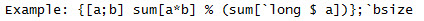

## Update Query

In addition to using Update Query code, Data Grid requires *Enable Edit Mode* and/or *Enable Insert/Delete* to be selected in Properties


Sample format for an Update Query


The User can *Edit* in their dashboard


Click inside cell to edit to change or add a row, then *Submit* or *Cancel* changes. 


An Update Query allows Dashboard end-users, both Read-Only and Write permissioned, to make changes to the source database inside a Data Grid; for example, when adding a new client to a database. The Update Query requires both a query, and a settings check in Data Grid properties.


<aside class="warning">
If Update Query is enabled, all Users permissioned for that dashboard will be able to make changes. If you only want some Read-only permissioned Users to have Edit permissions, duplicate the dashboard and uncheck Enable Edit Mode and Enable Insert/Delete from Data Grid properties and permission Users who shouldn't have edit control to this duplicate dashboard.  
</aside>

<aside class="warning">Remember to link to the **Breadcrumb** component for navigation control of the pivot</aside>

## Analytics

SubVWAP Analytic


Analytics are predefined queries, built in Control for Kx, which can be configured and executed as data sources.

The *subVWAP* analytic is an example of an analytic using streaming data.

<aside class="warning">
As with q queries, analytics must include a selected database from the dropdown menu
</aside>

## View State Parameters

View State Parameter menu


View State Parameters are used to store values and states. These parameters can be used to pass values between components and input values into queries. 

The View State Menu can be accessed by clicking inside any input box showing the  

Alternatively, certain inputs also support View State Parameter usage, but the icon is hidden; for certain components it's to the left of the clear button . If a View State Parameter is supported, a rollover of the input box will display the eye icon.

 

With the use of View State Parameters, any selection element from the dashboard editor can be made available to the dashboard user. By pairing a View State Parameter variable to a <a href="#text-input">Text Input</a> or <a href="#drop-down-list">Drop Down List</a> component, a User can pass a value,customize a chart color, or have available more advanced filtering options. To prevent errors in the formatting of the input, it may be neccessary to include a text prompt to help the user pass a variable in the correct format. 

### View State Parameter Menu

Select View State Parameter to enable *Rename* and *Delete* parameter

 

Create a New View State, and name it


Next set the parameter Type:

**Supported:** *boolean byte char date datetime dict double float guid int list long minute month second short string symbol time timespan timestamp*

Set a *Default* value if required. This will automatically map to *Value*.  When a dashboard is loaded it will automatically run queries using the View State Parameter

Finally, Select or Cancel to create.


### View State Parameters in Query Editor

View State Parameters can also be mapped from the Query Editor. When a user-variable is added to a Query, the Query Editor will automatically identify such variables. Query variables can be mapped to View State Parameters, and used with components like <a href="#data-form">**Date Form**</a>, <a href="#drop-down">**Drop down**</a>, or <a href="#date-picker">**Date Picker**</a>

Inside the Query Editor, map the variable to a View State Parameter. This is an automatic process on click. 


This will update *Value* to reflect the mapped View State Parameter. In the above example, <%Query/value%>


If a manual change to a View State Parameter is required; for example, to define a Default Value or change the Type, click the highlighted eye icon


<aside class="warning">
When defining parameter Type, do so from the View State Parameters menu, not from the Query Editor.  Changing variable Type inside the Query Editor will only change it for that query.  Also, Type defined in Query Editor will be overwritten by defined Type from the View State Parameter dialog.
</aside>

<aside class="warning">
However, when testing a query execution, it can be helpful to assign a value to a query parameter before mapping a View State. This can be done through the Query Editor.
</aside>

## Linking Components

Linking Components:


Components which share a Data Source can interact so that updates in one component are reflected in another.

Linking components is done by creating a View State Property and assiging the parameter to the *Focus* variable of **Basic** component properties. Such that an interaction between linked components; e.g. [Pivot Grid](pivotgrid.md), [Breadcrumbs](breadcrumbs.md), and [Bar Chart](barchart.md), can update on a single click. For example:


on click, becomes


## Snapshot PDF view

A screenshot of a dashboard can be taken using the PDF button: 

## Design

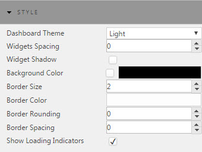

Thick Borders:

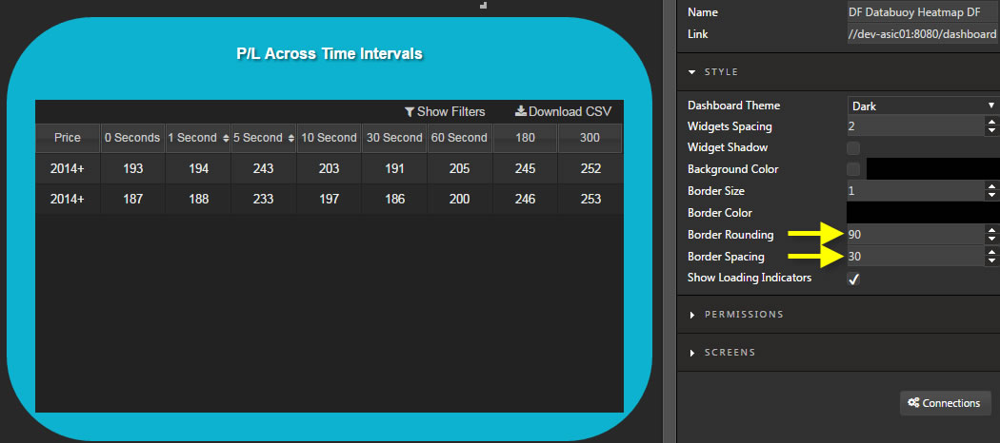

Thin Borders:

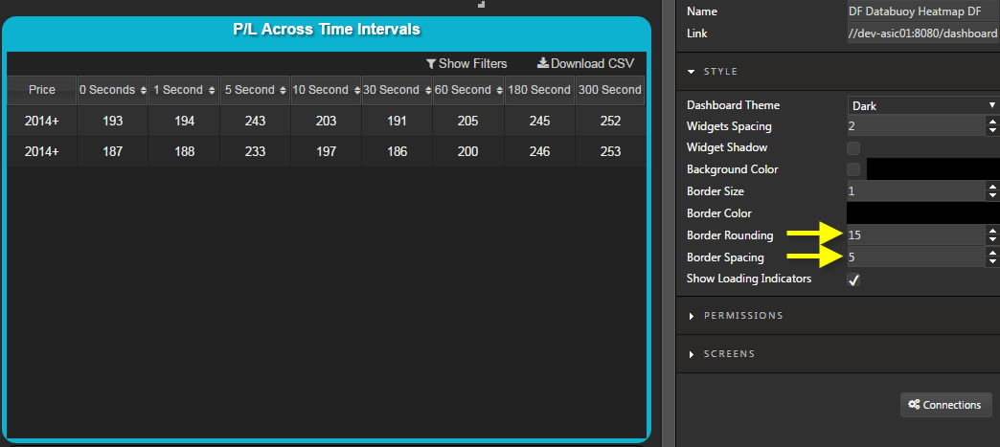

A number of styling and formatting options are available to customize dashboards. 

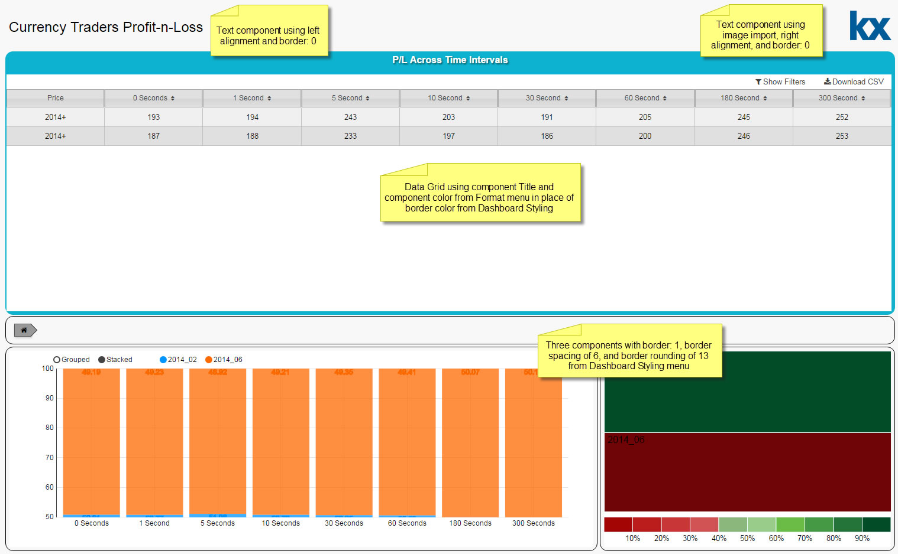

To apply a border to all components, set *Border Size* to a value greater than 1 in the **Dashboard Style** menu

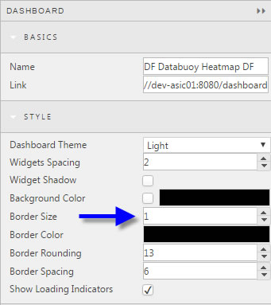

If a border is used (although not required), adding widget spacing will help apply a buffer between components.

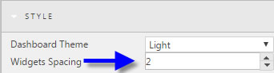

Added widget spacing is the equivalent of *Outer Margin* in the Margin menu of a component

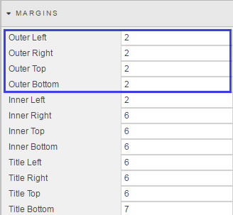

*Border Spacing* sets the spacing between the elements of the component and the border.
 
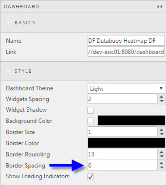

*Border Spacing* is the the equivalent of *Inner Margin* in the Margin menu of a component

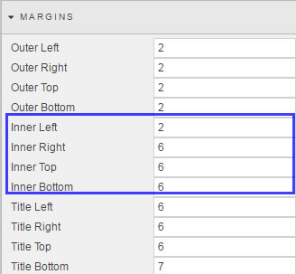

Rounding of borders is only possible if *Border Size* has a value greater than 1. Use of more rounded borders requires increased border spacing to avoiding edge cutting of the border. 
 
<aside class="warning">
Changes to Dashboard Styling will overwrite individual component Margin settings. When styling dashboards, ensure changes are made at the macro-dashboard level before configuring at the individual component level.
</aside>

### Adding a Logo

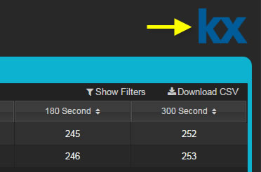

To add a logo to a dashboard, use the Text Component

[1] Drag the text component into the dashboard, then select
 
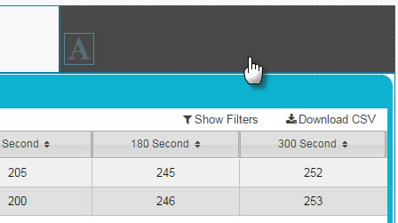

[2] Click inside the *Formatted Text* box of **Text Component** *Basics* property to open the Text editor

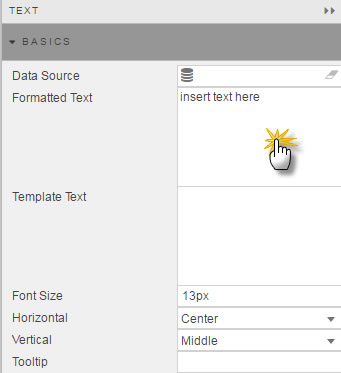

[3] Add an Image from the menu bar. The Height and Width of the logo are configured in pixels. 

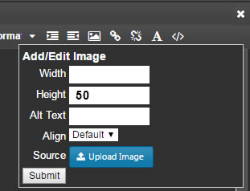

<aside class="warning">
Set the height of the logo (in pixels): 50 is good
Set widith if needed
Submit to load the image
</aside>

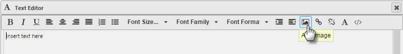

A sample height of 50 is good for a logo. The importer will rescale the logo maintaining the aspect ratio if just image height is set. 

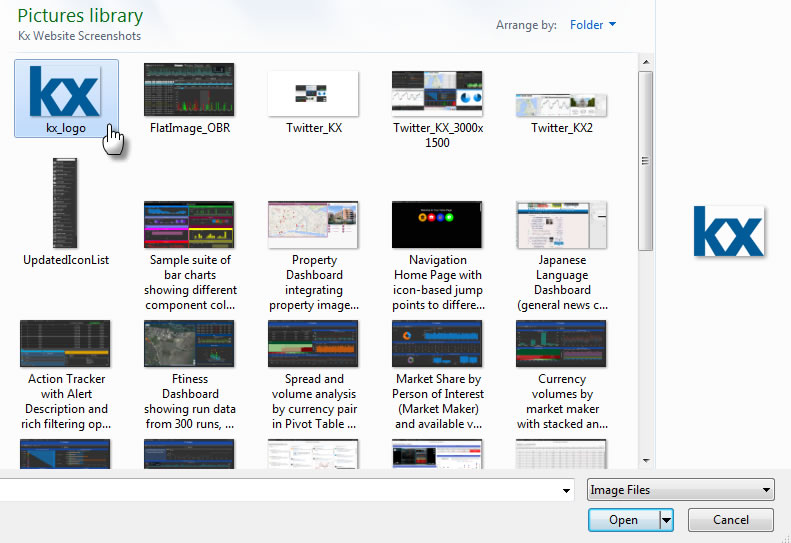

<aside class="warning">Ensure your logo image uses a transparent background so it's compatible with the background of the dashboard</aside>

<aside class="warning">Delete the default "insert text here" from the **Text Component** before adding the logo</aside>

[4] If your logo is positioned to the left of the dashboard, change the *Horizontal* alignment to Left. Do vice versa for right-positioned logos

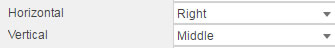

[5] To prevent the appearance of unncessary scroll bars around the logo on browser resize, update the *Advanced CSS* from the **Syle** menu

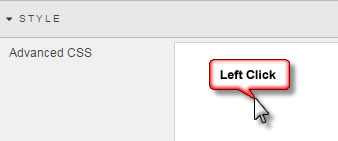

Next click the CSS icon to activate the selector

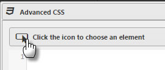

Rollover the *Text Component* until the *div.htmlContent* box is selected:

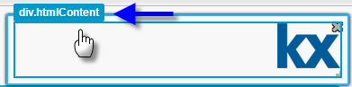

[6] Update the CSS so as to hide scroll bars using the *overflow* property. Set the *overflow* property to 'hidden'. Remember to add the CSS inside the '{}' brackets
 
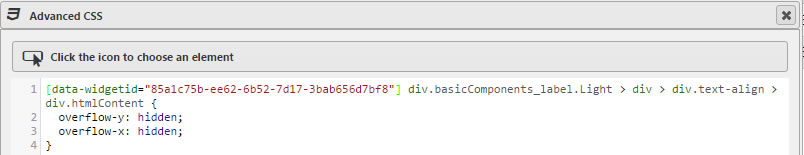

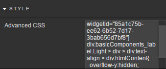

<aside class="warning">If Dashboard Styling is used to align and position components, remember to update the *Margins* setting of the Text Component to undo any unncessary changes in the position of the logo</aside>

## Margins

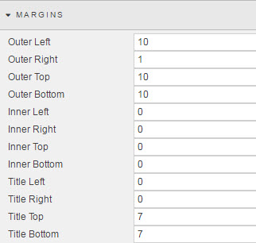

### Outer 

Controls spacing outside of component and component border

### Inner

Controls spacing between component (rectagular) pane and any utilized border.

<aside class="warning">In the absence of a defined border, changes between Inner and Outer Margin will appear similar</aside>

### Title 

Controls Title positioning relative to the component pane and outer border

Sample Title Settings | Results
--- | ---
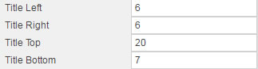 | 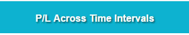
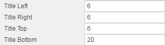 | 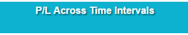
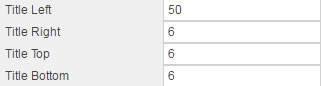 | 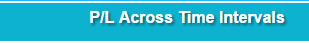

<aside class="warning">Adjusting *Title Left* and *Title Right* will add margin even if Title is center aligned for *Title Horizontal Align* in **Format** Menu </aside>

## Format

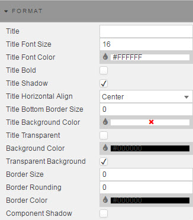

The Format menu is used to add a component Title and set individual component colors. 

### Title

Adds a title description to the component

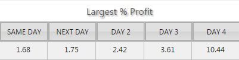

### Title Font Size

Defined in pixel size

### Title Font Color

Font Color. To change, click on the color bar to bring up the palette menu

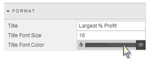
 
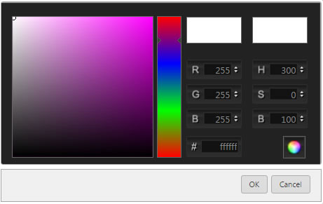

### Title Bold

Check if Title is to be in bold

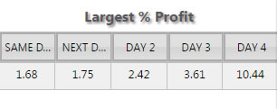

### Title Shadow

Check if shadow is to be applied to Title

### Title Horizontal Align

Position of title in component

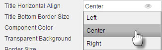

### Title Bottom Border Size
 
Defines distance between the Title and the content of the component

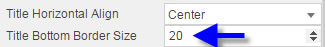

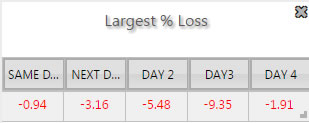

### Component Color

Sets color of component; applies to border and title background. Requires an uncheck of <a href="#transparent-background">Transparent Background</a> to activate.

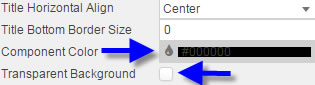

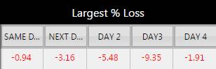

### Transparent Background

If checked, will use the background color set in <a href="#design">Dashboard Styling</a>. If unchecked, will use <a href="#component-color">Component Color</a> set in Format menu.

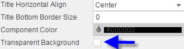

### Border Size, Rounding and Color
 
The three inputs control border use of a component

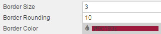

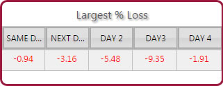

<aside="warning">
It may be necessary to adjust *Inner Top* and *Inner Bottom* margin to avoid the rectangular area box of the component from cutting into a rounded border
</aside>

### Component Shadow

Add shadow level around component edges

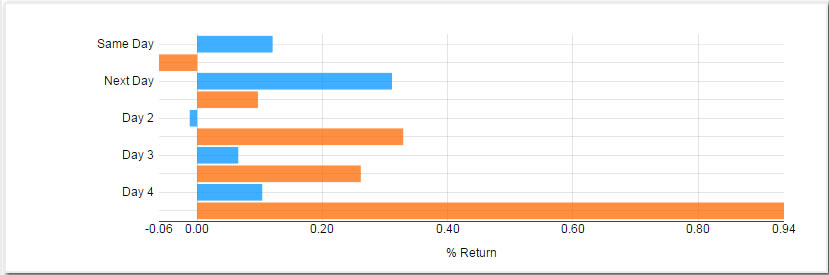

## Publish a Dashboard

Once a dashboard is complete, it can be published for release. Before publishing a dashboard can be previewed: . This removes the Editor frame and shows the end-User view with full interactivity.

Preview also offers iPhone and iPad views:


To create a public link, go to Dashboards Manager


Select the Dashboard to publish, and click 


The public link is available in Dashboard Basics properties.


## Publish Data from a Non-Delta Process

Example of published data from Non-Delta Process


* Start a q session on the host and port configured in the connection that was set up in Delta Control:

```
q -p 10101
```

* Define a table:

```
q)dfxQuoteTest:([]sym:`$();ask:"F"$();bid:"F"$())
```

*	Load the standard pub/sub code in to the q process.  This can be done by loading the u.q file from the Kx website:

```
q)\l u.q

```

*	Initialise and define function names that are called by the Query Manager:

```
q).u.init[]
q).d.unsub:.u.del
```

*	Publish updates to the table, this could be done as follows (as an example):

```
q)pubQuoteTest:{newdata:([]sym:10?(`$"EUR/USD";`$"GBP/USD";`$"USD/JPY");ask:10?1.5f;bid:10?1.35f);`dfxQuoteTest upsert newdata;.u.pub[`dfxQuoteTest;newdata]}
q).z.ts:{pubQuoteTest[]}
q)\t 10000
```

### Setting up an HTML5 dashboard to get updates from the non-Delta process

* Create a new data grid, uncheck Show Paging Control and Enable Grouping  and set filtering to disabled


* Click on Data Source and define a new data node.  Select the connection you defined from the drop down, select the tickSubscription Analytic and set to Streaming query


* In the Parameters box click on Existing Viewstate Path and create three new viewstates

a. 'table' (Type: Symbol) and set to dfxQuoteTest
b. 'symbols' (Type: List) and set to ccypairs to subscribe too
c. 'columns' (Type: List) defines display columns


* In the Parameters box, click the Text button to define three arguments: 'table', 'symbols' and 'columns'. Populate each with the corresponding viewstate as selected from the dropdown.


* Apply and Execute


* Select, then save the Dashboard.  The app should update from the non-Delta process

