## Navigation

The Navigation component can be used as a menu navigation between Dashboard screens, or as a "Welcome Screen" to open different dashboards.

## Basics

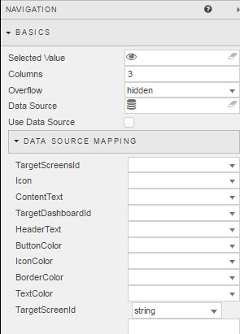

**Selected Value**

Assign a [view state parameter](introduction.md#view-state-parameters). Maps to selected button. 

**Columns**

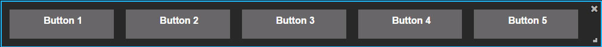

Configures the number of columns to use for button layout when **Fixed Width** buttons are not used.  Each column represents a button and will (relative) size according to the width of the navigation component. 

<aside class="warning">If <i>Fixed Width</i> is set for button defaults, set the number of <i>Columns</i> to 1</aside>

**Overflow**

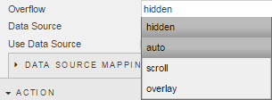

Determines scroll bar behaviour for navigation tool bar

Choice | Function
--- | ---
Hidden |  No scroll bar and visible buttons determined by component size.
Auto | Best fit of Navigation buttons with vertical scroll bar if required.
Scroll | Best fit of Navigation buttons include two scroll bars for vertical and horizontal axis.
Overflow | Best fit of Navigation buttons with reordering on rescale.

**Data Source**

Used when Navigation buttons are determined by a [Query](introduction.md#defining-a-query) or [Analytic](introduction.md#analytics)

<aside class="warning">Ensure employed <i>Data Source</i> has column entries for all <i>Data Source Mapping</i> elements</aside>

**Use Data Source**

Check box if **Data Source** is used to generate buttons 

### Data Source Mapping

When employing a **Data Source** to create Navigation buttons, ensure there are references in the **Data Source** for:

Data Source Variable | Description
--- | ---
Icon | URL Reference for icon image
Header Text | Descriptive header text for Navigation Button
Contains Text | Main body text for Navigation Button
Tooltip Text | Text to display on button rollover
TargetDashboardId | Reference id of Target Dashboard; e.g. 'New Dashboard'
TargetScreenId | Reference to Screen of Target Dashboard; e.g. 'Screen 1'
ButtonColor | Hex color reference to background button color; '#ffffff'
IconColor | Hex color reference to icon color; '#ffffff'
BorderColor | Hex color reference to border color; '#ffffff'
TextColor | Hex color reference to text color; '#ffffff'

For each item, select the matching column of the **Data Source** for each entry

## Action

### View State Mapping

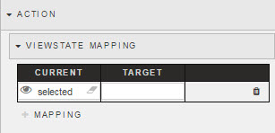
 
View State Mapping allows values of View State Parameters from Source dashboard to be transferred to View State Parameters in Destination Dashboard.

<aside class="warning">When mapping View State Parameters across dashboards, it will be necessary to create the Target View State Parameter in the destination dashboard first. Viewstate Mapping can only map to existing View State Parameters; it does not create them</aside>
 
To add a new Mapping element, click 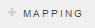 

### Button Defaults

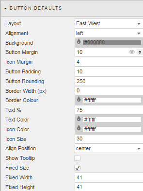

Sample buttons

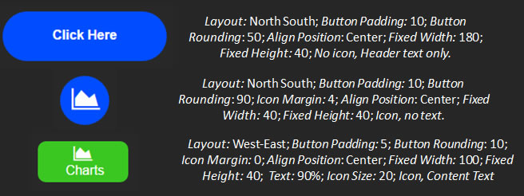

If a *Data Source* is not used to create and map buttons, then Navigation buttons can be created using the *Button Defaults* menu. Settings are applied across all buttons used. Individual button customisations are done from the <a href="#buttons">Buttons</a> menu. 

**Layout**

Configures the orientation order for icon and text. For example, a North-South aligment positions icon on top with text beneath, while an *East-West* alignment positions the icon to the left and text to the right

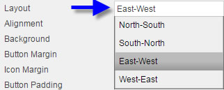
 
Layout | Position
--- | ---
North-South | Icon aligned on top with text beneath
South-Noth | Icon aligned underneadth text
East-West | Icon left aligned, text to right
West-East | Icon right aligned, text to left

<aside class="warning">The relative positioning of icons with text will also be dependent on the button size as icon and text are wrapped into button width.</aside>

**Alignment**

Set alignment of buttons inside Navigation component to left, right or center

**Background**

Use Hex color or colour palette to set background colour of button

**Button Margin**

Defines space (in pixels) around outside of button

**Icon Margin**

Defines space (in pixels) around icon, but inside the button

<aside class="warning">Adjusting icon margin may displace text 'out-of-view' for button, so icon margins should be small if combining icon and text</aside>

**Button Padding**

Defines space (in pixels) between around button icon and text, to edge of button.

**Button Rounding**

Applies Rounding to button. 

**Border Width**

Example: Border Width: 1; Colour: White; Rounding: 10

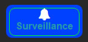

Applies a border around icon and text. This border will appear inside the bounds of the button.

**Border Colour**

Use colour palette to select button border color

**Border Rounding**

As for *Button Rounding*, applies a rounding edge to button border 

**Text %**

Where <i>Content Text</i> is used, *Text %* defines the position of the text inside the button. For example, the default value of 75% means button text will occupy three quarters the width of the button. 

**Text Color**

Use the colour palette to select a colour for button <i>Content Text</i>

**Icon Color**

Use the icon color to selet a colour for <i>icons</i> used in buttons.

**Icon Size**

Set the size of the icon 

**Align Position**

Defines the alignment of text and icons inside the button

**Show Tooltip**

Check control. Tooltip is configured in Navigation <a href="#Style">Style</a> menu.

**Fixed Size**

When checked, buttons will size (in pixels) according to settings of <i>fixed width</i> and <i>fixed height</i>.

<aside class="warning">If <i>Fixed Size</i> is not used, the number of buttons will be determined by <i>Columns</i> in the Basics Navigation and the height set by the Navigation panel</aside>

**Fixed Width**

Sets button width in pixels

<aside class="warning">Requires <i>*Fixed Size</i> to be checked</aside>

**Fixed Height**

Sets button height in pixels

<aside class="warning">Requires <i>Fixed Size</i> to be checked</aside>

## Buttons

### Details

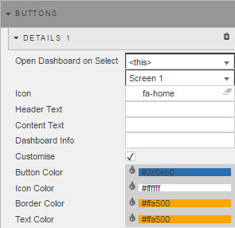

Individual buttons are added by clicking 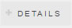

**Open Dashboard on Select**

Open a Different Dashboard:

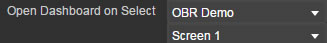

Open Screen in Current Dashboard:

Select the dashboard to open on button click. Buttons can also open screens ([customizing the dashboard](introduction.md#customizing-the-dashboard)); the screen is selected with the Dashboard set to "<this>"

**Icon**

Select an icon to use from icon menu

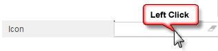

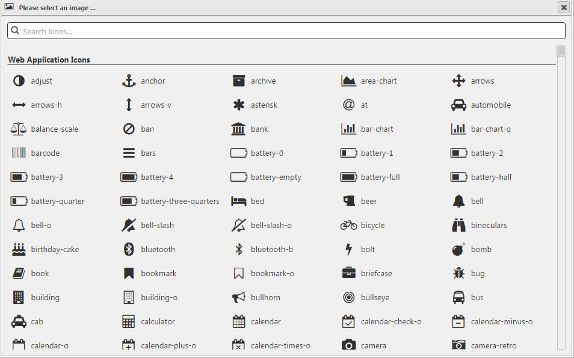

**Header Text**

Add bold text to button

**Content Text**

Add text beneath Header Text.  The size of this text is defined by <i>Text %</i> in button defaults. 

**Dashboard Info**

*Not currently in use*

**Customise**

When checked, allows for individual button customisation

<aside class="warning">If checked, button customisation will replace <a href="#button-defaults">button defaults</a> for the current button. However, if <a href="#button-defaults">button defaults</a> are later updated it will overwrite individual customizations.  Best to make individual button customisations after global button settings are completed</aside>

**Button Color**

Select button color from color palette

**Icon Color**
 
Select icon color from color palette

**Border Color**

Select icon color from color palette

**Text Color**

Select text color from color palette

## Style

Custom Tooltip Options

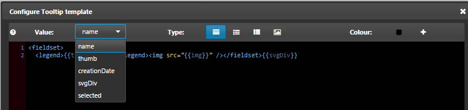

Configures tooltip for when **Show Tooltip** in <a href="#button-defaults">button defaults</a> is enabled.

### Custom Tooltip

Configure tooltip display. 

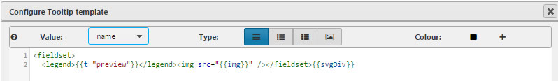

### Advanced CSS

 Navigation buttons and text can be changed using the Advanced CSS control. 

## Margins

See [Margins](introduction.md#margins) in Introduction for more

## Format

See [Format](introduction.md#format) in Introduction for more.