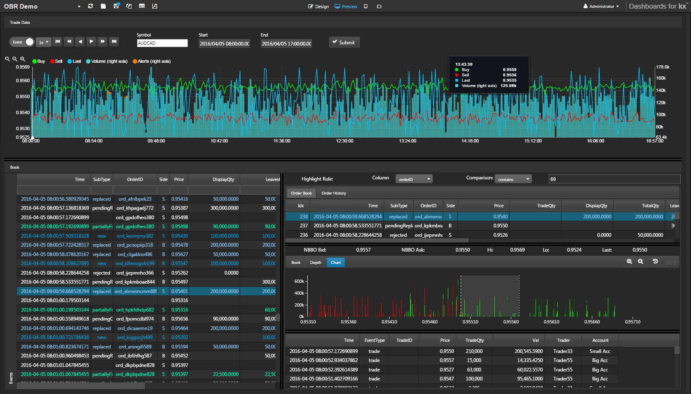
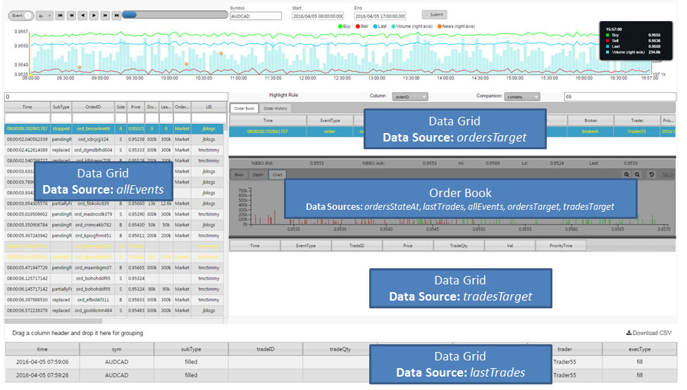
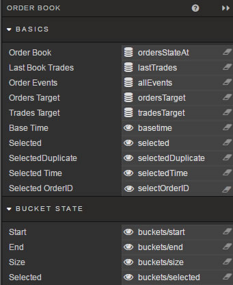
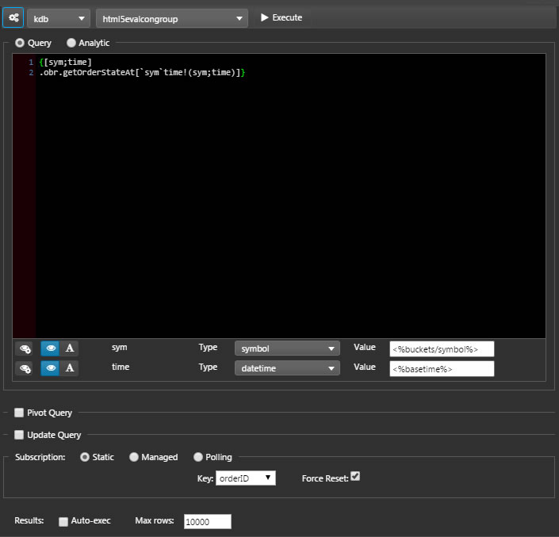
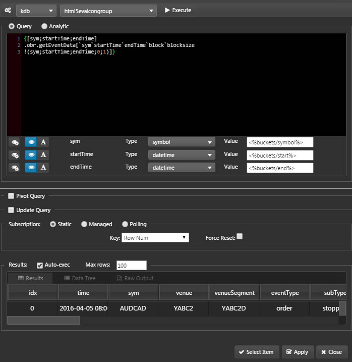
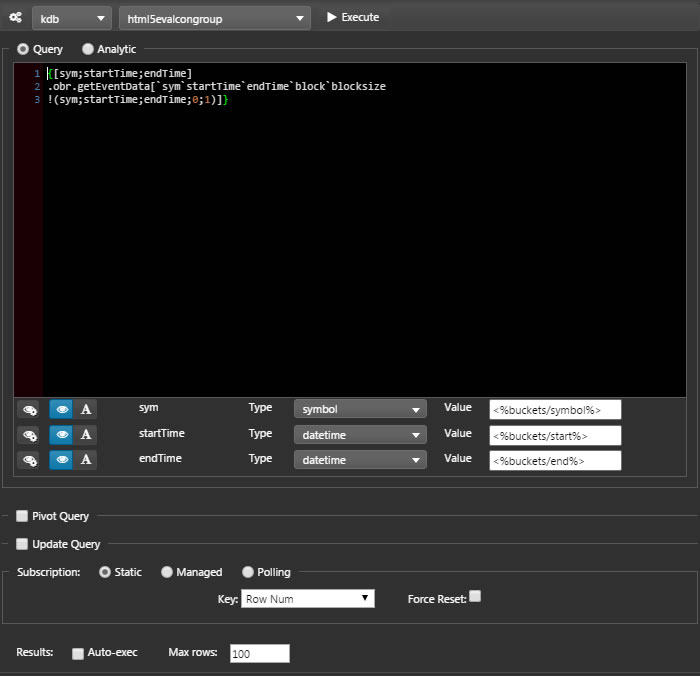
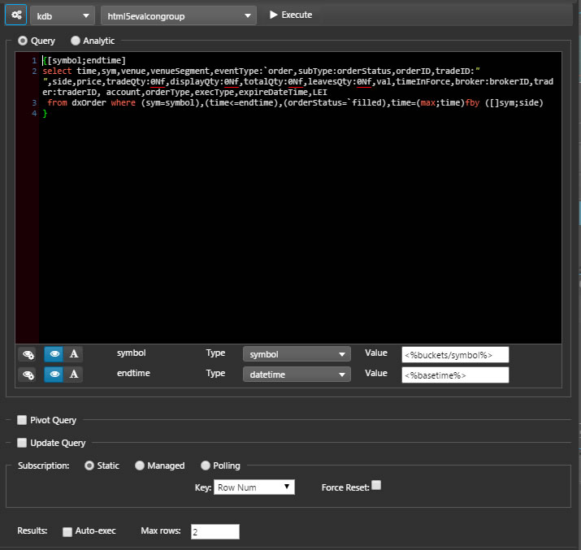
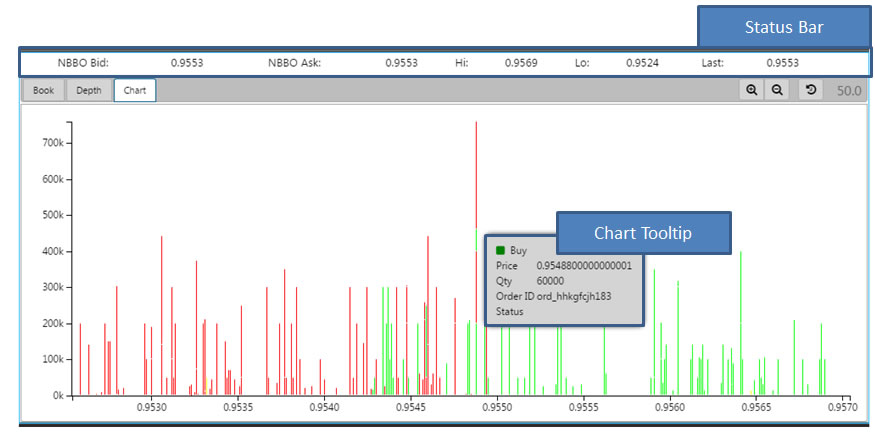

An Order Book charts market depth. It is used with charts and [Data Grids](datagrid) to build surveillance dashboards.

  
_Order Book Replay: a surveillance dashboard with an Order Book component (lower right) charting market depth_

  
_A surveillance dashboard’s components and their data sources_

## Basics

Data sources for the Order Book, typically shared with other dashboard components:

_Selected_

: A [View State Parameter](introduction#view-state-parameters)

_Order Book_

: 
 
    A data source: 
    <i class="fa fa-hand-o-right"></i> [Defining a Query](introduction#defining-a-query) and [Analytics](introduction#analytics)

_Order Events_

: 

    A data source: 
    <i class="fa fa-hand-o-right"></i> [Defining a Query](introduction#defining-a-query) and [Analytics](introduction#analytics)

_Orders Target_

: 

    A data source: 
    <i class="fa fa-hand-o-right"></i> [Defining a Query](introduction#defining-a-query) and [Analytics](introduction#analytics)

_Trades Target_

: 

    A data source: 
    <i class="fa fa-hand-o-right"></i> [Defining a Query](introduction#defining-a-query) and [Analytics](introduction#analytics)

_Base Time_

: A View State Parameter. _Base Time_ is not user-defined, but instead set by each bucket of data loaded into the Events Data Grid.  _Base Time_ is defined from the chart interaction, and is shared for block intervals of data.  
 
    Each data bucket stores 3,000 data points, all with the one _Base Time_. Moving to a new data bucket (of 3,000 data points) resets _Base Time_. 

    !!! tip "Restricting server calls"
        _Base Time_ is used to restrict the number of server calls to the database on each change of time.

_Last Book Trades_

: 

    A data source: 
    <i class="fa fa-hand-o-right"></i> [Defining a Query](introduction#defining-a-query) and [Analytics](introduction#analytics)

_SelectedDuplicate_

: A View State Parameter

_Selected Time_

: A View State Parameter

_Selected OrderID_

: A View State Parameter

_Clicked OrderID_

: A View State Parameter: displays the OrderID information of the order selected in the market-depth chart. 

_Pip Size_

: Determines the resolution of the chart; e.g. Forex pricing vs Equities

## Chart Highlight Rules

Color-code bar charts to show changes: best used with real-time streaming or polling data. 

_Condition Source_

: The dependent variable from the data source defining the trigger

_Condition Operator_

: Condition used to test _Condition Source_

_Condition Value_

: The value against which to test _Condition Source_. Typically, this is _previous value_ but can be numeric or text, depending on the data source

_Color_

: Color of the bar when the condition is true 

## Grid Highlight Rules

Rules for visual marking to notify users of changes in Data Grid values for Order Book and Trade History. 

_Name_

: The name of the rule

_Condition Source_

: The data series on which the trigger is measured

_Condition Operator_

: Condition used to test _Condition Source_

    Trigger | Explanation
    --- | ---
    search | find Condition Value match; assign [view state parameter](introduction#view-state-parameters) and pair with [Text Input](textinput). 
    contains | find all instances with the Condition Value
    starts with | find all instancs starting with the Condition Value
    ends with | find all instance ending with the Condition Value
    == | exact match, e.g. client name
    < | less than Condition Value
    > | greater than Condition Value
    <= | less than or equal to Condition Value
    >= | greater than or equal to Condition Value
    != | excludes Condition Value
    Fill Left-to-Right | fills cell with color from left-to-right
    Fill Right-to-Left | fills cell with color from right-to-left

_Condition Value_

: The value that will trigger the alert.  Default is _previous value_

_Color_

: Text color when rule is true

_Backround Color_

: Cell background color when rule is true. 

_Border Color_

: Cell border color when rule is true

_Icon_

: Icon when rule is true

_Icon Color_

: Color for the icon (if any) when rule is true

## Style

  
_Status Bar and Tooltip_

  
_HTML, CSS and Handlebars for Status Bar and Tooltip; Advanced CSS rules_

<i class="fa fa-hand-o-right"></i> [Style](style)
