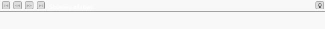
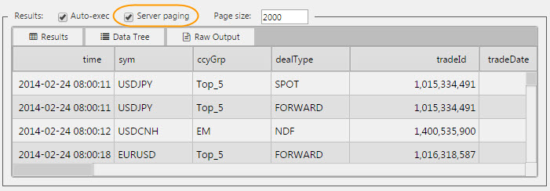

While Paging is inbuilt into Data Grid, other components can use the Paging component to control the amount of data displayed. All that's required is for the Pager component to share the same <a href="#data-source">Data Source</a> as other components requiring paging.

!!! Warning
    Ensure _Server Paging_ is checked in the Data Editor of **all** components requiring paging control; e.g. charts.  

## Basics

**Data Source**

See [Defining a Query](introduction#defining-a-query) and [Analytics](introduction#analytics) for more on data sourcing.

**Paging Type**

Dropdown selection

Type | Description
--- | ---
None | Server Paging switched off. 
Offset | Starts at page other than page 1 (Page Number:0)
Page Number | Use Page Number

**Offset/Page Number**

Set starting point for Paging

**Page Size**

Determine how many rows of data each page is defined by

## Style

[1] Left click inside Advanced CSS button

[2] Select the Pager component by first clicking on the  icon in the pop-up dialog and then clicking on the Pager component. 

[3] Add the required CSS content

## Format

See [Format](introduction#format) in Introduction for more.

## Margins

See [Margins](introduction#margins) in Introduction for more