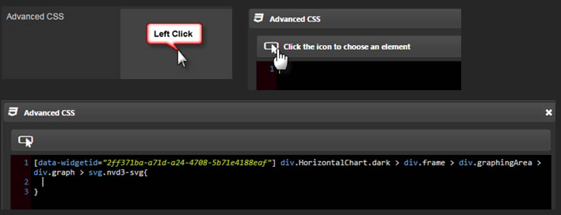
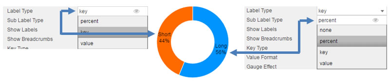

## Basics


### Data Source

See [Defining a Query](introduction.md#defining-a-query) and [Analytics](introduction.md#analytics) for more on data sourcing.

### Focus 

Used for [linking components](introduction.md#linking-components). Requires a [view state parameter](introduction.md#view-state-parameters).

### Selected Value 

Used to map a chart (query) data point to a [view state parameter](introduction.md#view-state-parameters) when a chart bar is clicked by the user. 

[1] Create a [view state parameter](introduction.md#view-state-parameters) and assign to <i>Selected Value</i>
 


[2] Go to <a href="#selected-value-attribute">Selected Value Attribute</a> to select a query variable to store in the Selected Value View State Parameter.

### Selected Value Attribute

This comes from the Data Source and is the variable paired with the <a href="#selected-value">selected value</a> [view state parameter](introduction.md#view-state-parameters). 


<aside class="warning">When mapping <i>Selected Values</i> to <i>Selected Value Attribute</i>, ensure the <i>Data Type</i> of the View State Parameter matches the <i>Data Type</i> of the <a href="#data-source">Data Source</a>; e.g. integer for numbered data </aside>

### Selected Row ViewState Routing

The aforementioned <a href="#selected-value">Selected Value</a> and <a href="#selected-value-attribute">Selected Value Attribute</a> handles a single data map. <a href="#selected-row-viewstate-routing">Selected Row Viewstate Routing</a> supports multiple mappings between <a href="#selected-value">Selected Values</a> and <a href="#selected-value-attribute">Selected Value Attributes</a>.


To add a row, click 

## Data


**Show Legend**

Toggle display of Pie Chart Legend

**Series Key**

Dropdown select from available <a href="#data-source">data source</a>.  

**Series Data**

Dropdown select from available <a href="#data-source">data source</a>.  

## Highlight Rules


Used to color code bar charts. Best used with real-time streaming or polling data. 

Click on  to include additional highlight rules.

**Name**

Gives highlight rule a name

**Apply to**

Define which <a href="#data-source">Data Source</a> variable the highlight rule will apply. An option to encompass "All" <a href="#data-source">Data Source</a> variables is included too. 

**Condition Source**

The data series on which the trigger is measured. Selected from the <a href="#data-sources">Data Source</a>

**Condition Operator**

Dropdown menu of rule operations, including greater and less than, not equal to, exactly equal to, and text contains alerts

**Condition Value**

What value threshold will trigger the alert.  Typical is "previous value" but can also be a text trigger

**Color**

What color bar will change on when highlight rule is true. 

**Show in Legend**

Highlight rule legend will appear in pie chart.

## Style

Configure Pivot line colors, CSS and Custom Toolbar


### ChartBarColors

Order color for a [pivot query](introduction.md#pivot-query). In the absence of a pivot query, the assignment of the colors is done in the order of the <a href="#data">Data</a> order. 

To add a color, click 


### Advanced CSS

CSS Configuration



Select to add CSS elements to the pie chart.

### Custom Tooltip

Step 1: Create View States for items in tooltip


Step 2: Add a html tag for View States (using handlebars)


Step 3: Chartview


Tooltips can use View State Parameters which have been mapped to Data Source variables


In the Configure Tooltip template, add html tags for the View State Parameters to display (using handlebars) 

If viewstate parameter = *param1*

Add a table cell with *param1* viewstate to tooltip with the tag:  <td>{{obj.param1}}</td>


Tool tip will appear as: 


### Tooltip Helper

Tooltip Helper


Apply Tooltip Helper Variable to Tooltip reference


Tooltips use <a href="http://handlebarsjs.com/">Handlebars.js</a> so variables can be added dynamically to tooltip.

For example:
 
```
{{fx}} : {{volume}}
```

could appear as
EUR/USD: 250000

To format "250000" so it will appear as "$250,000" use Tooltip Helper

**Name**

Give the function a name.  This name will be used inside the tooltip.

For example:


```
{{fx}} : {{fd volume}}
```

**Regex**

The regular expression used to find the required pattern

In this example:

```
(\d{3})(?=\d)
```

**Value**

The value to replace the text with. In this case, comma-delimited currency values: 

```
$1,
```

## Format


See <a href="#format">Format</a> for configuration of pie chart titles and borders.

**Show Donut**

Check to add donut to Pie Chart


**Donut Ratio**

Move slider to adjust size of donut

**Component Shadow**

Not used

**Label Type**

Select Pie Chart label from <a href="#data-sources">Data Source</a>



**Sub Label Type**

Select Pie Chart Sub Label Type from <a href="#data-sources">Data Source</a>

**Show Labels**

Check box to control display of **Label Type** and **Sub Label Type**

**Show Breadcrumbs**

Displays breadcrumb control if Pie Chart is using a [pivot query](introduction.md#pivot-query).

**Key Type**

Dropdown select of **Series Key** format; includes date, time, datetime and numeric support for six decimal places. Default is no format 

**Value Format**

Dropdown select of **Series Data** format; zero to six decimal places. Default is no format.

**Gauge Effect**

If checked, Pie Chart will convert to Gauge Form


**Chart Background**

Set colour for Pie Chart Background

**Inner Label** 

Adds an inner label to pie. This can also be a [view state parameter](introduction.md#view-state-parameters)  


### Pad angle


Includes spacing between pie segments

## Margins

See [Margins](introduction.md#margins) in Introduction for more