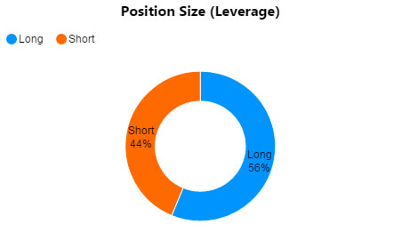
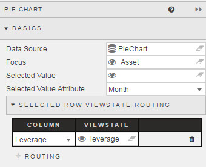
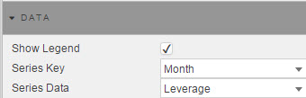
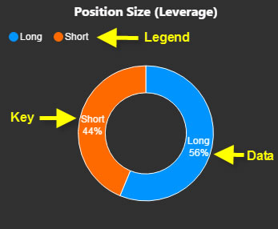
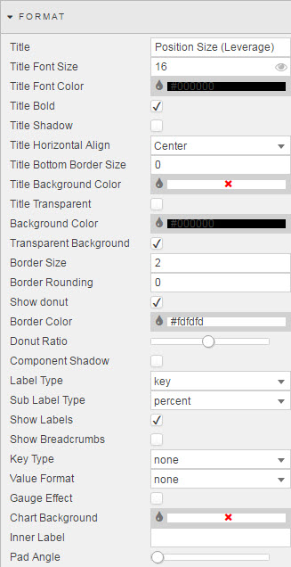
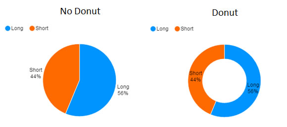
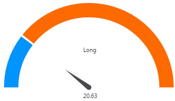
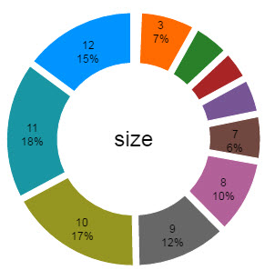
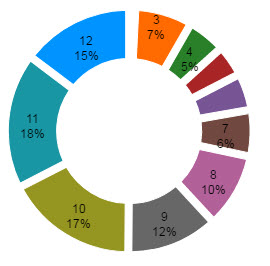

  
_A pie chart in donut style_

## Basics

_Data Source_

: <i class="fa fa-hand-o-right"></i> [Defining a Query](introduction/#defining-a-query) and [Analytics](introduction/#analytics) 

_Focus_

: A [View State Parameter](introduction/#view-state-parameters) used for [linking components](introduction/#linking-components)

_Selected Value_

: A View State Parameter: maps to a chart (query) data point when a chart segment is clicked by the user

_Selected Value Attribute_

: A _Data Source_ column to be paired with the _Selected Value_ View State Parameter

    

    !!! tip "Data types"
        When mapping _Selected Values_ to _Selected Value Attribute_, ensure the data type of the View State Parameter and the _Data Source_ have matching data types; e.g. integer for numbered data </aside>

_Selected Row ViewState Routing_

: _Selected Value_ and _Selected Value Attribute_ define a single data mapping. _Selected Row Viewstate Routing_ supports multiple mappings.

    

## Data

_Series Key_, _Series Data_
: Columns from _Data Source_

## Highlight Rules

<!-- 
 -->

Rules for color-coding charts: best used with real-time streaming or polling data 

_Name_

: A name for the rule

_Apply to_

: The _Data Source_ column to which the rule will apply (`All` is an option)

Condition

: The test for the highlight rule: values from _Condition Source_, a column from the _Data Source_, are compared with the _Condition Operator_ to _Condition Value_: typically `previous value`, but can also be a text trigger

_Color_

: The color to display when the condition is true

_Show in Legend_

: When checked, the highlight rule legend will appear in the chart

## Style

<i class="fa fa-hand-o-right"></i> [Style](style/#component-style) for common style parameters

## Format

<i class="fa fa-hand-o-right"></i> [Style](style/#component-style) for common style parameters

Donut

: When _Show Donut_ is checked, chart is displayed as a donut: _Donut Ratio_ determines how much of the disc becomes donut

_Component Shadow_

: (Not used)

Labels

: When _Show Labels_ is checked, displays labels according to _Label Type_ and _Sub Label Type_

_Show Breadcrumbs_

: When checked, displays breadcrumb control if chart is using a [pivot query](introduction/#pivot-query).

_Key Type_

: _Series Key_ format; includes date, time, datetime and numeric support for six decimal places. Default is no format 

_Value Format_

: _Series Data_ format; zero to six decimal places. Default is no format.

_Gauge Effect_

: If checked, chart shown in Gauge Form

    

_Chart Background_

: Background color

_Inner Label_

: Adds an inner label to pie. This can also be a [view state parameter](introduction/#view-state-parameters)  

_Pad Angle_

: 

    Includes spacing between pie segments

<i class="fa fa-hand-o-right"></i> [Style](style/#component-style) for common style parameters
