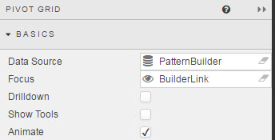
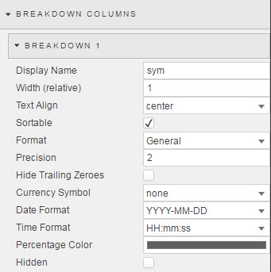
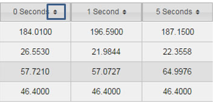
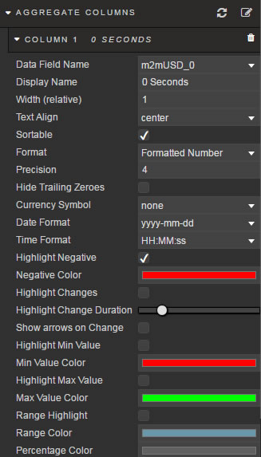
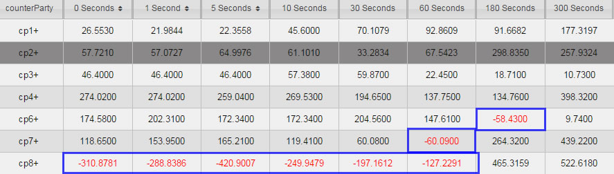
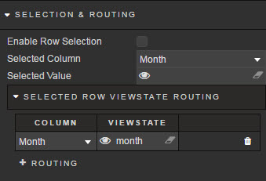
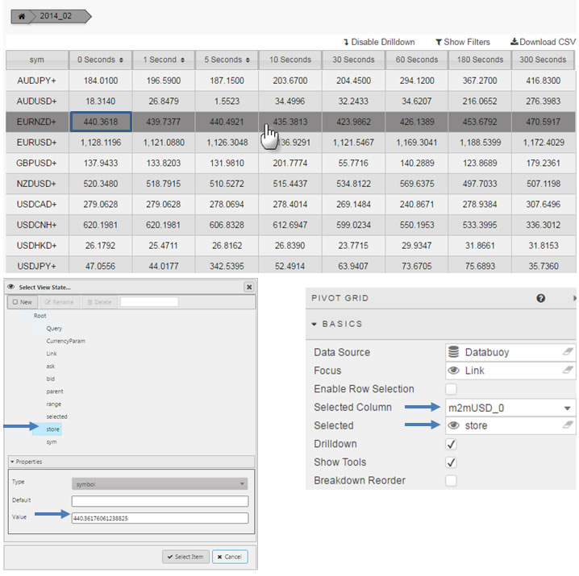
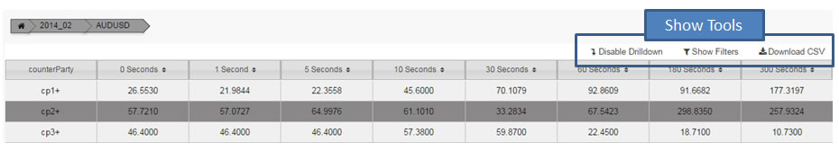
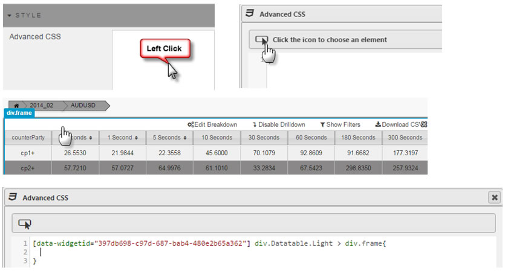

Supports Pivot/OLAP control data sets to dashboards
 

## Basics

Pivot Basics Menu

### Data Source

Defines the source data to for Pivot Grid. See [Pivot Query](introduction.md#pivot-query) in the Introductory section

### Focus

Used for [linking](introduction.md#linking-components) components; see introductory section for more detail. 

### Drilldown

Check control to auto-focus on Pivot/OLAP drilldown. 

### Show Tools

Show User controls, including toggle control for Drilldown; e.g. CSV import and filtering 

## Breakdown Columns

Breakdown Configuration

 
Defines appearance of independent variable columns from <a href="#pivot-query">Pivot Query</a>

**Display Name**

Descriptive name for column

**Width (relative)**

Relative measure to total width of Pivot Grid. Scale is contigent on the values of each column; for example, a column of Width (relative) of 20, in a Pivot Grid using column widths of 20,10,5,1 will scale at a column width of 55% (i.e. 20/(20+10+5+1)) 

Relative columns will scale according to the browser size.

**Text Align**

Dropdown control: Center, Left, Right cell alignment

**Sortable**

Check control.  When enabled, sort controls will be in column headers

**Format**

Sample formats
  

  
Select formatting for data type in column
  

**Precision**

Where numeric data is used, Precision sets the number of decimal places used.

**Hide Trailing Zeroes**

Removes the display of zeroes from end digits after the decimal point.

**Currency Symbol**
 
Currencies

 
Adds a currency symbol prefix to column data
  

**Date Format**

Combination Date and Time Format
  

  

  
Select date format

  
<aside class="warning">
Ensure Date or DataTime format is selected when Date Format is used
</aside>
  
**Time Format**
  
Select time format
  

  
<aside class="warning">
Ensure Time or DataTime Format is selected when Time Format is used. 
</aside>

**Percentage Color**

Percentage Color

Adds a mini-bar in Percentage formatted data. The proportion of the bar filled runs from 0 to 100%

To enable set Format to *Percentage* 

Select a colour to use for the bar 

<aside class="warning">Percentage Color can be a viewstate parameter. To assign a viewstate parameter, rollover end of input bar until until the eye icon appears, click the icon to assign the view state</aside>.

**Hidden**

When checked, column will not be displayed to the User

## Aggregate Columns

Aggregate Columns Configuration

Configures the dependent variable columns from the <a href="#pivot-query">Pivot Query</a>

**Data Field Name**

The Data Field Name is selected from data columns in the **Data Source** query. 

**Display Name**

The display name in the Pivot Grid column. This is case sensitive.

**Width (relative)**

Relative measure to total width of Pivot Grid. Scale is contigent on the values of each column; for example, a column of Width (relative) of 20, in a Pivot Grid using column widths of 20,10,5,1 will scale at a column width of 55% (i.e. 20/(20+10+5+1)) 

Relative columns will scale according to the browser size.

**Text Align**

Alignment of values inside Pivot Grid: left, center, right

**Sortable**

Check control. When enabled, users clicking on column header will toggle between ascending and descending sort. 

**Format**
  
Select formatting for data type in column

Supported formats include: *General, Number, Formatted Number, Smart Number, Date, Time, Datetime, and Percentage*

**Precision**

Where numeric data is used, Precision sets the number of decimal places used.

**Hide Trailing Zeroes**

Removes the display of zeroes from end digits after the decimal point.

**Currency Symbol**
 
Currencies

 
Adds a currency symbol prefix to column data

**Date Format**

Combination Date and Time Format
  

  

  
Select date format

  
<aside class="warning">
Ensure <i>Date</i> or <i>DateTime</i> Format is selected
</aside>
  
**Time Format**
  
Select time format
  

  
<aside class="warning">
Ensure <i>Time</i> or <i>DateTime</i> Format is selected
</aside>

**Highlight Negative**

Check control. When enabled, negative values in Pivot Grid will be shown in **Negative Color**

**Negative Color**

Select from the color palette the font color to use when **Highlight Negative** is enabled.

**Highlight Changes**

Check control. When enabled, cells will highlight green (for higher than previous value) or red (for lower than previous value). Used for streaming or polling data.

**Highlight Change Duration**

Move the slider to control how long **Highlight Changes** remains inside the Pivot Grid

**Show arrows on Change**

Check control. When enabled, up and down arrows will appear when value is greater or less than previous value. Used for streaming or polling data.

**Highlight Min Value**

Check control When enabled, cell in column with lowest value will be highlighted with color set in **Min Value Color**

**Min Value Color**
  
Min Value Color

  
Selection will place a color border highlight around lowest value in column
  

To Remove, again click on the color and select *No Color* from the palette tool.

<aside class="warning">Min Color can be a viewstate parameter. To assign a viewstate parameter, rollover end of input bar until the eye icon appears, click the icon to assign the view state</aside>
  
**Highlight Max Value**

Check control. When enabled, cell in column with highest value will be highlighted with color set in **Max Value Color**

**Max Value Color**

Max Value Color

  
Selection will place a color border highlight around highest value in column
  

Click the color bar again and then click *No Color* to remove the Max color setting 

<aside class="warning">Max Color can be a viewstate parameter. To assign a viewstate parameter, rollover end of input bar until the eye icon appears, click the icon to assign the view state</aside>

**Range Highlight**

Check control. When enabled, values in cell will have a background gradient determined by max/min values. The underlying range gradient is determined by **Range Color**.

**Range Color**

Range Color

  
Applies a selected colour gradient across all cells in a column. Assigning a color will automatically apply the Range Color. 
  

Click the color bar and then *No Color* to remove the Range color from column data

<aside class="warning">Range Color can be a viewstate parameter. To assign a viewstate parameter, rollover end of input bar until until the eye icon appears, click the icon to assign the view state</aside>

**Percentage Color**

Percentage Color

Adds a mini-bar in Percentage formatted data. The proportion of the bar filled runs from 0 to 100%

To enable set Format to *Percentage* 

Select a colour to use for the bar 

<aside class="warning">Percentage Color can be a viewstate parameter. To assign a viewstate parameter, rollover end of input bar until the eye icon appears, click the icon to assign the view state</aside>

## Selection and Routing

Selection and Routing

Allows values from data grid rows to be mapped to viewstate parameters; each value (cell) in a row will have its own viewstate parameter

To start, Enable Row Selection must be enabled.

If just a single value is to be stored, the *Selected Column* and *Selected Value* can be used.

[1] Select the Column of the data you wish to store

[2] Assign a viewstate parameter which will receive and store the selected cell value

<aside class="warning">If more than one value from a grid is to be stored, use Selected Row Viewstate Routing</aside>

### Selected Row Viewstate Routing

Where *Selected Column* and *Selected Value* stores just a single value, *Selected Row Viewstate Routing* can store multiple values

Click  to set storage for additional values

**Enable Row Selection**

Check control. When enabled, selecting a pivot grid row will assign the **Selected Column** value to the **Selected** <a href="#view-state-parameters">**view state parameter**</a>. 

 
**Selected Column**

When **Enable Row Selection** is enabled, the assigned **Data Source** variable from the row will be configured to the **Selected** <a href="#view-state-parameters">**view state parameter**</a>

**Selected**

Assign a <a href="#view-state-parameters">**view state parameter**</a>. Receives value from **Selected Column**

**Drilldown**

When enabled, enables User to control Pivot display

<aside class="warning">Requires Show Tools to be enabled</aside>

**Show Tools**

When enabled, displays user controls

## Style

Defines CSS of Pivot Grid

## File Export

Data from a data grid can be exported to a spreadsheet using the CSV downloader

The filename can be specified, or linked to a view state parameter which can then be defined by the user

## Margins

See [Margins](introduction.md#margins) in Introduction for more

## Format

See [Format](introduction.md#format) in Introduction for more
