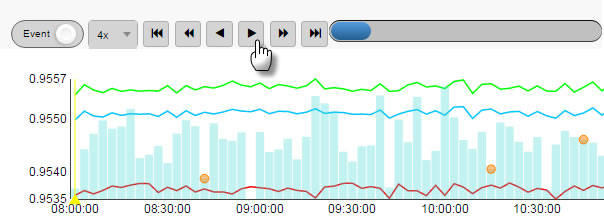
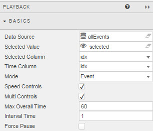
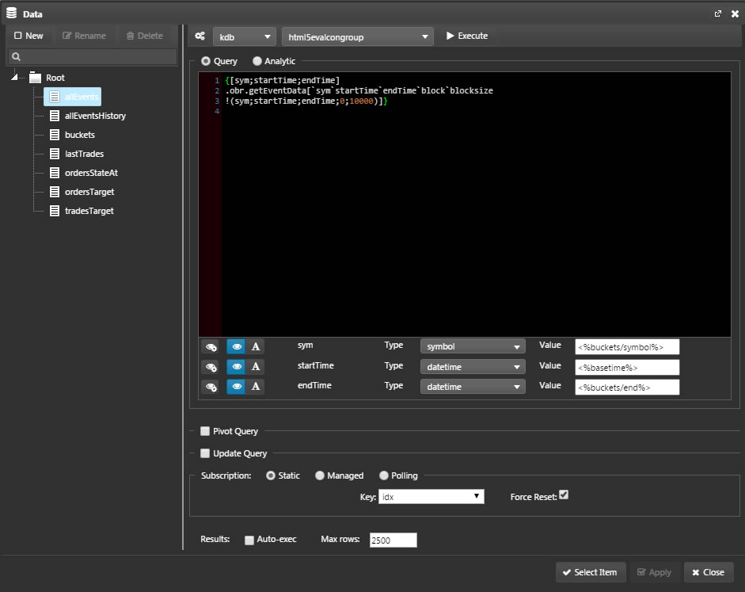
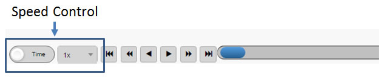
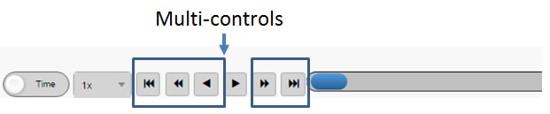
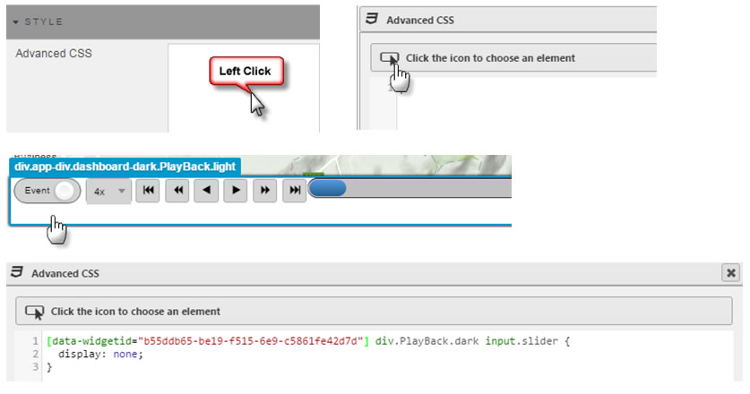

Used to play time sequence data in data grid and charting components.

## Basics

Configure time series <a href="#data-source">Data Source</a> and timing parameters

### Data Source

See [Defining a Query](introduction.md#defining-a-query) and [Analytics](introduction.md#analytics) for more on data sourcing. Ensure there is time series data (or equivalent) in the playback <a href="#data-source">Data Source</a>. 

Playback shares a <a href="#data-source">Data Source</a> with the component undergoing playback.

<aside class="admonition tip">'Time Series' data can be a numeric sequence, it doesn't need to be of Type Date or Datetime </aside>

**Selected Value**

Link to a [view state parameter](introduction.md#view-state-parameters) which is used as the time series variable. 

<aside class="admonition tip">The time series <i>Selected Value</i> can be of Type Integer, it doesn't need to be of Type Date or Datetime </aside>

**Selected Column**

Dropdown select from the **Data Source**. Will be used in playback sequence

<aside class="admonition tip">Column data can be a numeric sequence</aside>

**Time Column**

Dropdown select from the **Data Source**. Identifies Time series data. 
 
<aside class="admonition tip">Can use <i>Selected Column</i> columnn variable or different variable column with Type Date or Datetime</aside>

**Mode**

Select between Event or Time as default setting on load. 

**Speed Controls**

Check control. When enabled, offers different replay speeds: x0.25, x0.50, x1, x2, x4, x8, x16

**Multi Controls**

Check control. When enabled, offers fast forward and rewind controls

**Max Overall Time**

Sets upper limit for replay based on **Selected Value** view state parameter

**Interval Time**

Configures speed of **Selected Value** view state parameter.

<aside class="admonition tip">Values above '1' will skip data points; e.g. a value of '2' will use every second data point of the <i>elected Value</i> view state parameter</aside>

**Force Pause**

Check control. 

## Margins

See [Margins](introduction.md#margins) in Introduction for more

## Style

 Apply CSS to Playback component

 

## Format

See [Format](introduction.md#format) in Introduction for more.

