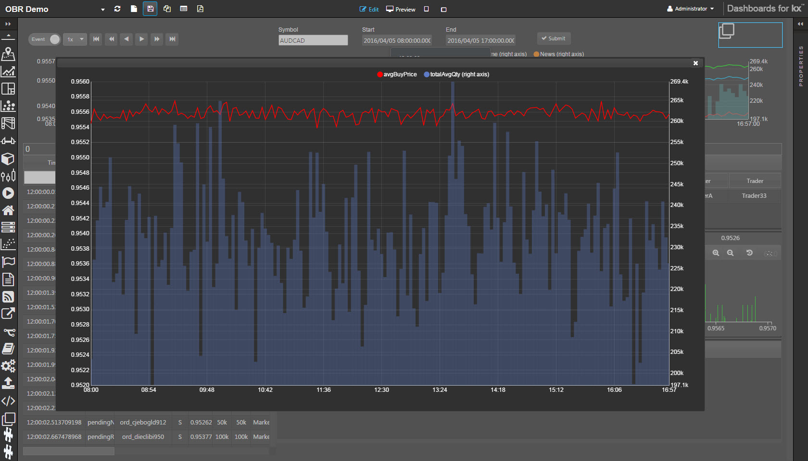
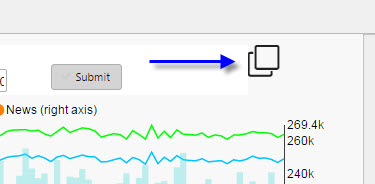
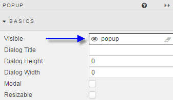
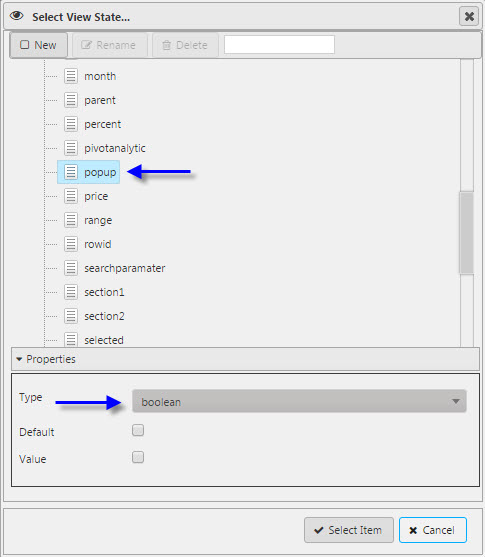
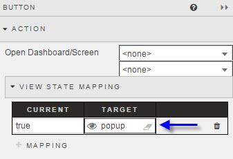

  
_<small>A dashboard with a chart popped up from a button top right</small>_

A Popup displays another component or screen as a ‘pop up’ from the dashboard, typically, when a Button or some other selection control is clicked. 

!!! tip "Quickview and Preview"
    For the Popup to appear in the Dashboard Builder’s Preview or Quickview modes it must be assigned to a View State Parameter of boolean type, and the View State Parameter bound to a Button or other selection control. When the user clicks the Button, the boolean View State Parameter is set to `true` and the Popup appears. 

Set up a Popup as follows: 

1. Drag a Popup component inside the dashboard

    

2. Click on the Popup component to edit it. Add a single component or a Layout panel with multiple components. Set them up as normal. 

3. In the _Basics_ dialog for the Popup, for the _Visible_ property create a View State Parameter, named e.g. `popup`, of type boolean. 

    

    

    <!-- The size and type of the dialog can be set from the _Basics_ properties. WTF? -->

4. Place on the dashboard a Button to summon the Popup. Change its _View State Mapping_ to set the `popup` View State Parameter to `true`. When the user clicks the Button, the Popup will appear.

    

