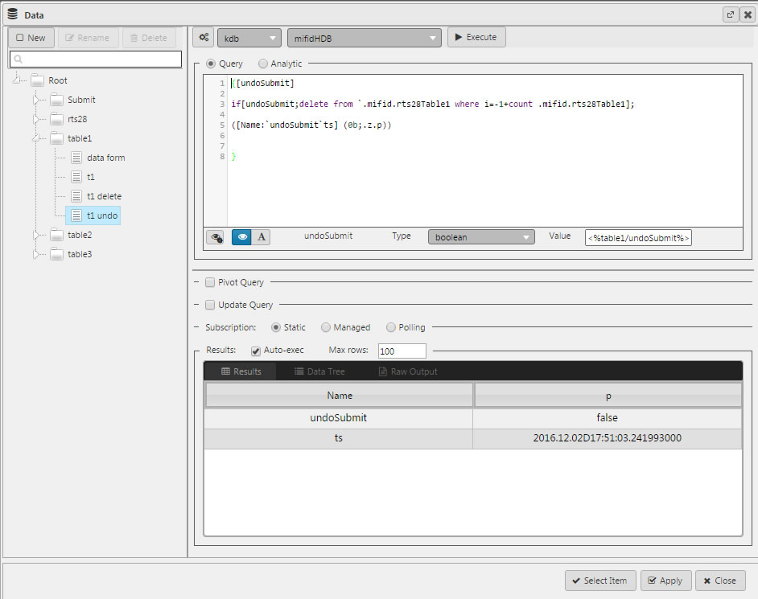
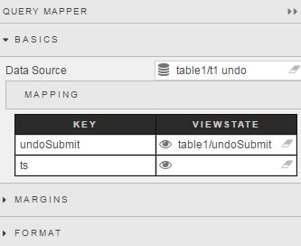

The Query Mapper is used to pair Data Source variables to Dashboard View State Parameters. 

Assign a query and execute as normal.  The output will list under _Key_ of Mapping property.

The Query Mapper is unique in it doesn't appear in the Dashboard User view - it's only viewable by the Dashboard designer.  

Not all Data Source need to be mapped to Dashboard View State Parameters.

## Format

See [Format](introduction#format) in Introduction for more.

## Margins

See [Margins](introduction#margins) in Introduction for more

