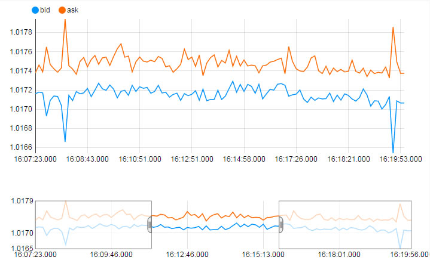
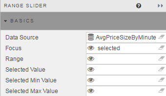
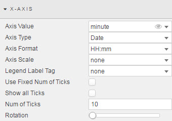
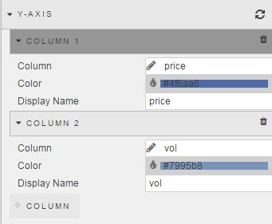
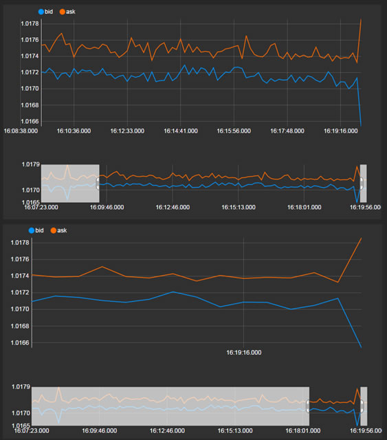
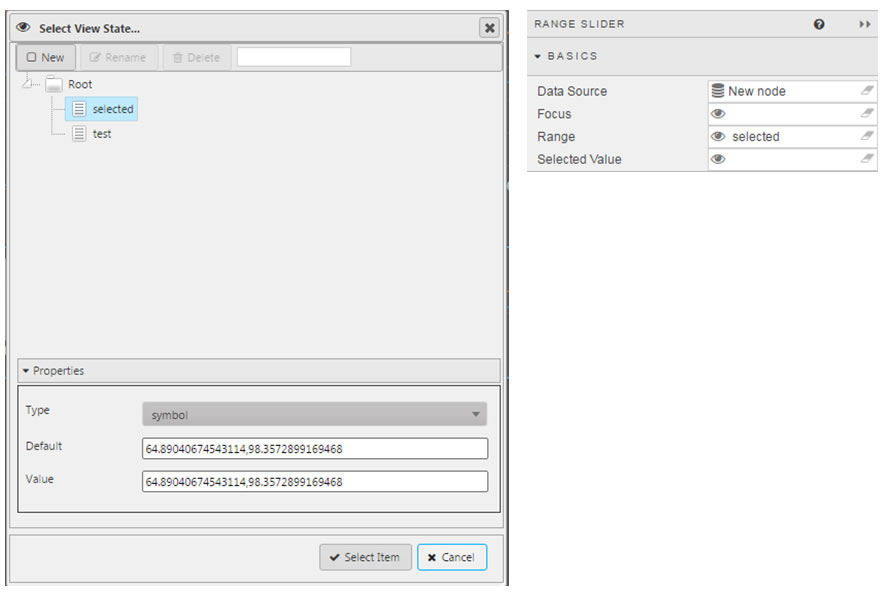
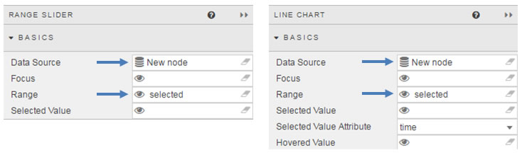
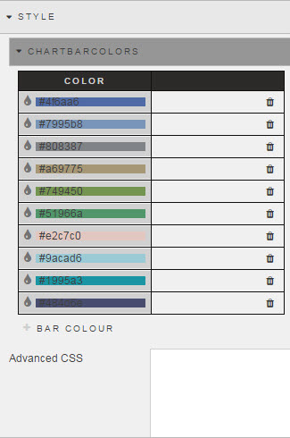
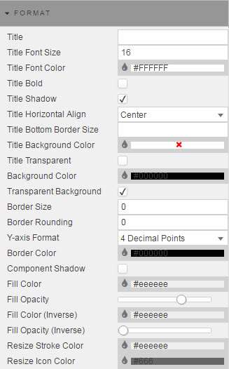
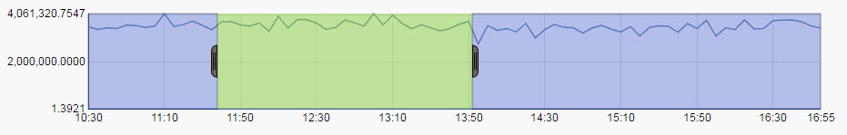

  
_<small>A chart with a Range Slider</small>_

The Range Slider plays a similar function to the [Breadcrumbs](breadcrumbs) component.  It supports zoom-in navigation for linked charts using sequential X-axis data (e.g. time)

## Basics

 

_Data Source_

: <i class="fa fa-hand-o-right"></i> [Defining a Query](introduction/#defining-a-query) and [Analytics](introduction/#analytics) 

_Focus_

: A [View State Parameter](introduction/#view-state-parameters) used for [linking components](introduction/#linking-components)

_Range_

: A View State Parameter: links the Range Slider to another component, which will have the same View State Parameter in its _Range_  
<i class="fa fa-hand-o-right"></i> [Link to a chart](#link-to-a-chart)

_Selected Value_

: A View State Parameter for the value selected <!-- What value? WTF? -->

_Selected Min Value_

: A View State Parameter for the minimum value of the selected range

_Selected Max Value_

: A View State Parameter for the maximum value of the selected range

## X Axis

_Axis Value_

: A _Data Source_ column to be used as the X-axis label

_Axis Type_

: Data type for the _Axis Value_

    !!! tip "Wrong X-axis labels?"
        If X-axis labels look incorrect, try selecting a different type

_Axis Format_

: For when _Axis Type_ is `Date`

_Axis Scale_

: `none`, numeric or temporal scaling <!-- WTF? -->

_Legend Label Tag_

: (Coming soon)

Ticks 

: When _Use Fixed Num of Ticks_ is checked, chart displays _Num of Ticks_ ticks in the X axis. 

    When _Show All Ticks_ is checked, every charted data point is shown in the X axis 

_Rotation_

:   
_<small>Rotated labels</small>_

## Y Axis

_Data Source_ columns, their display names and colors

## Link to a chart

  
_<small>Range Slider interaction with a Line Chart</small>_

1. Create a View State Parameter and select it as _Range_

    

2. Give the target chart the same _Data Source_ and _Range_ properties

    

3. Use to Quickview or Preview mode to test the result

## Style

_ChartBarColors_

: <i class="fa fa-hand-o-right"></i> [ChartBarColors in Style](/style/#chartbarcolors) when a [pivot query](introduction/#pivot-query) is used

    For non-Pivot data, line colors are set by the [Y-Axis](#y-axis) columns

_Advanced CSS_
: <i class="fa fa-hand-o-right"></i> [Advanced CSS in Style](style/#advanced-css) to add CSS rules to chart lines

## Format

<i class="fa fa-hand-o-right"></i> [Format in Style](style/#format) for common style parameters 

_Y-axis Format_

: Number of decimal places

_Component Shadow_

: When checked, applies a drop shadow to the component

_Fill Color_

: Background color of range during selection

    

_Fill Opacity_

: Opacity of the _Fill Color_ 

_Fill Color (Inverse)_

: Background color inside selected range

_Fill Opacity (Inverse)_

: Opacity of _Fill Color (Inverse)_

_Resize Stroke Color_

: Border color of selected range 

_Resize Icon Color_

: Color of the Range Slider’s drag bar

<i class="fa fa-hand-o-right"></i> [Style](style) for common style parameters