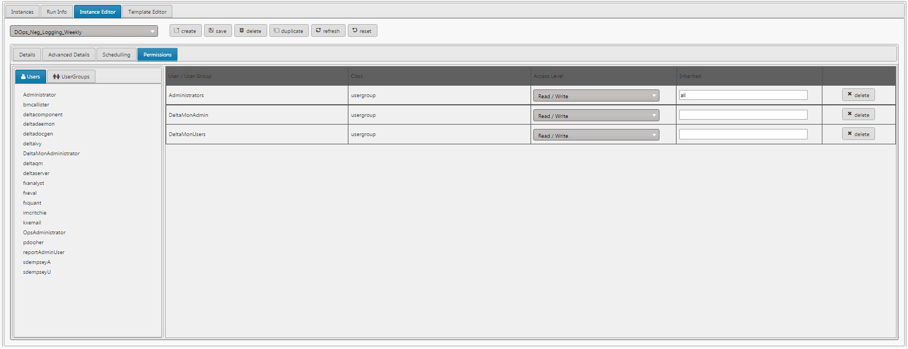

Report Manager is a self-contained component for creating and scheduling reports. 

### Create a Report

[1] The underlying structure of the report is created from the Template Editor. Click 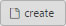 and give the report a name.

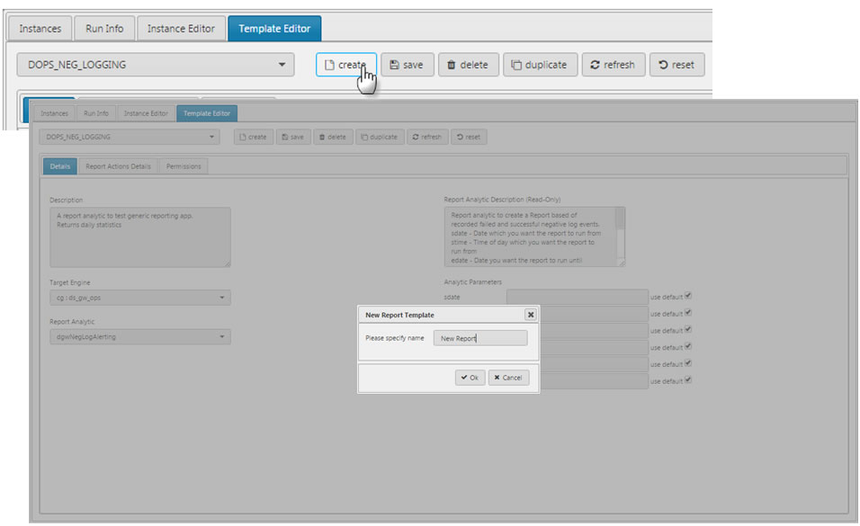

!!! Tip "Don't forget to save a newly created Report."

[2] In the _Details_ tab, set the _Target Engine_ or connection to use for the report. See [Creating a Connection](introduction#creating-a-connection) for more on adding a connection.

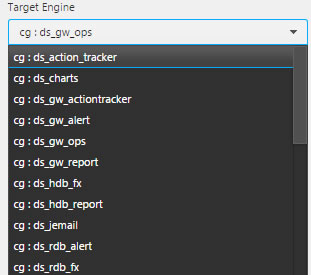

!!! Warning "Connections cannot be edited from inside Report Manager. Use the [Connections Manager](introduction#creating-a-connection) in Dashboards to create or edit a connection."

[3] Also from the _Details_ tab, select from the dropdown a _Report Analytic_.  This is the query used to pull data to populate the report.  Four default Analytics are offered.
 
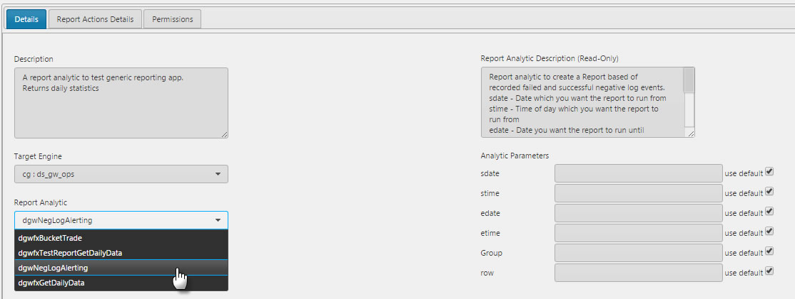

Available Analytic Parameters will update when a _Report Analytic_ is selected but are non-editable. Parameters are edited in the _Instance Editor_, see step [7]

The description will also update when the _Report Analytic_ is changed

!!! Warning "Only Analytics assigned to _DxReportAnalytics_ from Control for Kx will be available as an Analytic inside Report Manager."
 
[4] Configure what the report will do, click 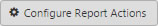 in _Report Actions Details_. This will bring up a menu list of Report Actions.

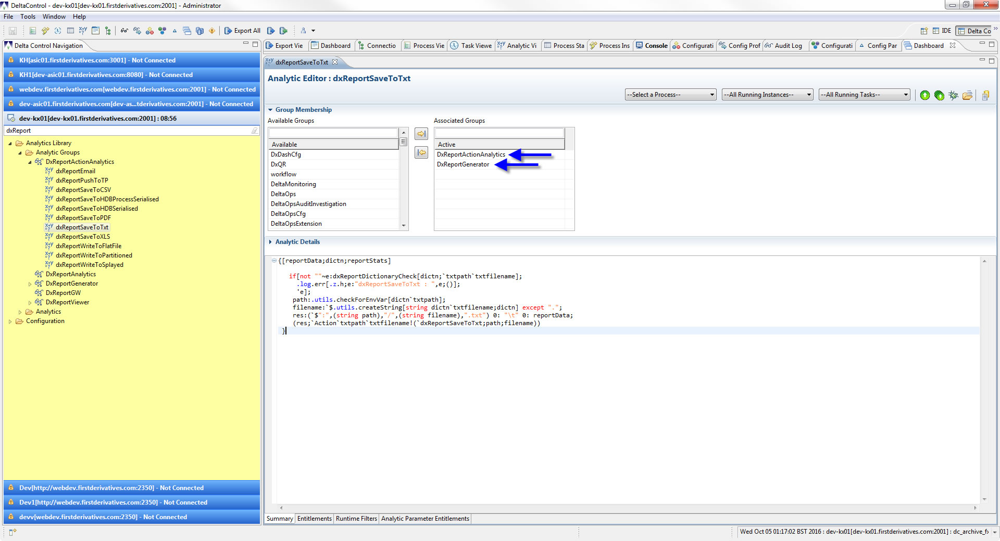

Left-click-and-drop from the _Available Analytics_ actions for the report to do from the list on the left into the _Selected Analytics_ box on the right.

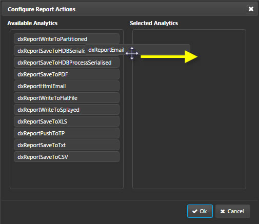

Selected Report Actions will be editable inside the _Instance Editor_

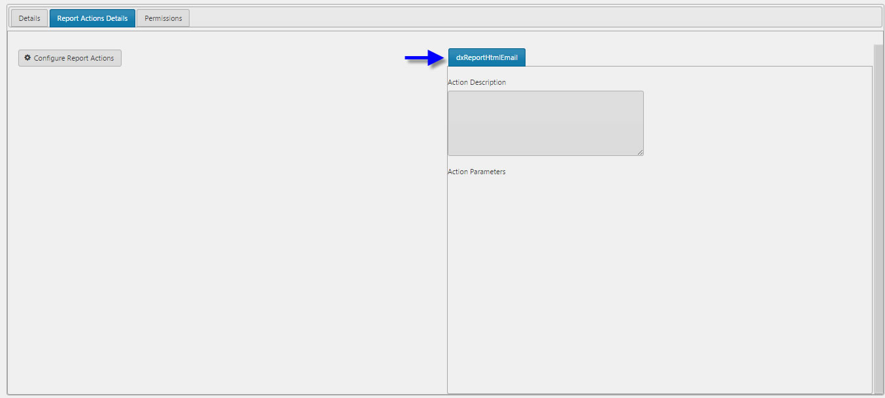

To remove an action, do so from the _Configure Report Actions_ by dragging from _Selected Analytics_ on the right back to _Available Analytics_ on the left.

!!! Warning "Only _Report Actions_ assigned to _DxReportActionAnalytics** from Control for Kx will be available as a Report Action. Create or remove a Report Action Analytic from the Control for Kx UI."

[5] Permissions to read and/or write the Report Template is set in the Permissions tab. Drag-and-drop Users from the left to the user group on the right, and configure _Access Level_ permission from the drop down.

The list of available Users and Access Level permisions is set in Control for Kx

[6] Save Template, then open _Instance Editor_

[7] From the Instance Editor,  a new Report Instance.

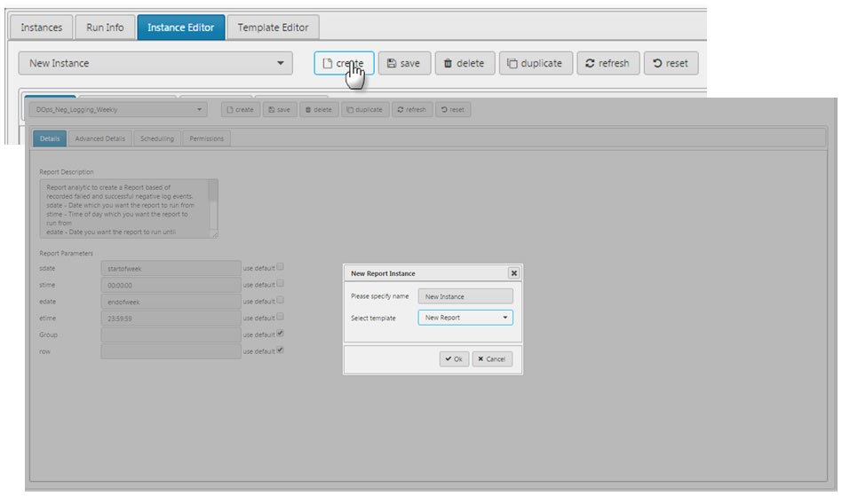

This will take the details from the Template and apply them to the current Instance.

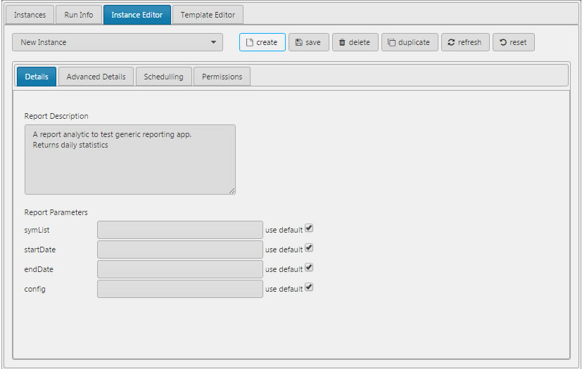

In _Details_, Report description can be changed from the default used in the Template Editor. To customize Report Parameters from Template defaults, uncheck the _use default_ and enter a value

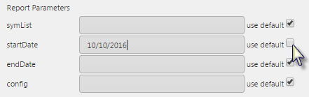

Further customization can be done from the _Advanced Details_ tab. Here, the _Target Engine_ can be changed from the default Template option.

The _Timeout_ is set to default of zero ("infinte time"). Changing the value will set a millisecond timeout for the report. 

It's in _Advance Details_ where _Action Parameters_ can be changed, including who will receive the Report. Recipents of a report use the Control for Kx User details.

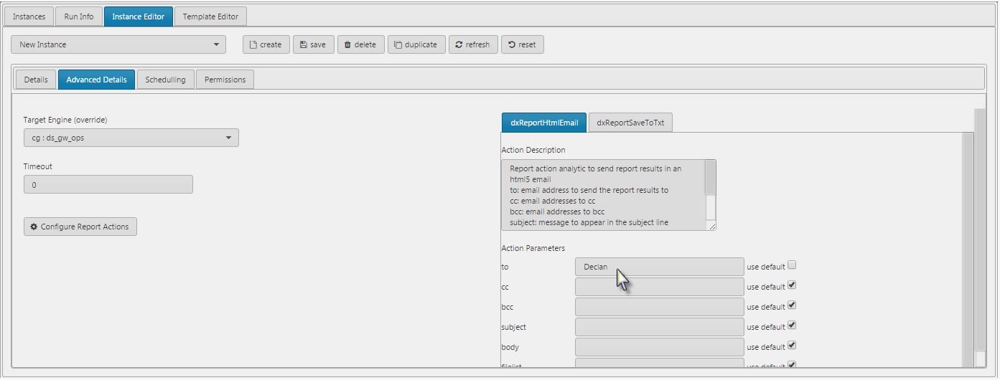

!!! Warning "Delivery recipients for to/cc/bcc have to be user entitled in Control for Kx."

!!! Warning "Do not use a User's email address for to/cc/bcc"

[9] Set Report Scheduling. This can be a once off report or a regularly scheduled report

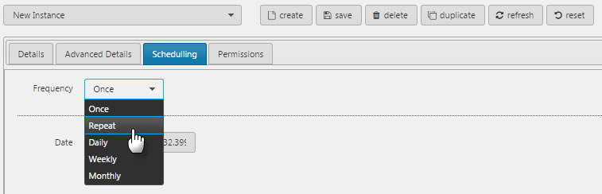

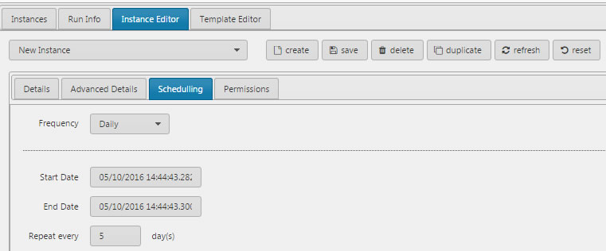

[10] Permissions can also be set to override the Template defaults

Recipients of a report do not need to be listed under Permissions.

[11] Save the Report Instance

[12] The final step is to run the report. If scheduled, the report will run at the defined time. However, reports can be run directly from the _Instances_ tab. Click 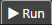

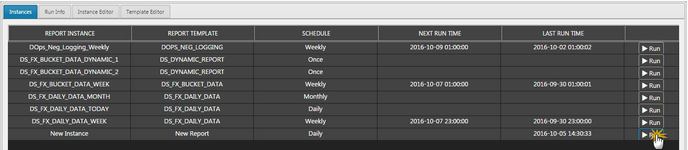

[13] The status of the report can be found under the _Run Info_ Tab. If successful, the log will show a green success, or a red fail.

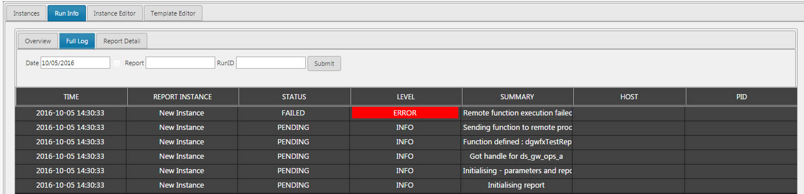

Use the Date, Report and/or RunID filters to search. Remember to click 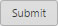 when running a filter. 

Users can use the <a href="#upload">Upload</a> component to view generated reports. 

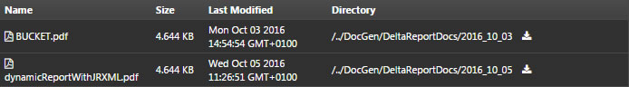

## Basics

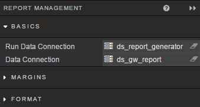

**Run Data Connection**

Select connection from dropdown menu

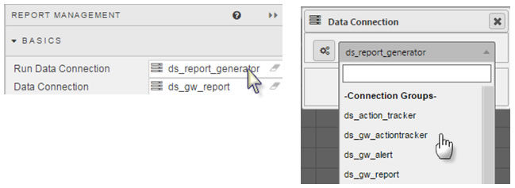
 
**Data Connection**

Select connection from dropdown menu

**Download Folder**

Set the folder to which Reports will be downloaded too.

**"Read Only"**

Check control for Read Only reports. 

**Filtering**

Switch between Quick Search (global search), Columns Filters, Advanced Column Filters and disabled (None). 

## Style

[1] Left click inside Advanced CSS button

[2] Select the Playback component by first clicking on the  icon in the pop-up dialog and then clicking on the Report Manager component. 

[3] Add the required CSS content

## Margins

See [Margins](introduction#margins) in Introduction for more

## Format

See [Format](introduction#format) in Introduction for more.

## User Controls

For more on using Report Manager, see Report Management in Stream for Kx.

