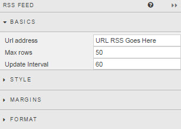
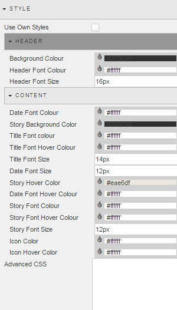
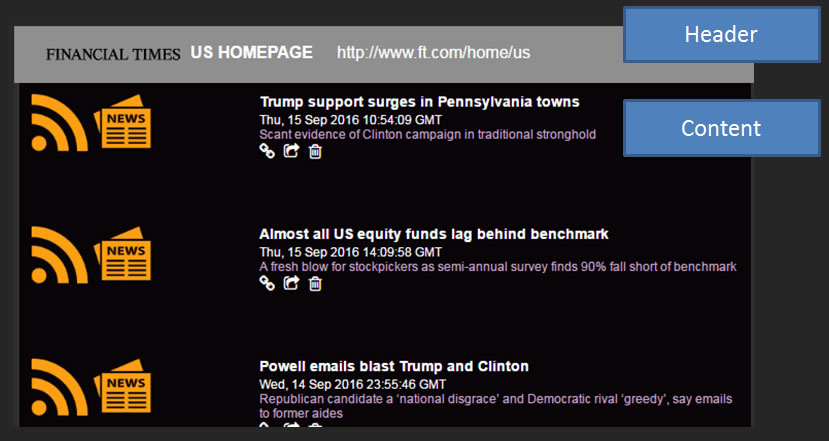
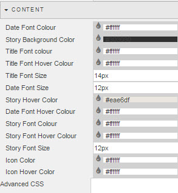
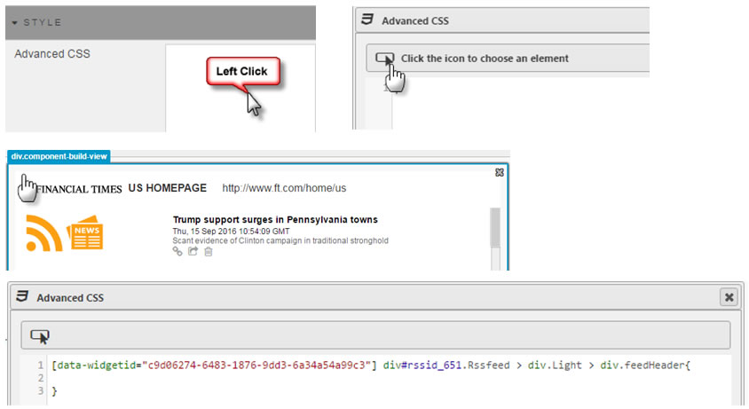

Adds third party RSS feeds into dashboards

## Basics

Configure RSS

**URL Address**

Add in the http(s) URL for the RSS feed

Ensure the correct RSS format is employed. Check the output in Preview mode

**Max Rows**

Number of news items to appear on feed.

**Update Interval**

Frequency of RSS update poll in seconds

## Style

 
RSS uses default style, but elements of the RSS feed can be individually configured.

**Use Own Styles**

Check control to enable custom styling

### Header 

**Background Colour**

Use color palette to select background color of RSS header.

**Header Font Colour**

Use color palette to select font color of RSS header.

**Header Font Size**

Set pixel size of RSS header font.

### Content

 

**Date Font Colour**

Use color palette to select font color of article date.

**Story Background Color**

Use color palette to select background color of articles.

**Title Font Colour**

Use color palette to select background color of article title.

**Title Font Hover Colour**

Use color palette to set rollover color of article Title.

**Title Font Size**

Set pixel size of article title font.

**Date Font Size**

Set pixel size of article date font.

**Story Hover Covers**

Use color palette to set color on rollover of article

**Date Font Hover Colour**

Use color palette to set color on rollover of article date

**Story Font Colour**

Use color palette to define font of article summary

**Story Font Hover Colour**

Use color palette to define font on rollover of article summary

**Story Font Size**

Set pixel size of article font.

**Icon Color**

Set color of icons to open and delete article

**Icon Hover Color**

Set color of icon rollover behaviour

**Advanced CSS**

Set CSS for RSS component

 
## Format

See [Format](introduction#format) in Introduction for more.

## Margins

See [Margins](introduction#margins) in Introduction for more

