## Monitoring

Monitoring for Kx is an enterprise solution for real-time monitoring, investigation and analysis
of system stability and performance. Specifically aimed at platforms where system
performance and efficiency is critical. Monitoring for Kx provides a sophisticated solution for
capturing data on servers, processes, CPUs, file system, NICs and network signals. These
signals can be analysed in real-time to trigger alerts and display critical information via
powerful dashboards in a versatile and meaningful way. Moreover using the power of kdb+ it
can incorporate previously stored data, results and signal information to further enrich its
analysis and monitoring capabilities.

Monitoring for Kx allows you to monitoring servers, processes network interfaces in real time
and historically. Alerts can be configured to send real time communication updates on the
status of the monitored servers, thus ensuring any software, hardware or data spikes cannot
silently bring down your infrastructure.

Monitoring for Kx provides a visual presentation of
the current status of all monitored servers. Each server must have a SysMon java application
installed and running to collect the server and process stats. The Monitoring for Kx architecture
is illustrated below

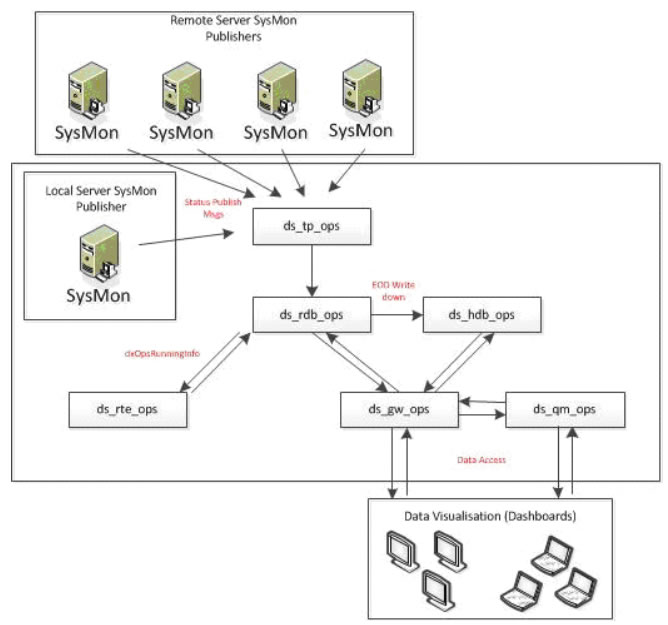

The following processes are illustrated in the Monitoring for Kx Architecture:

- *Sysmon* - a java based executable that collects server and process information.
- *ds_tp_ops* - the tickerplant process.
- *ds_rdb_ops* - the real time database which captures all the data from the tickerplant and
stores it in memory. At the end of day event, it writes all its data to the historic database.
- *ds_rte_ops* – the real time engine process which is used to subscribe to a data source and
consume data. 
- *ds_hdb_ops* - the historic database process which is used to access all the on-disk
(historic) data. Generally that is data which was captured prior to the current day.
- *ds_gw_ops* – the gateway process used to load balance and/or join data across different
processes.
- *ds_qm_ops* - the query manager process which off-loads client GUI load from the front end
by caching it and distributing it to front end components

Configuration of Alert Monitoring will be covered in _Monitoring for Kx_ when available. An existing help document can be found <a href="https://confluence.firstderivatives.com/pages/viewpage.action?title=Delta+Monitoring+User+Guide&spaceKey=DOC">here</a> which covers the Flex version of Monitoring for Kx. 

### Sample Monitoring Dashboard

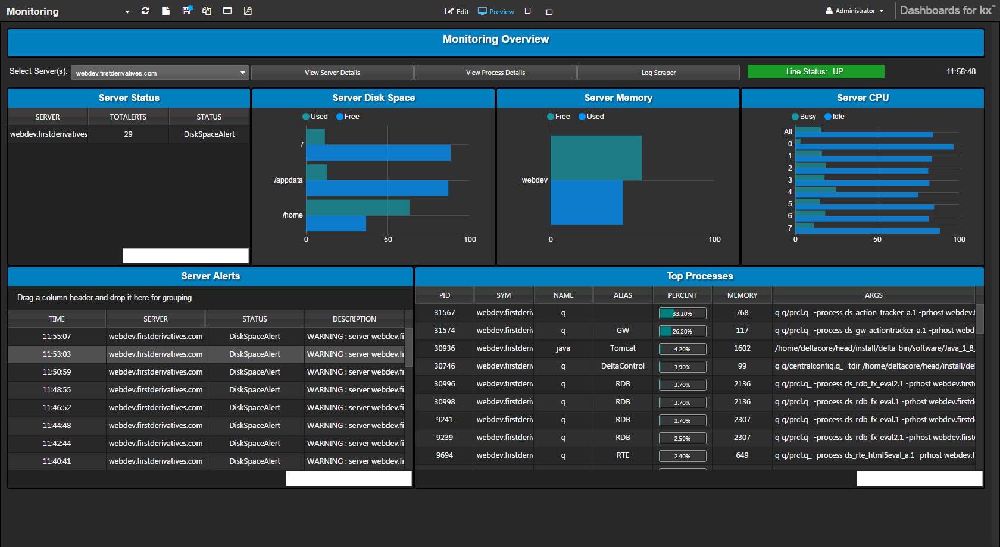

In the HTML5 Eval Pack of Dashboards is a Monitoring dashboard to display the monitoring of server alerts and processes.

Select an individual server or server group (for example, *webdev.firstderivatives.com*)

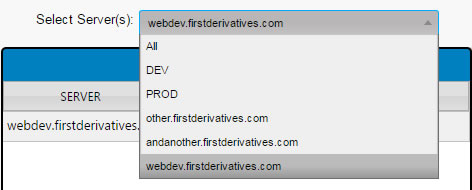

!!! Tip
    If selecting a server group, the Monitoring Overview page will only show overall performance of grouped servers.  If selecting an individual server, the Monitoring Overview will show the performance of individual partitions where relevant

The Navigation panel offers jump points to different sections of monitoring.  This will also show the connection status of the Server.

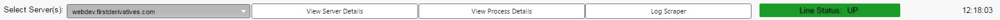

**Server Status**

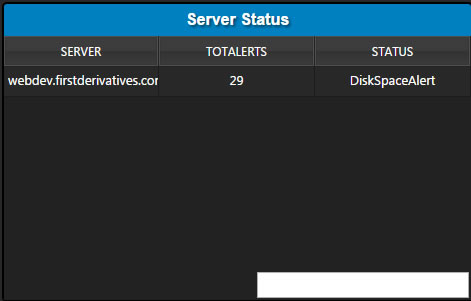

Shows an overall summary of all alerts triggered for the selected server. Details of these alerts will appear in the <a href="#server-alerts">Server Alerts</a> panel.

Items | Description
--- | ---
Server | Lists all servers in a server group, or names just the individual server if selected
Total Alerts | Number of Alerts triggered
Status | Description of most recent Alert

**Server Disk Space**

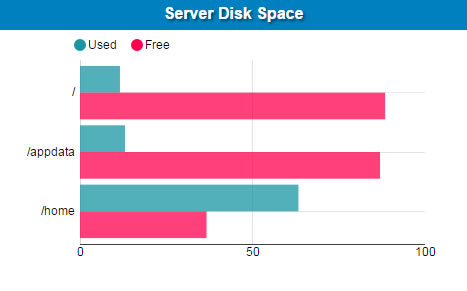

Shows the amount of free and used space for each directory on the server

**Server Memory**

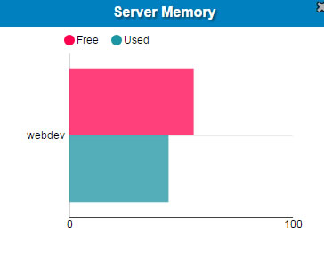

**Server CPU**

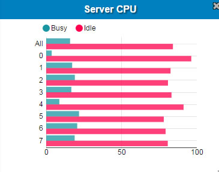

Shows % CPU utilisation for each core.

!!! Tip
    If a Server Group is selected, only overall Server CPU usage will be displayed

**Server Alerts**

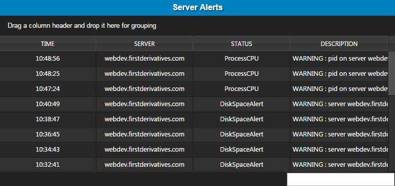

An individual list of the alerts identified in the overall **Server Status** alert count. 

Items | Description
--- | ---
Time | Time of Alert trigger
Server | Server on which the alert was triggered
Status | Alert Type
Description | Long form alert description

**Top Processes**

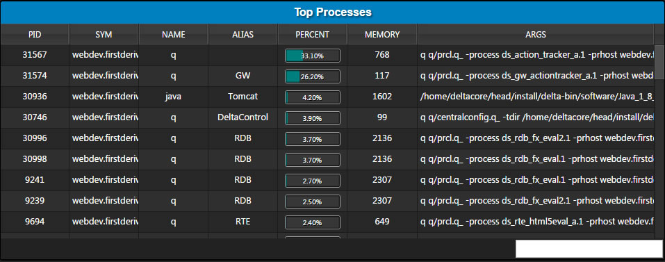

Items | Description
--- | ---
PID | Process ID
SYM | Host name
Name | Process Name
Alias | The identity of the connection. In many cases the connection is a work station to the tomcat, so the machine name will be viewable. 
Percent | CPU usage by Process
Memory | Memory usage (MB) by Process
Args | Description of Process

### Server Details

This is a time series output of memory, cpu and load usage for the selected server

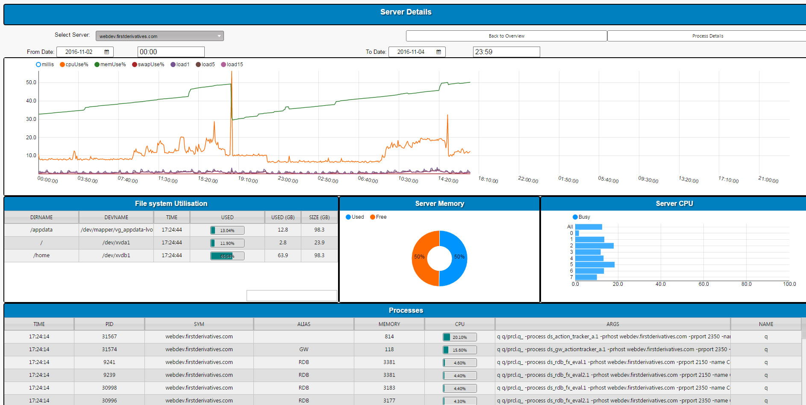 

The initial load screen is blank until a Server is selected from the dropdown menu

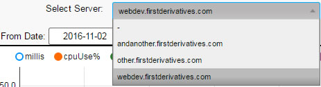 

**Time Series**

The chart shows the CPU, Memory, memory Swap usage and CPU load for the selected time period.  

Load1, load5, and load15 represent the 1, 5 and 15 minute server load usage respectively.

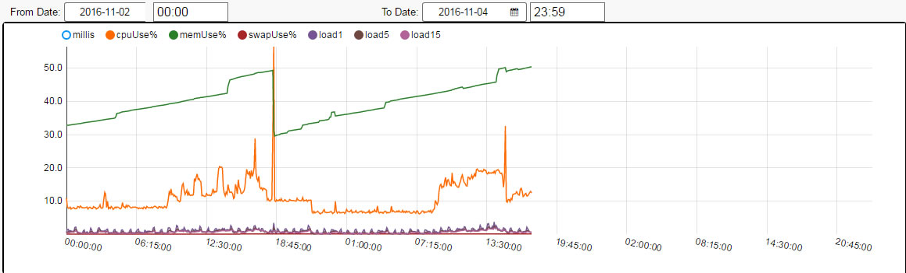 

Click on the legend bullet to toggle the display of CPU, Memory and Load data on the chart.

**File System Utilisation**

Monitors disk space usage by directory on the server

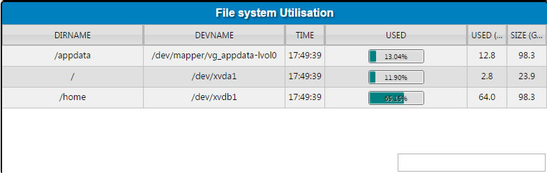 

Items | Description
--- | ---
DIRNAME | Directory Name
DEVNAME | Dev directory name
Time | Time of Snapshot usage
Used | Percentage of Memory used for each listed directory
Used (GB) | Total space used in GB
Size (GB) Total amount of memory available for use 

**Server Memory**

A pie chart showing server memory usage and percentage available. Updates on refresh. 

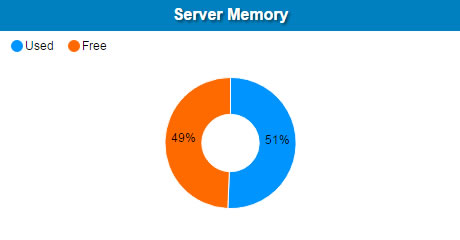 

**Server CPU**

Percentage of server usage across cores of selected server

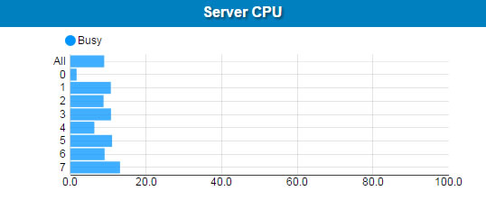 

**Processes**

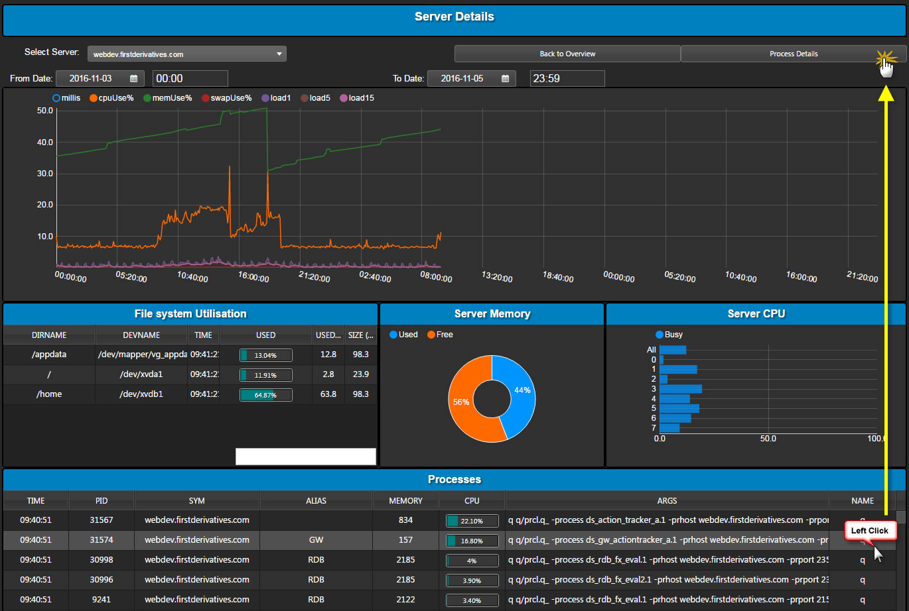 

List of server running processes (includes Processes not triggering threshold limits as displayed in Overview page). 

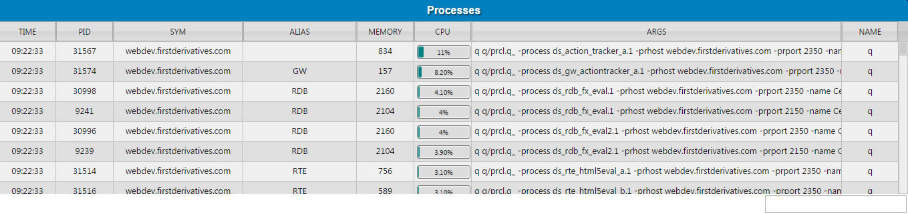 

Items | Description
--- | ---
Time | The time the snapshot was taken. The frequency of updates in controlled by the Lookback seconds specified in the filters (configured in Monitoring for Kx)
PID | Process ID
SYM | Host name
Alias | The identity of the connection. In many cases the connection is a work station to the tomcat, so the machine name will be viewable.
Memory | Memory usage (MB) by Process
CPU | CPU usage by Process
Args | Description of Process
Name | Process Name

To get additional details on a process, select one - then click [!Screenshot](img/processdetailshtmllight.jpg) 

### Process Details

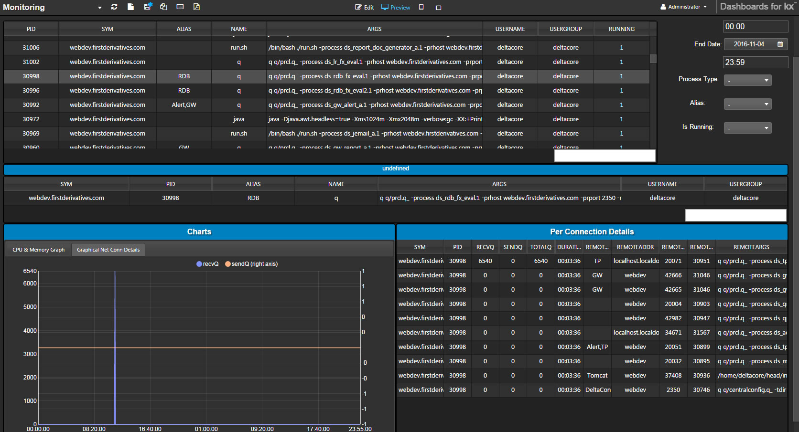 

Selecting a Process from <a href="#server-details">Server Details</a> populates this screen with additional details from the selected Process.

The table lists additional Process Details:

Items | Description
--- | ---
PID | Process ID
SYM | Host name
Alias | The identity of the connection. In many cases the connection is a work station to the tomcat, so the machine name will be viewable.
Name | Process Name
Args | Description of Process
Username | Monitoring Username
Usergroup | Monitoring Usergroup
Running | Is Process running: (1) Yes, (0) No

To the right of the table are filters which can help navigate what information is displayed in the table

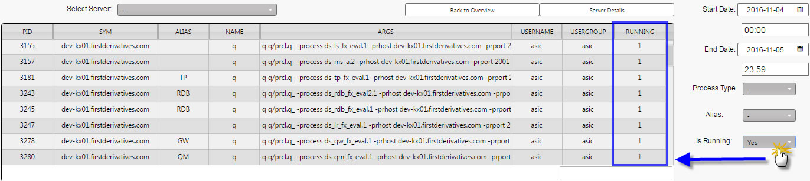 

Selecting an individual detail from the selected Process will populate Connection details and Chart.

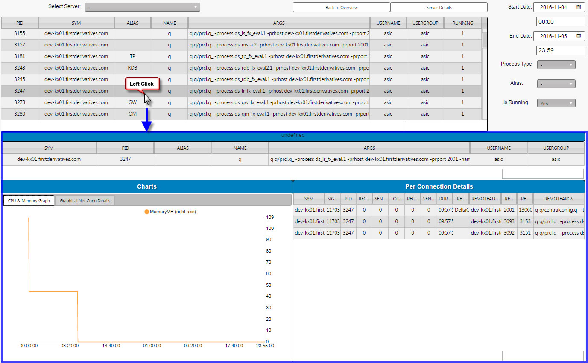 

The single bar of information offers a larger view of information presented in the table for the selected Process

**Chart**

The chart shows CPU & Memory usage and Connection details over time. 

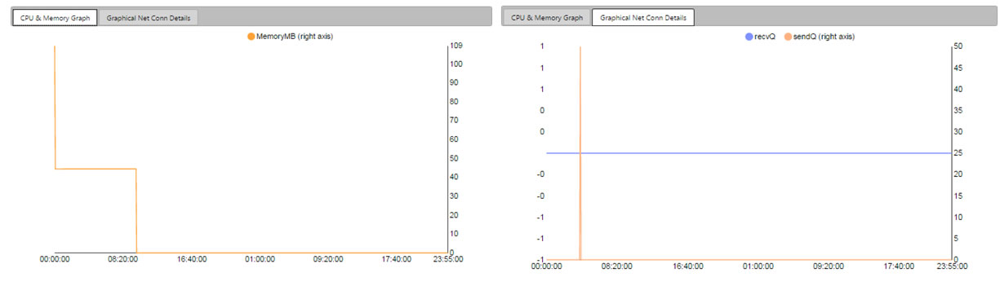 

Items | Description
--- | ---
MemoryMB | Memory usage
UsageCPU | % CPU Usage
recvQ | The receive queue size
sendQ | The send queue size

**Per Connection Details**

The table lists associated connection details for the selected Process

Items | Description
--- | ---
SYM | Host name
PID | Process ID
RecvQ | The receive queue size
SendQ | The send queue size
TotalQ | Absolute value of the combined valuesof the messages sitting on a process send receive queue.
Duration | Length of time connection is active
Remote Alias | This is a combination of fields to identify the connection to the process instance displayed. In many cases the connection is a work station to
the tomcat, so a remote machine name will appear.
Remote Address | The remote address.
Remote Port | The remote port connection.
Remote PID | The remote Process ID.
Remote Args |  Remote process arguments which provide additional details about the running process.

!!! Note
    Not all Processes have Connection Details and this table will be blank.

### Log Scraper

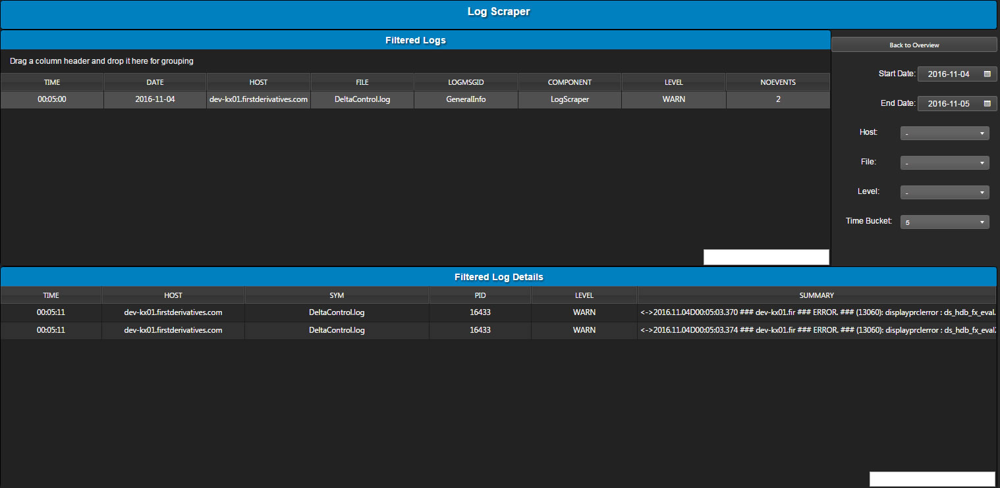 

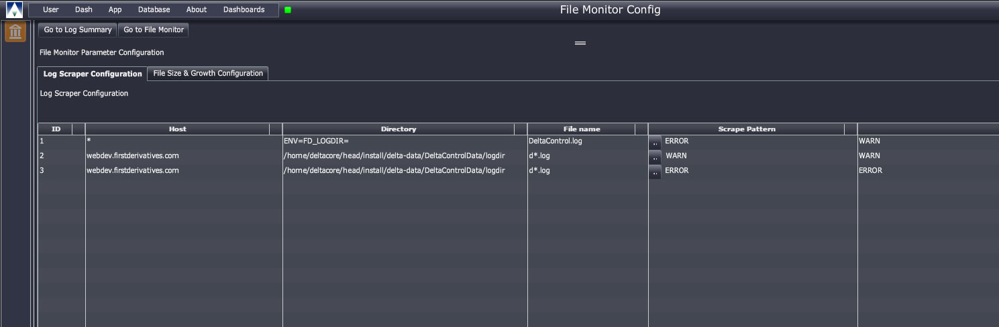 

This screen runs independent of Server and Process overview. It requires configuration in Flex. 

**Filtered Logs**

The filtered log displays log messages based on the filters specified. 

Client-side filters to the right of the table help navigate the display of this information

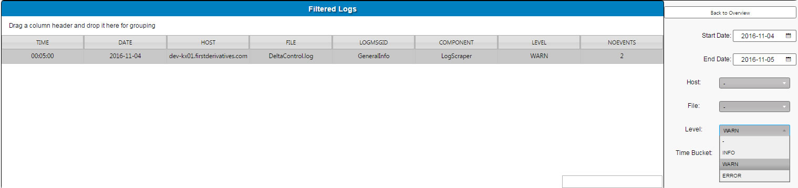 

Items | Description
--- | ---
Time | The time the message occurred
Date | The date the message occurred
Host | The host name of the process instance
File | Name of log file
LogMsgID | The message ID
Component | The component where the message was created
Level | The level of logging
No. Events | Number of logged Events

**Filtered Log Details**

Selecting an information row from Filtered Logs will populate the table with additional details of the selected log.

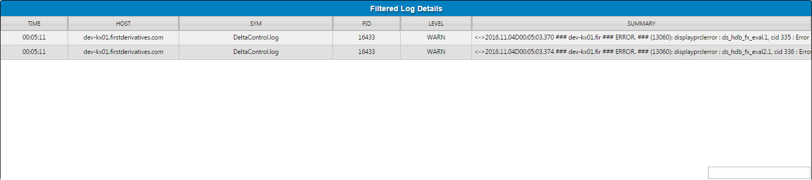 

Items | Description
--- | ---
Time | The time the message occurred
Host | The host name of the process instance
SYM | Name of log file
PID | Process ID
Level | The level of logging
Summary | Summary description of selected log. 