Specialised chart with support for upto four, cross-referenced <a href="#data-source">data source</a> variables

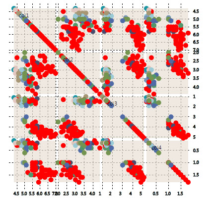

## Basics

Scatter Plot Menu

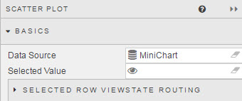

**Selected Value**

*Not in Use*

### Data Source

See [Defining a Query](introduction.md#defining-a-query) and [Analytics](introduction.md#analytics) for more on data sourcing.

### Selected Row ViewState Routing

The aforementioned <a href="#selected-value">Selected Value</a> and <a href="#selected-value-attribute">Selected Value Attribute</a> handles a single data map. <a href="#selected-row-viewstate-routing">Selected Row Viewstate Routing</a> supports multiple mappings between <a href="#selected-value">Selected Values</a> and <a href="#selected-value-attribute">Selected Value Attributes</a>.


To add a row, click 

## Plot By

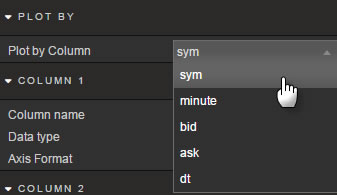

Configures what **Data Source** variable, e.g. asset symbol, will be charted for each **Data Source** column category.

### Column 1

First comparative column

**Column Name**

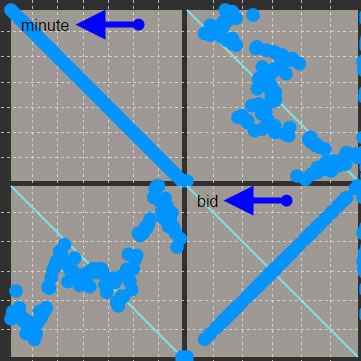

Selects **Data Source** variable to be plotted. Variable name is listed inside the Scatter Plot.

**Data Type**

Dropdown select of Data Type; either number or date

**Axis Format**

In dropdown menu, select between Smart, None, or 1-6 Decimal places

### Column 2

First comparative column

**Column Name**

Selects **Data Source** variable to be plotted. Variable name is listed inside the Scatter Plot.

**Data Type**

Dropdown select of Data Type; either number or date

**Axis Format**

In dropdown menu, select between Smart, None, or 1-6 Decimal places 
 
### Column 3

First comparative column

**Column Name**

Selects **Data Source** variable to be plotted. Variable name is listed inside the Scatter Plot.

**Data Type**

Dropdown select of Data Type; either number or date

**Axis Format**

In dropdown menu, select between Smart, None, or 1-6 Decimal places 

### Column 4

First comparative column

**Column Name**

Selects **Data Source** variable to be plotted. Variable name is listed inside the Scatter Plot.

**Data Type**

Dropdown select of Data Type; either number or date.

**Axis Format**

In dropdown menu, select between Smart, None, or 1-6 Decimal places.

### Format

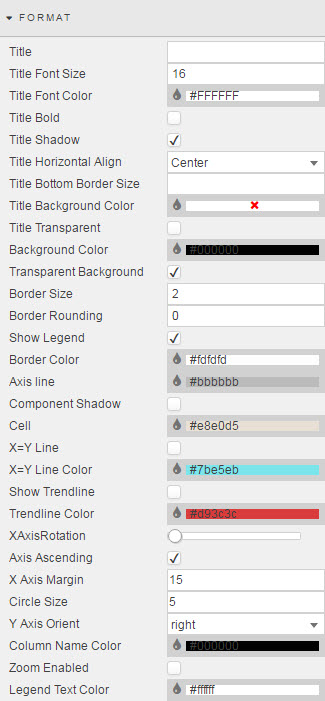

Formatting of Component Titles and Component Borders can be found in the introductory section of <a href="#dashboards-for-kx">Dashboards for Kx</a>.

**Show Legend**

Toggles Legend label in top-left of Scatter Plot component.

**Border Color**

Use Hex color or select from palette the color to use for the scatterplot border.

**Axis line**

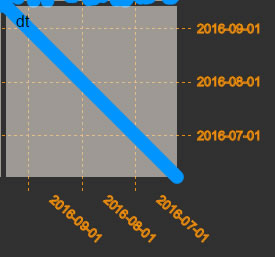

Use Hex color or select from palette the color to use for the different scatterplot axes gridline and labels.

**Cell**

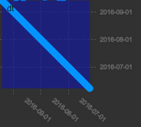

Use Hex color or select from palette the color to use for the background of each 'minichart' within the scatter plot.

**X=Y Line**

Check control to display line where x = y. 

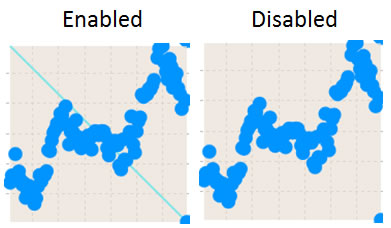

**X=Y Line Color**

Select color for X=Y line from the color palette

**Show Trendline**

Overlay trendline on top of scatter plot chart.

**Trendline Color**

Set color of trendline

<aside class="admonition caution">Ensure <b>Show Trendline</b> is checked for trendline to appear</aside>

**XAxisRotation**

Adjust angle of x-axis labels. 

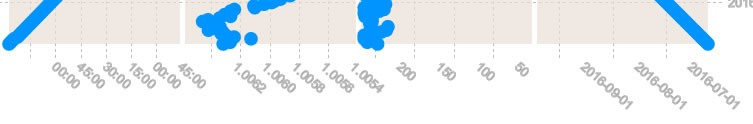

**Axis Ascending**

Toggles order of axis from descending to ascending

**X Axis Margin**

Define distance between axis and component edge (and therefore, size of scatter plot)

**Circle Size**

Set size of circles used for scatter plot

**Y Axis Orient**

Change position of y-axis labels (larger margin will be on label side)

**Column Name Color**

Change color of label names. Select Hex color or from color palette.

**Zoom Enabled**

Zoom into chart (mouse scroll wheel)

**Legend Text Color**

Change color of legend. Select Hex color or from color palette.

## Style

Set format of Scatterplot

### Plot Color

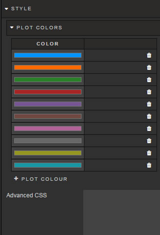

Color order for different scatter plot. Click on individual color bar to change.

### Advanced CSS

Configure CSS for Scatter Plot component

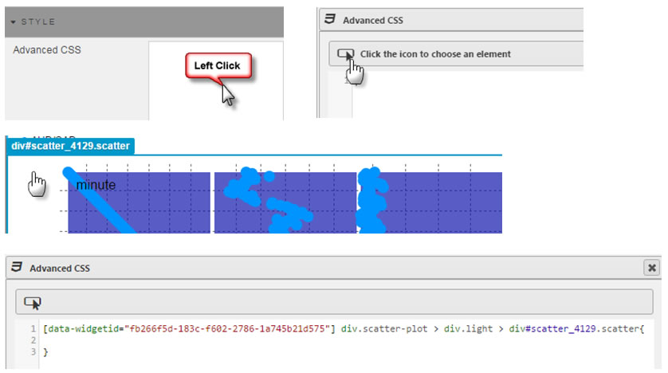

## Margins

See [Margins](introduction.md#margins) in Introduction for more

## Sample Data


```
tab:flip `col1`col2`col3`col4`name!(
5.1 4.9 4.7 4.6 5 5.4 4.6 5 4.4 4.9 5.4 4.8 4.8 4.3 5.8 5.7 5.4 5.1 5.7 5.1 5.4 5.1 4.6 5.1 4.8 5 5 5.2 5.2 4.7 4.8 5.4 5.2 5.5 4.9 5 5.5 4.9 4.4 5.1 5 4.5 4.4 5 5.1 4.8 5.1 4.6 5.3 5 7 6.4 6.9 5.5 6.5 5.7 6.3 4.9 6.6 5.2 5 5.9 6 6.1 5.6 6.7 5.6 5.8 6.2 5.6 5.9 6.1 6.3 6.1 6.4 6.6 6.8 6.7 6 5.7 5.5 5.5 5.8 6 5.4 6 6.7 6.3 5.6 5.5 5.5 6.1 5.8 5 5.6 5.7 5.7 6.2 5.1 5.7 6.3 5.8 7.1 6.3 6.5 7.6 4.9 7.3 6.7 7.2 6.5 6.4 6.8 5.7 5.8 6.4 6.5 7.7 7.7 6 6.9 5.6 7.7 6.3 6.7 7.2 6.2 6.1 6.4 7.2 7.4 7.9 6.4 6.3 6.1 7.7 6.3 6.4 6 6.9 6.7 6.9 5.8 6.8 6.7 6.7 6.3 6.5 6.2 5.9; 3.5 3 3.2 3.1 3.6 3.9 3.4 3.4 2.9 3.1 3.7 3.4 3 3 4 4.4 3.9 3.5 3.8 3.8 3.4 3.7 3.6 3.3 3.4 3 3.4 3.5 3.4 3.2 3.1 3.4 4.1 4.2 3.1 3.2 3.5 3.6 3 3.4 3.5 2.3 3.2 3.5 3.8 3 3.8 3.2 3.7 3.3 3.2 3.2 3.1 2.3 2.8 2.8 3.3 2.4 2.9 2.7 2 3 2.2 2.9 2.9 3.1 3 2.7 2.2 2.5 3.2 2.8 2.5 2.8 2.9 3 2.8 3 2.9 2.6 2.4 2.4 2.7 2.7 3 3.4 3.1 2.3 3 2.5 2.6 3 2.6 2.3 2.7 3 2.9 2.9 2.5 2.8 3.3 2.7 3 2.9 3 3 2.5 2.9 2.5 3.6 3.2 2.7 3 2.5 2.8 3.2 3 3.8 2.6 2.2 3.2 2.8 2.8 2.7 3.3 3.2 2.8 3 2.8 3 2.8 3.8 2.8 2.8 2.6 3 3.4 3.1 3 3.1 3.1 3.1 2.7 3.2 3.3 3 2.5 3 3.4 3; 1.4 1.4 1.3 1.5 1.4 1.7 1.4 1.5 1.4 1.5 1.5 1.6 1.4 1.1 1.2 1.5 1.3 1.4 1.7 1.5 1.7 1.5 1 1.7 1.9 1.6 1.6 1.5 1.4 1.6 1.6 1.5 1.5 1.4 1.5 1.2 1.3 1.4 1.3 1.5 1.3 1.3 1.3 1.6 1.9 1.4 1.6 1.4 1.5 1.4 4.7 4.5 4.9 4 4.6 4.5 4.7 3.3 4.6 3.9 3.5 4.2 4 4.7 3.6 4.4 4.5 4.1 4.5 3.9 4.8 4 4.9 4.7 4.3 4.4 4.8 5 4.5 3.5 3.8 3.7 3.9 5.1 4.5 4.5 4.7 4.4 4.1 4 4.4 4.6 4 3.3 4.2 4.2 4.2 4.3 3 4.1 6 5.1 5.9 5.6 5.8 6.6 4.5 6.3 5.8 6.1 5.1 5.3 5.5 5 5.1 5.3 5.5 6.7 6.9 5 5.7 4.9 6.7 4.9 5.7 6 4.8 4.9 5.6 5.8 6.1 6.4 5.6 5.1 5.6 6.1 5.6 5.5 4.8 5.4 5.6 5.1 5.1 5.9 5.7 5.2 5 5.2 5.4 5.1; 0.2 0.2 0.2 0.2 0.2 0.4 0.3 0.2 0.2 0.1 0.2 0.2 0.1 0.1 0.2 0.4 0.4 0.3 0.3 0.3 0.2 0.4 0.2 0.5 0.2 0.2 0.4 0.2 0.2 0.2 0.2 0.4 0.1 0.2 0.2 0.2 0.2 0.1 0.2 0.2 0.3 0.3 0.2 0.6 0.4 0.3 0.2 0.2 0.2 0.2 1.4 1.5 1.5 1.3 1.5 1.3 1.6 1 1.3 1.4 1 1.5 1 1.4 1.3 1.4 1.5 1 1.5 1.1 1.8 1.3 1.5 1.2 1.3 1.4 1.4 1.7 1.5 1 1.1 1 1.2 1.6 1.5 1.6 1.5 1.3 1.3 1.3 1.2 1.4 1.2 1 1.3 1.2 1.3 1.3 1.1 1.3 2.5 1.9 2.1 1.8 2.2 2.1 1.7 1.8 1.8 2.5 2 1.9 2.1 2 2.4 2.3 1.8 2.2 2.3 1.5 2.3 2 2 1.8 2.1 1.8 1.8 1.8 2.1 1.6 1.9 2 2.2 1.5 1.4 2.3 2.4 1.8 1.8 2.1 2.4 2.3 1.9 2.3 2.5 2.3 1.9 2 2.3 1.8;
`setosa`setosa`setosa`setosa`setosa`setosa`setosa`setosa`setosa`setosa`setosa`setosa`setosa`setosa`setosa`setosa`setosa`setosa`setosa`setosa`setosa`setosa`setosa`setosa`setosa`setosa`setosa`setosa`setosa`setosa`setosa`setosa`setosa`setosa`setosa`setosa`setosa`setosa`setosa`setosa`setosa`setosa`setosa`setosa`setosa`setosa`setosa`setosa`setosa`setosa`versicolor`versicolor`versicolor`versicolor`versicolor`versicolor`versicolor`versicolor`versicolor`versicolor`versicolor`versicolor`versicolor`versicolor`versicolor`versicolor`versicolor`versicolor`versicolor`versicolor`versicolor`versicolor`versicolor`versicolor`versicolor`versicolor`versicolor`versicolor`versicolor`versicolor`versicolor`versicolor`versicolor`versicolor`versicolor`versicolor`versicolor`versicolor`versicolor`versicolor`versicolor`versicolor`versicolor`versicolor`versicolor`versicolor`versicolor`versicolor`versicolor`versicolor`virginica`virginica`virginica`virginica`virginica`virginica`virginica`virginica`virginica`virginica`virginica`virginica`virginica`virginica`virginica`virginica`virginica`virginica`virginica`virginica`virginica`virginica`virginica`virginica`virginica`virginica`virginica`virginica`virginica`virginica`virginica`virginica`virginica`virginica`virginica`virginica`virginica`virginica`virginica`virginica`virginica`virginica`virginica`virginica`virginica`virginica`virginica`virginica`virginica`virginica)
```
