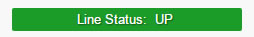
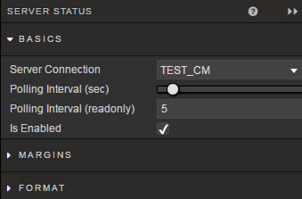

A small component which displays connectivity status of connected Server

## Basics

Configure server connection and update test frequency.

**Server Connection**

From dropdown menu, select the connection to be monitored in Server Status

**Polling Interval (sec)**

 Use the slider to adjust the frequency of server updates

 <aside class="notice">Adjusting the slider will change the value for **Polling Interval (readonly)**</aside>

**Polling Interval (readonly)**

 This displays the slider value for **Polling Interval**. It's a readonly value.

**Is Enabled**

 A check control. Tick to enable server connection monitoring.

## Style

[1] Left click inside Advanced CSS button

[2] Select the Playback component by first clicking on the  icon in the pop-up dialog and then clicking on the Server Status component. 

[3] Add the required CSS content

## Margins

See [Margins](introduction.md#margins) in Introduction for more

## Format

See [Format](introduction.md#format) in Introduction for more.

