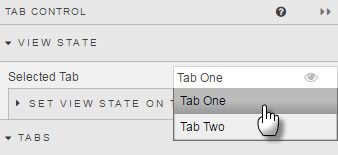
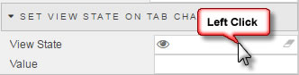
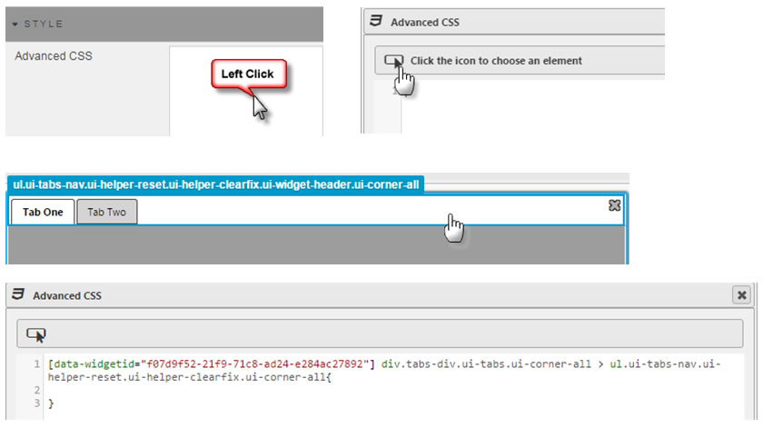

Each tab can receive a single component or can support multiple components if a [Layout Panel](layout) is used inside the tab. 
 
 

<aside class="admonition caution">To delete a component from inside a tab, drag-and-drop a replacement component on top of the existing component or click the delete button in the top right. If a Layout Panel is used, use the delete button to remove it</aside> 

## View State

<aside class="admonition caution">To link tabs in two separate Tab components (so that clicking on tab 1 of tab-component 1 opens tab 1 of tab-component 2), create a [view state parameter](introduction/#view-state-parameters) and assign to <i>Selected Tab</i> of tab-component 1 and tab-component 2</aside>

Dropdown menu selects the current tab view. When working with tabs, use this menu to switch views

### Set View State on Tab Change

In addition to linking different tab components, switching tabs can be used to assign a value to a [view state parameter](introduction/#view-state-parameters); for example, if looking to reset a default value on tab switch.

## Tabs

Change the name and delete tabs.

To add a tab, click 

Tab controls can be hidden by checking the 'Hide' box. Hiding a Tab control does not remove the content from the tab, just the means to tab-click to it. In the latter example, navigation to the hidden tab content could be achieved using a button control (as an example).

## Style

Use Advanced CSS to customise tabs

## Margins

See [Margins](introduction/#margins) in Introduction for more

## Format

See [Format](introduction/#format) in Introduction for more.

