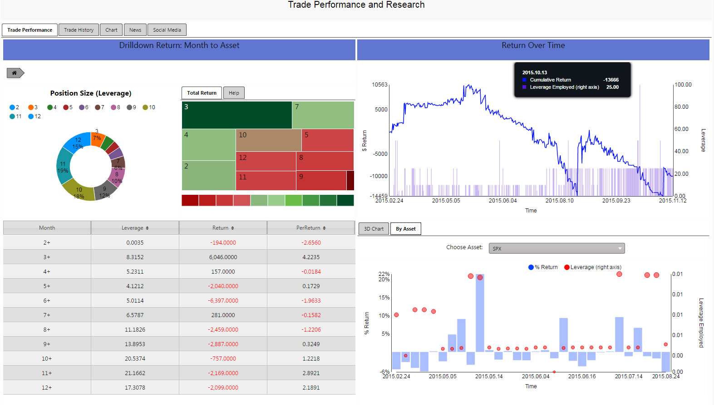
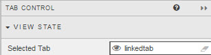
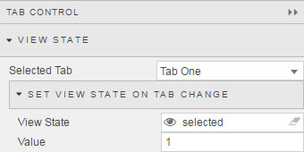
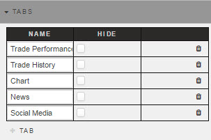

  
_<small>A Tab Control with five tabs. The first Tab, Trade Performance, is selected and visible</small>_

A container of multiple displays, the currently visible display selected by tabs. Each Tab holds either a single component or a [Layout panel](layout) containing several. 

!!! tip 
    To delete a component from inside a Tab, drop a replacement component on top of the existing component or click the _Delete_ button top right. If a Layout panel is used, use its _Delete_ button to remove it.

## View State

_Selected Tab_
: The Tab visible at launch

    !!! tip "Linking Tab Controls"
        To link Tabs in two separate Tab Controls (so that clicking on Tab 1 of Tab Control 1 opens Tab 1 of Tab Control 2), create a [View State Parameter](introduction/#view-state-parameters) and assign it to _Selected Tab_ of Tab Control 1 and Tab Control 2.

        

_Set View State on Tab Change_

: In addition to linking different tab components, switching tabs can be used to assign a value to a View State Parameter; for example, if looking to reset a default value on tab switch.

    

## Tabs

A Tab can be hidden by checking its _Hide_ box. Hiding a Tab does not remove it, just the means to click its tab. Navigation to the hidden tab content could still be effected using e.g. a [Button](button).

## Style

<i class="fa fa-hand-o-right"></i> [Style](style) for common styling parameters
