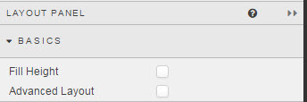
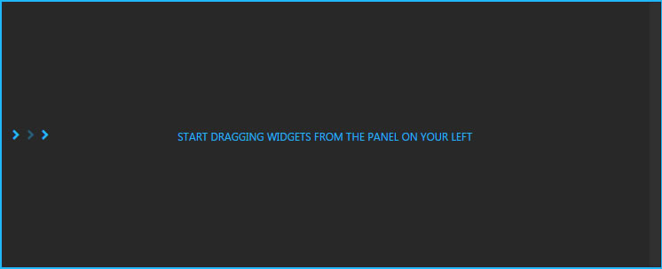
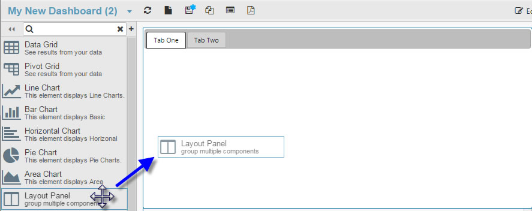
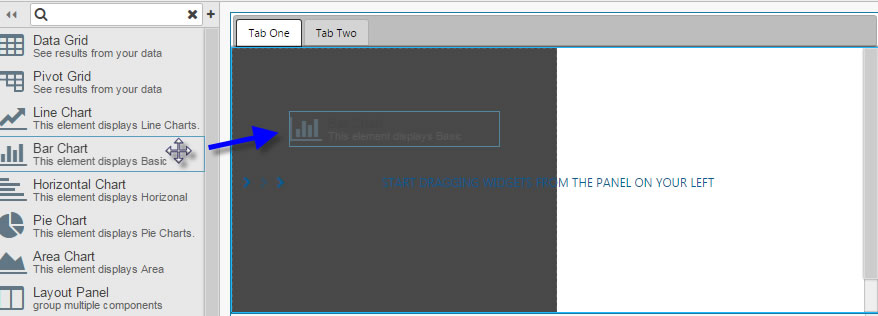
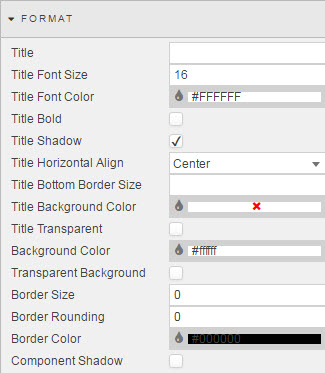

## Basics

**Fill Height**

Automatically autosizes components to fill the height of the Layout panel.  

<aside class="warning">Selection of *Fill Height* is best done after adding all required components</aside>

**Advanced Layout**

When checked, added components will best fit the Layout panel by width. 

Layout panels are best used with [Tab Control](tabcontrol) and [Accordion](accordion) component.  With the addition of a Layout panel to these components, more than one component can be dropped inside a tab or accordion section. 

[1] Add an Accordion or Tab Component

[2] Left-click-and-drag the Layout panel inside the tab or accordion space

[3] Then add other components to the Layout panel

<aside class="warning">Unless <i>Fill Height</i> is checked, components added to the Layout panel will not resize in height on Accordion panel resize; e.g. Accordion panel goes from half-screen to full-screen, components added to half-screen Accordion panel will remain the same size, leaving a half-space gap on accordion full-size</aside>

<aside class="warning">Unless <i>Advanced Layout</i> is checked, components added to the Layout panel will not resize in width on Accordion panel resize</aside>

## Margins

See [Margins](introduction/#margins) in Introduction for more

## Format

See [Format](introduction/#format) in Introduction for more.

