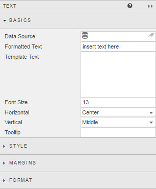
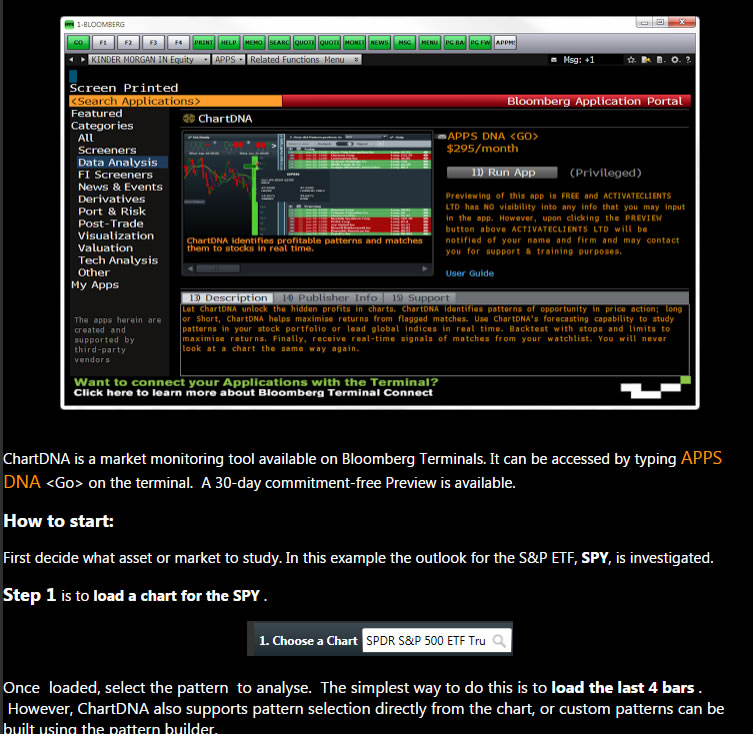
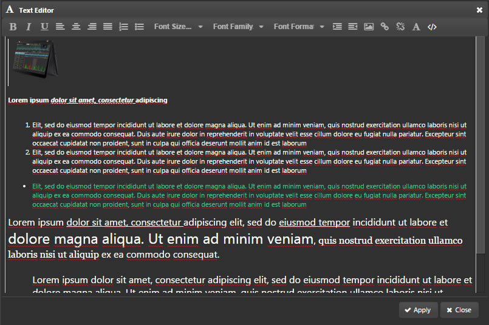
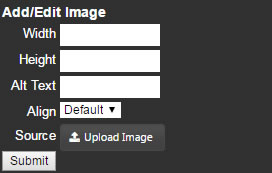
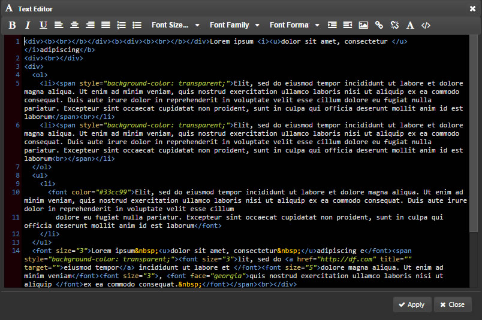
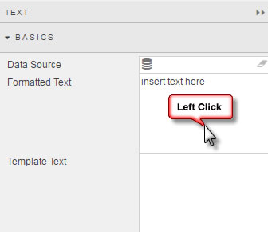
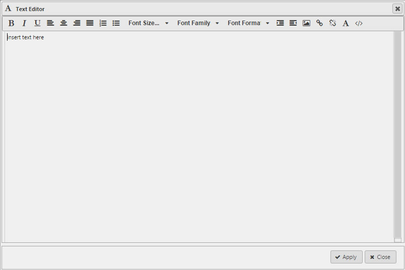

Allows users to enter bodies of text, embed third-party HTML content, create custom tables for displaying data, or copy website content directly into a dashboard.

## Basics

### Data Source

See [Defining a Query](introduction.md#defining-a-query) and [Analytics](introduction.md#analytics) for more on data sourcing.

**Formatted Text**

Sample Text

 
Text Editor

Add Image

HTML editor

Click inside the Formatted Text box to open the editor.

Function | Description
--- | ---
![Screenshot](img/fontstylehtmllight.jpg"> | Choose between **bold**, *italic* or underscore
![Screenshot](img/alignmenthtmllight.jpg"> | Left, center, right and justify alignment
![Screenshot](img/listoptionhtmllight.jpg"> | bullet or numeric points
Font Size | 8pt, 10pt, 12pt, 14pt, 18pt, 24pt
Font Family | Arial, Comic Snas, Courier New, Georgia, Helvetica, Impact, Times, Trebuchet, Verdana
Font Format | Paragraph, Pre, Heading 6, Heading 5, Heading 4, Heading 3, Heading 2, Heading 1

<aside class="notice">Template Text is dependent on a Data Source. If no Data Source is defined then the Template will not appear</aside>

**Font Size**

Defines font size, but font changes - including for size - are best done with the **Formatted Text** editor

**Horizontal**

Sets alignment of content inside component. 

**Vertical**

Sets alignment of content inside component

**Tooltip**

*Not in Use*

## Style

CSS styles can also be applied

## Format

See [Format](introduction.md#format) in Introduction for more.

## Margins

See [Margins](introduction.md#margins) in Introduction for more

