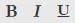
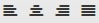
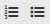
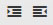
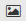
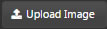
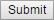
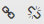
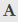
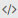

A container for text and images: everything from a short string, through HTML tables, to entire web pages. Content may include values from the component’s data source. 

  
_<small>A Text component with formatted content</small>_

## Basics

_Data Source_
: <i class="fa fa-hand-o-right"></i> [Defining a Query](introduction/#defining-a-query) and [Analytics](introduction/#analytics)

_Formatted Text_
: Clicking on the field summons the [Text Editor](#text-editor), which toggles between WYSIWYG and HTML modes. 

_Template Text_
: Template text can include data from the _Data Source_. Clicking on the field summons the [Template Editor](#template-editor).

_Font Size_
: Default type size, in pixels

_Horizontal_
: Horizontal alignment of text

_Vertical_
: Vertical alignment of text

_Tooltip_
: (Not in use)

## Text Editor

Click inside the _Formatted Text_ box to summon the Text Editor.

  
_<small>Text Editor in WYSWIG mode</small>_

  
_<small>Text Editor in HTML mode</small>_

### Toolbar 

button | function
--- | ---
 | **Bold**, *italic* or underscore
 | Left, center, right and justify alignment
 | Bullet or numeric points
Font Size | 8pt, 10pt, 12pt, 14pt, 18pt, 24pt
Font Family | Arial, Comic Sans, Courier New, Georgia, Helvetica, Impact, Times, Trebuchet, Verdana
Font Format | Paragraph, Pre, Heading 6, Heading 5, Heading 4, Heading 3, Heading 2, Heading 1
 | Add or remove paragraph indent
 | Import an image. Includes options to set width, height, Alt Text and image alignment. To import an image, click , source the image from the PC, then click   
 | Add or remove URL links. Define the URL, give the URL a descriptive Title, and configure from the dropdown whether the link should open in the current window or a new window
 | Select text color from the color palette
 | HTML or WYSWIG mode

### Uploading an image

## Template Editor

### Embedding values

As an example, the table:

was generated from the following _Template Text_:

### Online help

The _Help_ button offers additional configuration assistance: 

!!! warning "Can’t see Template Text?"
    _Template Text_ requires a data source. If no _Data Source_ is defined, _Template Text_ will not appear.

## Style, Margins, Format

<i class="fa fa-hand-o-right"></i> [Style](style) for common styling parameters