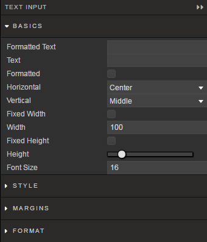
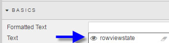
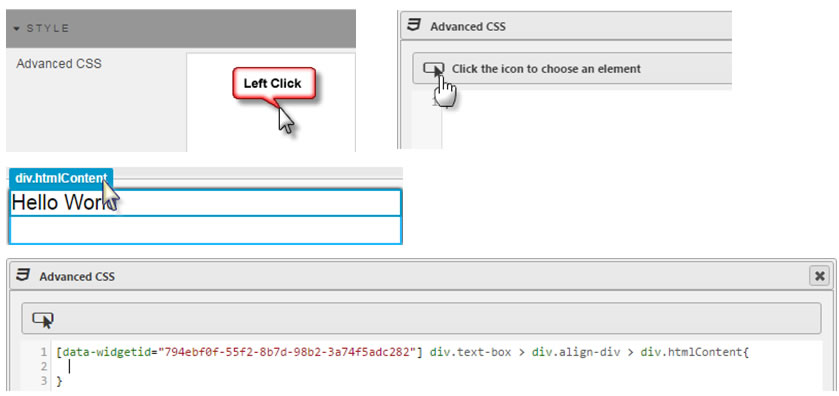

The **Text Input** component offers a means for users to input values into [view state parameter](introduction/#view-state-parameters). Text inputs are not limited to variables or dates, but can include text entries, colour choices, etc. Any Dashboard input supporting an  can map to a [view state parameter](introduction/#view-state-parameters) and connect it to a <a href="text-input">Text Input</a>.

### Basics

Text can either be read-only Formatted text, or user input Text. 

**Text**

The default setting for Text Input. Input values can be mapped to a <a href="#view-state-parameters">View State Parameter</a>.
 

<aside class="admonition tip">To change styling of Text input, use <a href="#style">Advanced CSS</a></aside>

**Multiline**

Check box to break content for a single, long line of text.

**Fixed Width**
 
When checked, defines width of *Text* Input box.

**Width**

Sets width of input text box in pixels

**Fixed Height**

Slider to change height of input text box.

**Horizontal**

Sets Left, Right, Center alignment of Input Box inside Text Component

**Vertical**

Sets Top, Middle, Bottom alignment of Input Box inside Text Component

**Font Size**

Changes size of font for *Text* or *Formatted Text*

## Style

Use Advanced CSS to set styles
 

## Margins

See [Margins](introduction/#margins) in Introduction for more

## Format

See [Format](introduction/#format) in Introduction for more.

