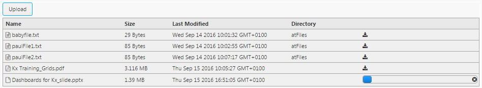
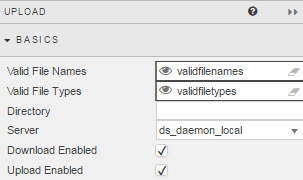
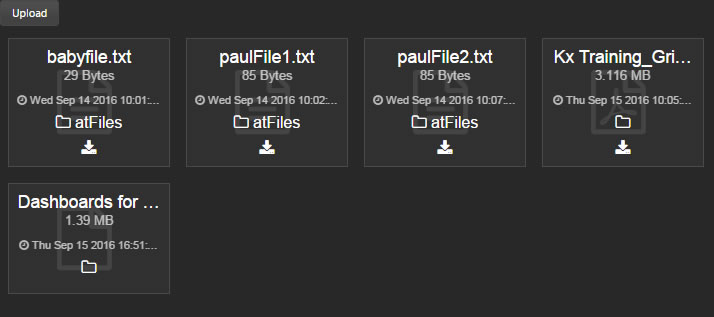
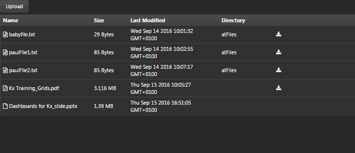
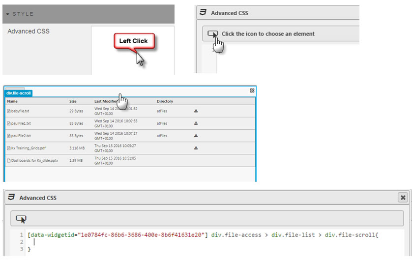

The Upload component gives a view of a server directory and supports uploading and downloading files to and from it. 

  
_<small>An upload in progress</small>_

## Basics

_Valid File Names_

: File name/s, or a [View State Parameter](introduction#view-state-parameters)

_Valid File Types_

: File type for import, or a View State Parameter. If undefined, all file types are supported.

    Types are specified as extensions or [MIME](https://en.wikipedia.org/wiki/MIME) types, with multiple file types separated by commas:

    type/s | files
    --- | ---
    .csv, .pdf | CSV and PDF files (file extensions)
    image/* | any image file (MIME type)
    .csv, .pdf, image/* | CSV, PDF files and any image type

_Directory_
: A View State Parameter: a filepath on the server

_Server_
: A server [connection](introduction/#creating-a-connection) with _Type_ `daemon`  

_Download Enabled_
: When checked, downloads are enabled

_Upload Enabled_
: When checked, uploads are enabled

## Style

<i class="fa fa-hand-o-right"></i> [Style](style) for common styling parameters

_Display Type_

: Table View is default

    Icon View:
    : 

    Table View:
    : 

_Advanced CSS_
: 

## Margins and Format

<i class="fa fa-hand-o-right"></i> [Style](style) for common styling parameters
